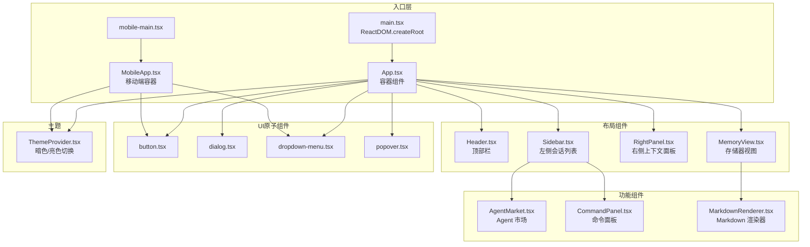
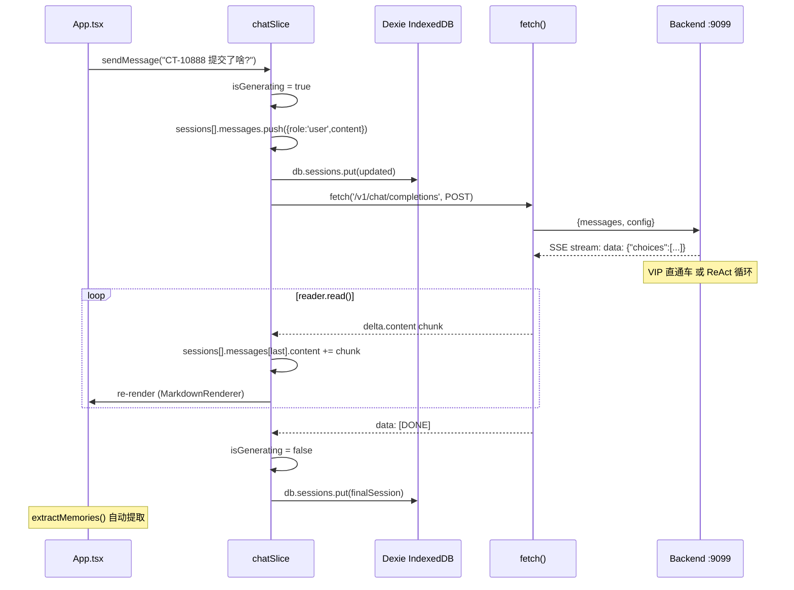

# Alice AI Bridge — 前端组件树与状态流转图 (v1.0)

> 版本：v1.0 | 日期：2026-06-03 | 作者：可达鸭 (Psyduck)
>
> 基于 `frontend/src/` 目录实际文件结构生成。

---

## 一、组件挂载树



---

## 二、状态管理流转图 (Zustand + Dexie)

```mermaid
graph LR
    subgraph 用户操作
        U[用户输入消息]
        U2[切换会话]
        U3[停止生成]
        U4[设置更改]
    end

    subgraph Zustand Store
        direction TB
        CS[chatSlice<br/>状态核心]
        AS[agentSlice<br/>Agent 管理]
        MS[memorySlice<br/>存储器]
        US[uiSlice<br/>UI 状态]
    end

    subgraph chatSlice 内部状态
        S1[sessions: Session[]]
        S2[activeSessionId: string]
        S3[isGenerating: boolean]
        S4[abortController: AbortController]
    end

    subgraph Dexie IndexedDB
        D1[sessions 表<br/>持久化会话]
        D2[customAgents 表<br/>自定义 Agent]
    end

    subgraph 后端通信
        B1[POST /v1/chat/completions<br/>SSE 流式读取]
        B2[GET /health<br/>健康检查]
        B3[POST /proxy/jira/test<br/>连接测试]
    end

    U -->|sendMessage()| CS --> B1
    U2 --> CS --> S2 --> D1
    U3 -->|stopGenerating()| S4
    U4 --> US --> B3

    CS --> S1 --> D1
    CS --> S3

    B1 -->|reader.read()| CS -->|set state| S1

    AS --> D2
    MS --> CS
```

---

## 三、组件职责矩阵

| 组件 | 层 | 职责 | 状态依赖 |
|------|-----|------|----------|
| **App.tsx** | 容器 | 三栏布局、SSE 错误气泡、isGenerating 动画 | chatSlice |
| **MobileApp.tsx** | 容器 | 移动端单栏布局 | chatSlice |
| **Header.tsx** | 展示 | 标题栏、模型切换 | uiSlice |
| **Sidebar.tsx** | 交互 | 会话列表 CRUD、新建/删除/搜索 | chatSlice.sessions |
| **RightPanel.tsx** | 展示 | 上下文信息面板（可折叠） | chatSlice.activeSession |
| **MemoryView.tsx** | 展示 | 记忆/知识库视图 | memorySlice |
| **AgentMarket.tsx** | 功能 | Agent 浏览/安装 | agentSlice |
| **CommandPanel.tsx** | 功能 | 斜杠命令面板 | — |
| **MarkdownRenderer.tsx** | 渲染 | Markdown → React 组件 | — |
| **ThemeProvider.tsx** | 基础设施 | 主题切换 | uiSlice |

---

## 四、核心数据流：一次完整对话



---

## 五、前端与后端 API 断层分析

| # | 断层点 | 前端期望 | 后端实际 | 风险等级 |
|---|--------|----------|----------|----------|
| 1 | **多模态图片上传** | `chatSlice.sendMessage()` 支持 `imageBase64` 参数，构造 `[{type:"image_url",...}]` | 后端 `parse_user_config` 未提取图片字段；DeepSeek V4 Flash 可能不支持多模态 | 🔴 高 — 前端有实现，后端未适配 |
| 2 | **Agent 工具白名单** | `sendMessage` 传递 `tool_whitelist: currentAgent.allowedTools` | 后端未使用 `tool_whitelist` 过滤工具 | 🟡 中 — 前端传了，后端忽略 |
| 3 | **extractMemories** | `chatSlice` 在对话完成后调用 `(get() as any).extractMemories?.(msgs)` | 无对应 API。`memorySlice` 定义了 `extractMemories` 但似乎在前端本地处理 | 🟡 中 — 可能是本地 LLM 调用，未验证 |
| 4 | **admin.html 直接存在于 backend/** | 模型下拉即保存；API 分轨编辑 | `backend/admin.html`（Vue CDN），`GET/POST /v1/admin/config`、`GET /v1/admin/models` | 🟢 低 — 与 React 聊天端解耦，全局默认模型由 `global_config.json` 注入后端 |
| 5 | **确认卡 SSE 事件** | 无专门的状态处理；前端可能依赖通用消息流 | 后端发送 `_event:"confirm_card"` 的 SSE 事件 | 🟡 中 — 前端 chatSlice 无确认卡状态机 |
| 6 | **config 对象字段不一致** | 前端传 `config: {agentId?, tool_whitelist?, provider?}` | 后端期望 `config: {jira_url?, jira_pat?, deepseek_key?, deepseek_model?, max_steps?}` | 🔴 高 — 前端传的 config 结构不完整 |
| 7 | **/health 响应未被前端使用** | 无健康检查轮询逻辑 | `/health` 返回 `{status:"ok"}` | 🟢 低 — 优化项 |
