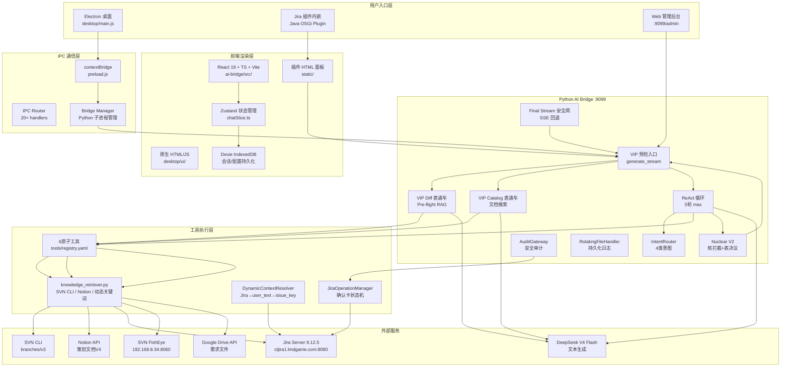
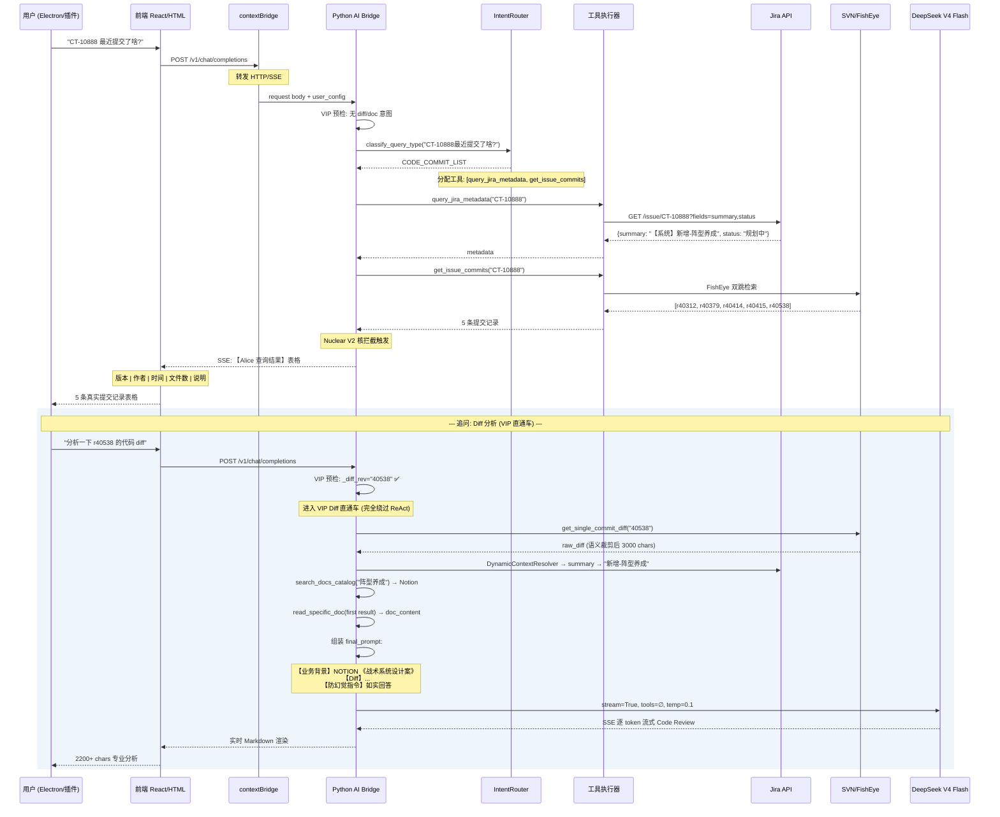

# Alice AI Bridge — 核心架构技术文档 (Master Architecture)

> 版本：v1.0 Master | 日期：2026-06-03 | 作者：可达鸭 (Psyduck)
>
> 本文档基于仓库 `H:\workbuddy\alice` 全部实际代码和配置文件汇编而成。所有图表使用 Mermaid.js。

---

## 【核心约束】奥卡姆剃刀原则 (2026-06-03 确立)

> **本项目采取 Electron (容器) + React (前端视图) + Python (后端大脑) 的唯一主干架构。**
>
> - **前端**：唯一入口为 `frontend/` (React 19 + TypeScript + Vite)，Electron 仅作为容器加载
> - **后端**：唯一入口为 `backend/` (Python Flask + Waitress)，监听 `:9099`
> - **Java Jira 插件**：正式降级为边缘维护分支，**严禁在其上开发任何与 Electron 端重叠的新业务特性**
> - **禁止双轨**：不允许同时维护两套前端 UI（原生 HTML 已物理删除）

---

## 一、全局系统架构



---

## 二、项目目录结构 (奥卡姆剃刀后)

```
H:\workbuddy\alice\
├── backend/                  # Python AI 引擎
│   ├── ai_bridge.py          # 主引擎: VIP 入口 + ReAct 循环
│   ├── knowledge_retriever.py
│   ├── intent_router.py
│   ├── tools/
│   │   └── registry.yaml    # 6 原子工具
│   ├── tests/
│   ├── logs/
│   └── requirements.txt
│
├── frontend/                 # React 19 + TS + Vite (唯一前端)
│   ├── src/
│   │   ├── App.tsx
│   │   ├── MobileApp.tsx
│   │   └── store/slices/chatSlice.ts
│   ├── index.html
│   ├── package.json
│   └── vite.config.ts
│
├── desktop/                  # Electron 容器 (仅主进程)
│   ├── main.js               # 加载 ../frontend/
│   ├── preload.js
│   └── dev.bat
│
├── plugin/jira-workbuddy-plugin/  # Jira 插件 (边缘维护)
├── docs/master/              # 设计文档
└── .gitignore
```

### 交付形态

| 形态 | 技术栈 | 入口 | 状态 |
|------|--------|------|------|
| **Electron 桌面** | Electron + React 19 | `desktop/dev.bat` | ✅ 主力 |
| **Jira 插件** | Java OSGi + HTML | Jira Server 内嵌 | 🟡 边缘维护 |
| **Web 管理后台** | Flask `/admin` | `:9099/admin` | ✅ 可用 |

---

## 三、一次标准指令执行的完整时序



---

## 四、核心设计模式与关键决策

### 4.1 VIP Express > ReAct Loop

```
传统 ReAct:
  User → LLM决策工具 → Python执行 → LLM决策工具 → ... → 回答
  问题: deepseek-v4-flash 在工具链末端输出 DSML 文本, 全部被过滤

VIP Express:
  User → Python全检索 (无LLM参与) → 组装Prompt → LLM纯文本流式
  优势: 零工具调用, 零DSML泄漏, 零幻觉, 稳定可靠
```

### 4.2 DeepSeek V4 Flash 适配策略

| 问题 | 方案 |
|------|------|
| 不支持 `tools` 参数 | VIP 路径用 Python 预检索, LLM 纯文本 |
| 输出 `<\|DSML\|>` 文本 | DSML 检测 + 清洗正则 + retry 逻辑 |
| 列表查询编造数据 | Nuclear V2 核拦截, 直接输出工具数据 |
| Final Stream 输出 tool_calls | Final Stream 安全网: 回退到工具数据 |

### 4.3 反幻觉三级防护

```
Layer 1: DynamicContextResolver — 零硬编码关键词
Layer 2: 文档溯源注入 — 标题+来源+防编造指令
Layer 3: Final Stream 安全网 — 过滤后回退到真实工具数据
```

---

## 五、数据与缓存层

| 缓存 | 策略 | TTL |
|------|------|-----|
| SVN 提交缓存 | `safe_get_commits()` | 60s |
| 语义缓存 | Jaccard 字符相似度 | 120s |
| LRU 缓存 | `BoundedCache` | 300s |
| 前端会话 | Dexie IndexedDB | 持久化 |
| 用户配置 | `electron-store` | OS 级加密 |

---

## 六、安全架构

```
用户消息
  →
L0: IntentClassifier (规则引擎)
  ├── ⛔ 直接拦截: rm -rf, force push, .env 泄露, SQL 注入
  ├── 🛡️ 确认卡: Jira 创建/更新, 企业微信发送
  └── ✅ 放行
  │
  ▼
AuditGateway (操作审计)
  ├── 敏感字段扫描 (password/secret/token)
  ├── 禁止关键词过滤
  ├── 速率限制 (per_minute / per_hour)
  └── 批量上限控制
  │
  ▼
JiraOperationManager (状态机)
  ├── awaiting_confirmation → running → created/failed/rejected
  └── 5 种错误分类 + 自动恢复方案
```

---

## 七、已知盲区与技术债

| # | 发现 | 影响 |
|---|------|------|
| 1 | `desktop_app_plan.md` 的 React 前端实际在 `ai-bridge/src/`，`desktop/` 仍用原生 HTML | 双轨前端 |
| 2 | `retrieval-architecture-plan.md` 的 Plan-and-Execute (S0→L4) 过于复杂 | 代码简化文档过时 |
| 3 | Java 插件与 Electron 桌面功能重叠 | 维护负担双倍 |
| 4 | React 19 前端不在项目根 `src/` 而在 `ai-bridge/src/` | 结构不直观 |
| 5 | `测试连接` 按钮未实现 | 用户无法自检 |
