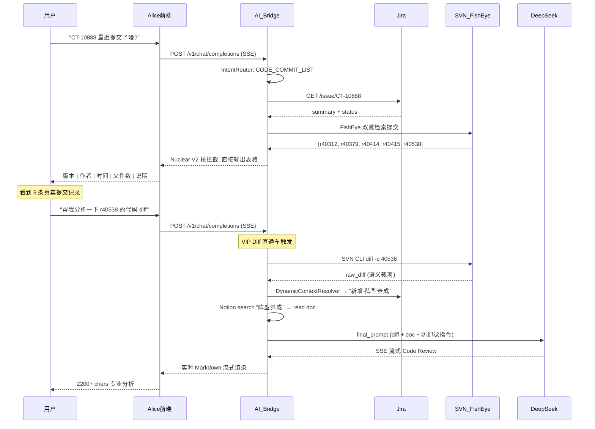
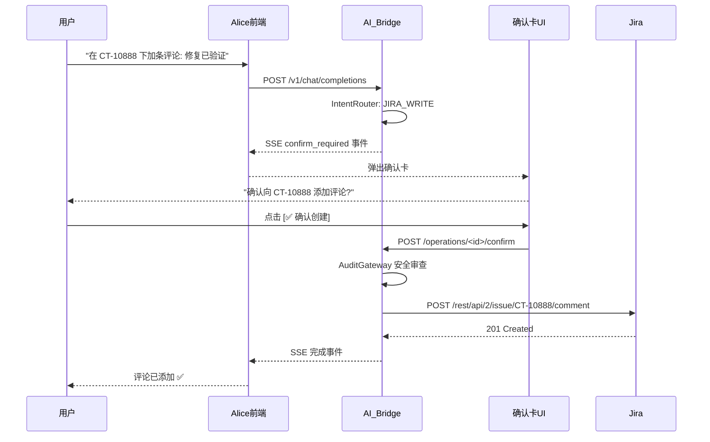
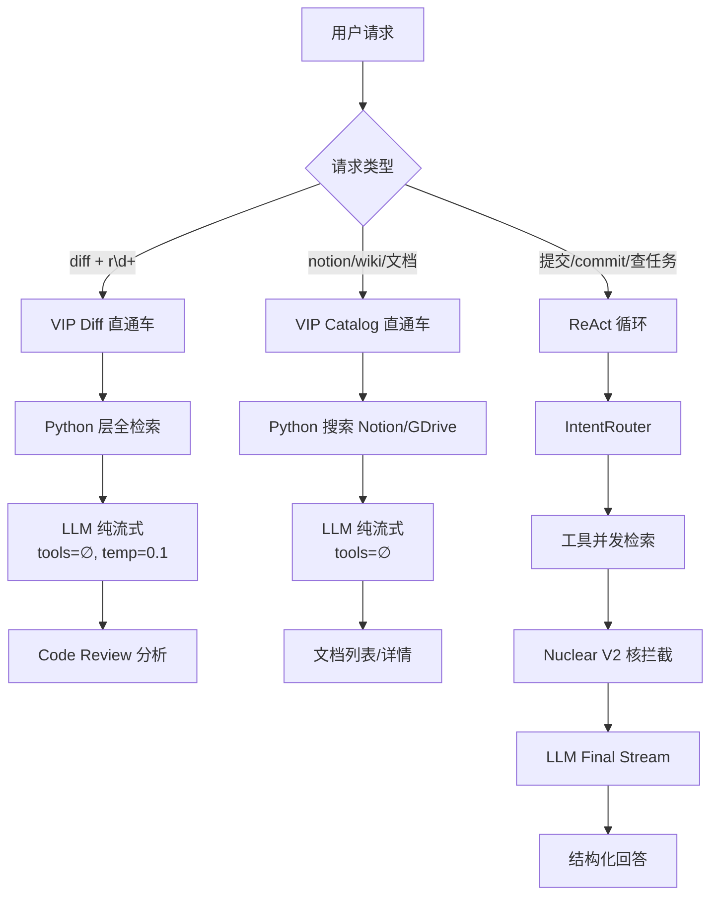

# Alice AI Bridge — 产品需求文档 (Master PRD)

> 版本：v1.0 Master | 日期：2026-06-03 | 作者：可达鸭 (Psyduck)
>
> 本文档基于仓库 `H:\workbuddy\alice` 全部现有代码和文档汇编而成。
> 标注 `✅` = 已实现，`🟡` = 部分实现，`⏳` = 规划中。

**相关文档**：[三期蓝图计划（开发校准路径）](alice三期蓝图计划.md) · [文档索引](README.md) · [技术架构](Alice_Master_Architecture_v1.0.md) · [白泽 Baize 架构（Jira/确认卡上游参考）](Baize_Architecture_v1.0.md)

> **排期与架构变更**以 [alice三期蓝图计划.md](alice三期蓝图计划.md) 为准；本文档描述功能需求。

---

## 一、产品定位与目标用户

### 1.1 产品概述

Alice（内部称 WorkBuddy，代号"可达鸭"）是一款面向**游戏研发团队**的 AI 工作助手。

核心能力：联通 **Jira**（任务管理）、**SVN/FishEye**（代码版本）、**Notion**（策划文档）、**Google Drive**（需求文件）四大工具链，利用 DeepSeek 大模型实现智能检索、代码审查和知识管理。

### 1.2 目标用户

| 角色 | 场景 | 当前覆盖 |
|------|------|----------|
| 项目经理 (PM) | 查任务状态、本周汇总、提交记录 | ✅ |
| 客户端/服务器开发 | 查 SVN 提交、分析代码 Diff、追溯需求文档 | ✅ |
| 策划人员 | 查 Notion 策划案、设计文档关联任务 | ✅ |
| 架构师/技术 Leader | Code Review、变更风险评估 | ✅ |

---

## 二、核心功能矩阵

### 2.1 P0 — 已实现 ✅

| 功能模块 | 能力 | 实现路径 |
|----------|------|----------|
| **Jira 查询** | 任务元数据、关键词搜索、本周/个人任务 | `query_jira_metadata` + `search_jira_issues` |
| **SVN 提交列表** | FishEye 双跳检索，版本号/作者/时间/文件数表格 | `get_issue_commits` |
| **SVN Diff 分析** | 单版本完整 Diff + 语义裁剪 + LLM Code Review | VIP Diff 直通车 |
| **Notion/GDrive 关联** | 自动检索策划文档 → 注入 Code Review 上下文 | `search_docs_catalog` + `read_specific_doc` |
| **意图路由** | 4 类意图自动识别 + 工具子集分配 | `intent_router.py` |
| **核拦截 (Nuclear V2)** | 列表查询跳过被污染的 LLM，直接输出表格 | `ai_bridge.py` Nuclear V2 |
| **反幻觉溯源** | 真实文档标题 + 来源注入 prompt + 防编造指令 | VIP diff/catalog prompt |
| **动态关键词** | Jira → user_text → issue_key 三级提取，零硬编码 | `DynamicContextResolver` |
| **Jira 评论写回** | 分析结果一键写回 Jira 评论 (PAT 认证) | `add_jira_comment` + 确认卡 |
| **Jira 插件** | Jira Server 内嵌聊天面板 (Tampermonkey + OSGi) | `jira-workbuddy-plugin` |
| **Electron 桌面端** | 独立桌面窗口 + IPC 安全桥 + Python 子进程 | `desktop/` |
| **日志持久化** | RotatingFileHandler 10MB×5 滚动日志 | `logs/alice_bridge.log` |
| **SSE 异常兜底** | 流中断 → 红色错误气泡 + isGenerating 复位 | `chatSlice.ts` + `App.tsx` |

### 2.2 P1 — 部分实现 🟡

| 功能 | 状态 | 缺口 |
|------|------|------|
| 快捷提问按钮 | 规划代码已存在 | 前端 UI 未接入 |
| 预设问题模板 | P0 需求文档已定义 | 未在 UI 中实现 |
| 多会话管理 | `conversations.js` 有实现 | 仅桌面端，插件端无 |
| 企业微信集成 | API 配置已就绪 | Bot 消息未联调 |
| Admin 管理面板 | `/admin` 可用 | 模型下拉即保存；API 配置分轨编辑；周报字段映射 |
| 确认卡机制 | `jira_operation_manager.py` | 仅 Jira 写操作 |

### 2.3 P2 — 规划中 ⏳

| 功能 | 说明 |
|------|------|
| Agent 市场 | 可安装的领域专家 Agent |
| 图片多模态 | 截图直接提问 |
| .exe 打包分发 | electron-builder NSIS 安装包 |
| 多项目上下文切换 | 动态切换 Jira 项目 |
| 多 Issue 交叉对比 | 同时分析多个关联任务 |
| 配置表变更识别 | `.xlsx` / `.csv` 游戏配置 DIFF |

---

## 三、核心用户流程 (Mermaid)

### 3.1 日常开发流程：查任务 → 看提交 → 分析 Diff

### 3.2 写操作安全流程

---

## 四、架构选型与设计决策

---

## 五、交付形态

| 形态 | 技术栈 | 用户入口 | 状态 |
|------|--------|----------|------|
| **Jira 插件** | Java OSGi + HTML/JS | Jira Server 内嵌面板 | ✅ 可用 |
| **Electron 桌面** | Electron 28 + React 19 | 独立 .bat 启动 | ✅ 开发中 |
| **Web 管理后台** | Flask `/admin` + `admin.html` | 浏览器 :9099/admin | ✅ 配置热重载 + 模型切换 |

---

## 六、已知盲区与技术债

| # | 问题 | 影响 | 建议 |
|---|------|------|------|
| 1 | `src/` 在 `ai-bridge/src/` 下，非项目根目录 | 新成员困惑 | 统一到 `src/` 或保留现状 |
| 2 | `desktop_app_plan.md` 规划的 React+TS 前端在 `ai-bridge/src/` 已实现，但 `desktop/` 仍用原生 HTML | 双轨前端 | 明确桌面端是否复用 React 前端 |
| 3 | `retrieval-architecture-plan.md` 的 Plan-and-Execute (S0→L4) 过于复杂，实际简化为 VIP 直通车 | 文档与代码不一致 | master 文档已统一，旧文档归档 |
| 4 | Java 插件与 Electron 桌面功能重叠 | 维护负担 | 确定主力交付形态后放弃一个 |
| 5 | `测试连接` 按钮未实现 | 用户无法自助排障 | P1 补上 |
