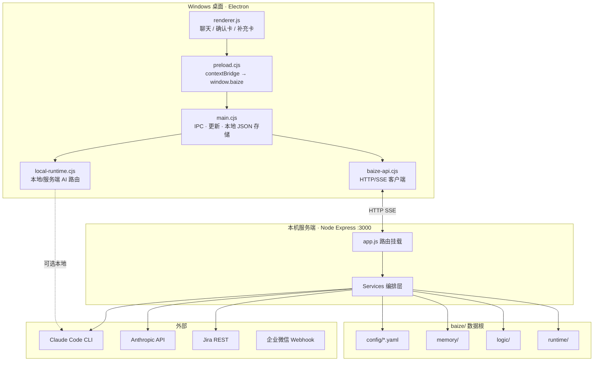
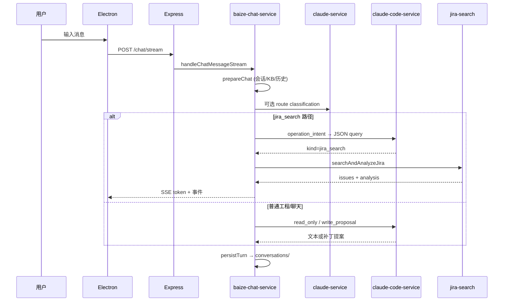
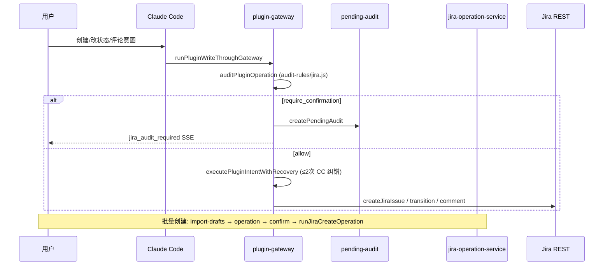

# 白泽（Baize）技术架构方案 v1.0

> **版本**：v1.0 | **日期**：2026-06-04  
> **受众**：架构师（兔子）  
> **源码仓库**：`H:\workbuddy\baize`（Alice 对照：`H:\workbuddy\alice`）  
> **依据**：Baize 公开 README、`docs/baize-overall-architecture.mmd`、`docs/architecture.mmd`、核心 `src/services/*` 实现  

**相关文档（Alice 仓库）**：[三期蓝图计划](alice三期蓝图计划.md) · [Alice 技术架构](Alice_Master_Architecture_v1.0.md) · [TECHNICAL](TECHNICAL.md) · [Jira A/B 报告](../../eval/reports/jira_baize_ab_latest.md)

---

## 1. 产品定位与设计原则

### 1.1 定位

白泽（Baize Local Hub）是 **本地优先的 AI 工作中枢**，不是「聊天窗口 + Claude Code 外壳」，而是把以下能力收进 **可本地部署的单机产品**：

| 能力域 | 说明 |
|--------|------|
| **对话与编排** | 统一聊天入口、意图分流、多 Provider 路由 |
| **本地智能执行** | Claude Code CLI（读工程、解析附件、Jira 意图 JSON） |
| **云端推理** | Anthropic API（路由分类、普通回复、图像分析） |
| **外部插件** | Jira、企业微信、知识库 |
| **治理** | 逻辑断言、浅/深记忆、写操作审计、确认卡 |
| **桌面交付** | Electron 客户端、自动更新、工作区授权 |

### 1.2 架构原则（智能中枢设计）

1. **对外单一人格**（白泽/小泽），内部可多「子智能体」概念（记忆官、逻辑官、任务官、集成官、审计官），用户不直接感知子 Agent 切换。  
2. **插件化接入**外部系统（Jira / WeCom / KB），配置在 `baize/skills`。  
3. **写操作必须可确认**：AI 可分析与建议，**静默写 Jira/记忆/逻辑默认禁止**。  
4. **配置与数据本地化**：`baize/` 目录为数据根（config / memory / logic / runtime / uploads / conversations）。  
5. **Claude Code 是执行引擎，不是唯一大脑**：确定性 JQL、REST、统计在 Node 层完成；LLM 负责 NL→结构化、失败恢复、复杂编排。

---

## 2. 物理部署与进程拓扑



### 2.1 双运行时模型

| 运行时 | 路径 | 职责 |
|--------|------|------|
| **服务端** | `src/` | 权威业务逻辑、Jira REST、审计、会话持久化、Claude Code **服务端 spawn** |
| **桌面客户端** | `client/desktop/` | UI、IPC 安全桥、本地会话缓存、**可选本机 Claude Code**、Jira 确认后客户端桥执行 |

**安全模型（桌面）**：

- `contextIsolation: true`，`nodeIntegration: false`
- 仅 `preload.cjs` 经 `contextBridge` 暴露约 40 个 `window.baize.*` API
- 流式聊天可 `cancelChatStream(requestId)` 取消

### 2.2 本地 Claude Code vs 服务端

```text
handleChat(input)
  ├─ readRuntimeConfig(serverUrl)          // control-plane
  ├─ shouldUseLocalClaudeCode(config)?
  │     YES → localClaudeCode.send() + syncLocalEvents()
  │     NO  → transport → POST /chat/stream (服务端)
  └─ Jira 确认后 → confirmJiraOperation → mode: jira_confirmed_execution
```

控制面下发：`client-runtime.yaml` → `localClaudeCode.enabled`、`command`、`env`、`jira` 字段映射等（`control-plane-service.js`）。

---

## 3. 逻辑分层架构

```text
┌─────────────────────────────────────────────────────────────┐
│ L0 入口：Electron UI / POST /chat /chat/stream /plugins/*   │
├─────────────────────────────────────────────────────────────┤
│ L1 路由层 src/routes/*.routes.js                              │
│     health · config · chat · conversations · attachments      │
│     memory · logic · plugins · claude-code · sync             │
│     control-plane · client-version · jira-bug-analysis        │
├─────────────────────────────────────────────────────────────┤
│ L2 编排层 baize-chat-service.js（主编排器）                    │
│     意图正则(engineering-intent) + Claude 路由分类             │
│     Provider 选择 · SSE 事件 · 会话持久化                      │
├─────────────────────────────────────────────────────────────┤
│ L3 领域服务                                                    │
│     Jira: client / search / import / operation / bug-analysis │
│     AI: claude-service · claude-code-service                  │
│     治理: plugin-gateway · pending-audit · patch-policy       │
│     上下文: memory · logic · knowledge-base · plugin-service │
├─────────────────────────────────────────────────────────────┤
│ L4 基础设施 lib/file-store · config-service · paths           │
├─────────────────────────────────────────────────────────────┤
│ L5 数据 baize/{config,memory,logic,runtime,uploads,...}       │
└─────────────────────────────────────────────────────────────┘
```

---

## 4. AI 双引擎架构（核心）

白泽 **不是**「所有事都交给 Claude Code」，而是 **API 分类 + Code 执行** 分工：

| 引擎 | 模块 | 典型用途 |
|------|------|----------|
| **Anthropic API** | `claude-service.js` | `generateChatRouteClassification` 意图路由；普通流式回复；图像分析 |
| **Claude Code CLI** | `claude-code-service.js` | spawn `claude`；多 `permissionMode`；输出 **严格 JSON** 意图 |

### 4.1 Claude Code `permissionMode`（工具策略）

| Mode | 工具权限 | 场景 |
|------|----------|------|
| `read_only` | Read/Grep/Glob/只读 Bash | 工程只读分析 |
| `write_proposal` | 禁止 Edit/Write | 补丁提案（经 patch-policy 校验） |
| `operation_intent` | 解析用户 Jira/插件意图 JSON | 聊天主路径 |
| `confirmed_operation_intent` | 用户确认后的分步执行 | Jira 创建/过渡 |
| `jira_search_error_analysis` | 分析搜索失败，输出 recovery JSON | JQL 自动恢复 |
| `jira_write_error_analysis` | 写失败恢复 | 创建/评论/状态 |
| `plugin_operation_error_analysis` | 插件写失败 | 网关恢复 |
| `bug_analysis_workspace` | 限定 SVN 工作区 + 只读 svn status/info | BUG 工程分析 Run |

**Prompt 约束示例**（`operation_intent`）：要求输出如：

```json
{"kind":"jira_search","reply":"...","query":{"projectKey":"CT","assignee":"张三","status":"处理中"}}
```

由 `claude-code-service` 解析后交给确定性层。

### 4.2 聊天 Provider 路由（`baize-chat-service`）

`resolveProvider` / `routeFromClaudeClassification` 将一轮对话分到：

| Provider | 含义 |
|----------|------|
| `claude` | API 直接回复 |
| `claude_code` / `claude_code_operation` | 走 Claude Code 意图 JSON + 后续执行器 |
| `jira` / `jira_search` | Jira 结构化搜索（可先 Code 抽 query） |
| `jira_create` / `jira_add_comment` 等 | 写路径或降级 |
| `local_kb` | 本地知识库检索回复 |
| `claude_code_blocked` / `_ambiguous` / `_pending` | 工程意图拦截、歧义、待确认操作 |

**工程意图本地兜底**（`engineering-intent-service.js`）：`dangerous` / `engineering_write` / `engineering_readonly` / `engineering_test` 等正则，在 API 分类失败时仍能做安全分流。

---

## 5. 关键业务流水线

### 5.1 标准聊天流（SSE）



**SSE 事件类型（节选）**：`jira_audit_required`、`jira_search_supplement_required`、`jira_search_recovery_not_recoverable`、活动心跳 `emitActivity('jira_search', ...)` 等。

### 5.2 Jira 读路径（高准确性的来源）


**`jira-search-service.js` 要点**：

1. **`buildResolvedJql`**：项目、assignee、自定义「任务负责人」字段、`status`/`issuetype`/`labels`、时间窗、`ORDER BY` 白名单。  
2. **用户消歧**：`resolveJiraUsers` 多候选 → `requiresUserInput` + `supplement` 卡片（前端补选）。  
3. **`searchAndAnalyzeJira`**：执行 REST → `simplifyIssue` → **`analyzeIssues` 预聚合**（按状态/负责人等统计，减少 LLM 幻觉）。  
4. **失败恢复循环**（最多 3 次）：可恢复错误 → `runClaudeCodeTask(permissionMode: jira_search_error_analysis)` → 校验 `validateJiraSearchRecoveryJql` → 重试 JQL。

### 5.3 Jira 写路径（确认卡 + 审计网关）



**`jira-operation-service.js`**：

- 状态机：`awaiting_confirmation` → `confirmed` → `executing` → `completed` / `recovery_required`
- 持久化：`baize/runtime/jira-operations/index.json`
- 失败：`classifyJiraApiError` + `buildDefaultRecoveryFromFailure` + 恢复卡

**插件 HTTP**（`plugins.routes.js`）：

| 方法 | 路径 | 作用 |
|------|------|------|
| POST | `/plugins/jira/search` | `searchAndAnalyzeJira` |
| POST | `/plugins/jira/import-drafts` | Excel/文本 → 草稿 + operation |
| GET/POST | `/plugins/jira/operations/:id` | 查询/确认/改草稿/拒绝/恢复 |
| POST | `/audit/:auditId/confirm` | 审计卡确认 |

确认执行：`confirmJiraOperationThroughClaudeCode` → 再次 spawn Claude Code（`confirmed_operation_intent`），按 Jira 返回分步修正字段。

### 5.4 Jira BUG 分析 Run（重工程路径）

- 路由：`jira-bug-analysis.routes.js` + `jira-bug-analysis-service.js`
- 服务端定时：`server.js` 每 60s `recoverInterruptedBugAnalysisRuns`
- Claude Code：`bug_analysis_workspace`（受控 SVN 目录；**禁止**自行 `svn update`，由服务端预先 cleanup/update）
- 产出：分析结论 + 可选 Jira 草稿 → 仍走确认/审计

### 5.5 记忆与逻辑

| 子系统 | 路径 | 行为 |
|--------|------|------|
| **浅层记忆** | `baize/memory/shallow/*.md` | 摘要检索 `searchShallowMemory` |
| **深层记忆** | `baize/memory/deep/` | 附件全文、索引；图片需本机 CC 视觉分析后才上传摘要 |
| **逻辑断言** | `baize/logic/assertions` + `executable/*.yaml` | `getLogicContext` 注入 Claude Code prompt |
| **知识库插件** | `knowledge-base-service.js` | 文档搜索/register |

---

## 6. 模块清单（Services）

| 模块 | 文件 | 职责 |
|------|------|------|
| 主编排 | `baize-chat-service.js` | 聊天、SSE、Jira/CC 路由、网关写、确认回调 |
| Claude API | `claude-service.js` | 分类、流式回复、XLSX→草稿 |
| Claude Code | `claude-code-service.js` | CLI spawn、permission、JSON 解析、prompt 模板 |
| Jira REST | `jira-client-service.js` | 认证、search、create、comment、transition |
| Jira 搜索 | `jira-search-service.js` | buildResolvedJql、analyzeIssues、恢复循环 |
| Jira 导入 | `jira-import-service.js` | 表格/文本 → draft |
| Jira 操作 | `jira-operation-service.js` | 确认卡状态机、批量创建 |
| Jira 审计规则 | `audit-rules/jira.js` | per-issue allow/deny/require_confirmation |
| 插件网关 | `plugin-gateway-service.js` | 统一 `auditPluginOperation` |
| 待审计 | `pending-audit-service.js` | 30min 过期审计队列 |
| 工程意图 | `engineering-intent-service.js` | 本地正则安全分类 |
| 配置 | `config-service.js` | YAML：`claude-code.yaml`、`jira.yaml` |
| 控制面 | `control-plane-service.js` | 客户端 runtime 下发 |
| 同步 | `sync-service.js` | 客户端事件同步 |
| 补丁策略 | `patch-policy-service.js` | diff 校验、越界拦截 |
| 附件 | `attachment-service.js` | 上传、分类、OCR/图像 |
| 会话 | `conversation-service.js` + `conversation-manager-service.js` | 持久化、摘要标题 |
| 企业微信 | `wecom-service.js` | Webhook |
| 客户端版本 | `client-version-service.js` | `latest.yml` 更新 |

---

## 7. HTTP API 面（节选）

| 域 | 端点 | 说明 |
|----|------|------|
| 健康 | `GET /health` | 探活 |
| 聊天 | `POST /chat`、`POST /chat/stream` | 同步 / SSE |
| 会话 | `conversations.routes` | CRUD + messages |
| Claude Code | `claude-code.routes` | operations 生命周期 |
| 插件 | `/plugins/jira/*`、`/plugins/wecom/webhook` | 见 §5.3 |
| 记忆/逻辑 | `memory.routes`、`logic.routes` | 读写断言与记忆 |
| 控制面 | `control-plane.routes` | 桌面拉配置 |
| 同步 | `sync.routes` | 多端事件 |
| 更新 | `client-version.routes` | Windows 自动更新 |
| 附件 | `attachments.routes` | 上传（JSON body limit 256kb） |

默认：**http://127.0.0.1:3000**；`app.js` 同时将 `client/desktop` 静态托管为 Web UI。

---

## 8. 数据与配置

```text
baize/
├── config/
│   ├── claude-code.yaml      # CLI command / timeout / env
│   ├── jira.yaml             # baseURL / PAT / fieldMappings
│   ├── client-runtime.yaml   # 本地 CC 开关、sync 间隔
│   └── client-version.yaml   # 更新源
├── logic/                    # 断言 + 可执行 rules
├── memory/                   # shallow / deep / policies
├── skills/registry.yaml      # 插件注册表
├── runtime/
│   ├── jira-operations/      # 写操作索引
│   ├── bug-analysis/         # BUG Run 状态
│   └── audit-pending/        # 待审计
├── conversations/            # 服务端会话
└── uploads/                  # 附件
```

Electron **userData**（与 baize 根分离）：`conversations.json`、`workspaces.json`、`jira-config`（加密）、`claude-code-sessions.json`。

---

## 9. 安全、审计与可靠性

| 机制 | 实现 |
|------|------|
| **写操作审计** | `plugin-gateway` → `decision: allow \| require_confirmation \| deny` |
| **AI 创建单识别** | `audit-rules/jira.js` 区分 AI 创建 vs 人工单，影响是否强制确认 |
| **JQL 注入防护** | `validateJiraSearchRecoveryJql` 禁止 DDL 关键词、无约束 JQL |
| **Claude Code 沙箱** | `disallowedTools: Edit,Write,...`；敏感路径禁止读取 |
| **工程危险拦截** | `engineering-intent` dangerous 模式 |
| **错误可恢复** | 写/搜/执行 三类 `*_error_analysis` permissionMode，最多 2–3 次重试 |
| **中文错误面** | `jiraError` / `publicMessage` 统一用户可见文案 |

---

## 10. 技术栈与依赖

| 类别 | 选型 |
|------|------|
| 语言 | Node.js 20+ / CommonJS |
| Web | Express |
| 桌面 | Electron 28 + electron-builder + electron-updater |
| 测试 | Vitest |
| AI | `@anthropic-ai/sdk`、`@anthropic-ai/claude-code`（npm 装 CLI，非提交二进制） |
| 配置 | YAML（`yaml` 包） |

---

## 11. 与 Alice 的对照（架构决策参考）

> Alice 侧完整架构见 [Alice_Master_Architecture_v1.0.md](Alice_Master_Architecture_v1.0.md)；交付形态以蓝图 **Phase A** 为准（Electron + `frontend/` React）。

| 维度 | 白泽 Baize | Alice V2 |
|------|------------|----------|
| **形态** | Electron + Express 同仓双端 | Electron 壳 + **Python Flask** `ai_bridge` :9099 |
| **主 LLM** | Claude API + **Claude Code CLI** | **DeepSeek**（VIP 直通车 + ReAct/LangGraph） |
| **Jira NL→Query** | Claude Code JSON → `buildResolvedJql` | 规则 `parse_query` + LLM intent router |
| **Jira 写** | 审计网关 + CC 分步执行 + 客户端确认桥 | `jira_operation_manager` + SSE `confirm_card` |
| **工程分析** | 本机 CC 读仓库 + BUG Run + SVN 工作区 | FishEye/SVN VIP + Notion/GDrive |
| **记忆/逻辑** | 一等公民 `baize/memory` `baize/logic` | 工具链上下文 + KB/RAG |

**Alice 已移植的白泽语义**（代码注释可追溯）：

| Alice 模块 | Baize 来源 |
|------------|------------|
| `intent_classifier.py` | `engineering-intent-service.js` |
| `jira_operation_manager.py` | `jira-operation-service.js` |
| `jira_search_engine.py` | `jira-search-service.js`（**无 Claude Code 依赖**） |
| `jira_search_recovery.py` | `jira_search_error_analysis`（DeepSeek 替代 CC） |
| `ai_bridge.py` 确认卡 / 意图拦截 | Baize 确认卡机制 |

**准确性对齐路线图**（见 [jira_baize_ab_latest.md](../../eval/reports/jira_baize_ab_latest.md)）：

| 能力 | Baize | Alice | 优先级 |
|------|-------|-------|--------|
| NL→结构化 query | Claude Code JSON | 规则 parse_query | P0 逐步加 LLM 槽位 |
| JQL 失败恢复 | CC jira_search_recovery | 规则 + LLM recovery | P0 |
| 用户消歧 | LLM 自动选 | supplement 卡片 | P1 |
| Bug 分析/批量导入 | 完整流水线 | Phase 4 占位 | P2 |

---

## 12. 参考图源（Baize 仓库内）

- `docs/baize-overall-architecture.mmd` — 端到端（含 SVN、BUG Run）
- `docs/architecture.mmd` — 客户端/服务端模块细图
- `docs/superpowers/specs/2026-05-19-baize-intelligent-hub-design.md` — 智能中枢概念设计
- `DESKTOP_ANALYSIS.md` — Electron 深度分析（Alice 侧亦有摘录）

**概念分层（长期设计）**：

```text
用户 → 统一入口(桌面/WeCom/API)
     → 白泽主控(baize-chat-service)
         ├─ 记忆官 memory-service
         ├─ 逻辑官 logic-service
         ├─ 任务官 jira-* + bug-analysis
         ├─ 集成官 plugin-service / wecom
         └─ 审计官 plugin-gateway + pending-audit
     → 插件层 skills/registry.yaml
     → 存储层 baize/{memory,logic,runtime}
```

---

## 13. 结论（给架构师）

1. **白泽 = 产品化本地 Hub**：Claude Code 负责 **执行与 NL 结构化**；**JQL 构建、REST、统计、审计、状态机** 在 Node 确定性层——这是 Jira「更准确」的主因。  
2. **写路径设计值得 Alice 继续对齐**：审计决策 → 确认卡 → 用户确认 → 执行 → 失败 recovery；避免 LLM 直接声称「无权限」或静默写入。  
3. **Alice 不必 1:1 复刻全量 Claude Code**：更合理路线是 **保留白泽确定性层 + DeepSeek/规则补 NL 槽位**。  
4. **Alice 尚未移植的大块**：BUG 分析 Run（SVN 工作区）、批量 Excel 导入创建、本地工作区 patch 授权、WeCom 全链路。

---

## 附录 A：目录结构（Baize 仓库）

```text
.
├── baize/                 # 知识、规则、配置、插件和运行目录
│   ├── config/
│   ├── logic/
│   ├── memory/
│   ├── runtime/
│   └── skills/
├── client/desktop/        # Electron 桌面客户端
├── docs/                  # 架构 mmd、项目介绍
├── src/                   # Node.js 服务端
│   ├── app.js
│   ├── server.js
│   ├── routes/
│   └── services/
├── tests/
└── package.json
```

## 附录 B：本地启动

```bash
# 服务端
npm start                    # http://127.0.0.1:3000

# 桌面端
npm run desktop:dev

# 健康检查
curl http://127.0.0.1:3000/health
```

配置模板：`baize/config/claude-code.example.yaml`、`baize/config/jira.example.yaml`。
