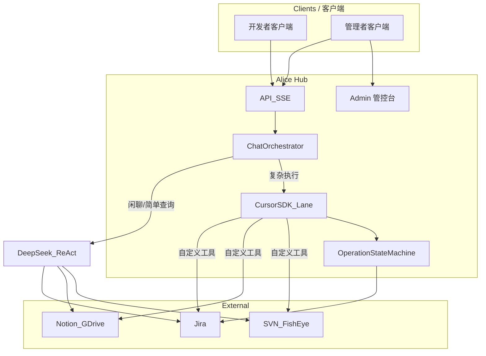
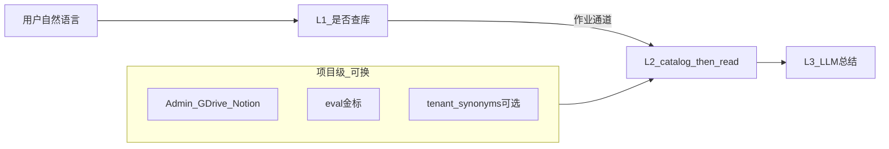

# Alice 三期蓝图计划

> **文档性质**：产品开发白皮书 · 修订记录与里程碑日志（v3.0 架构方案以 `docs/v3.0/ALICE_V3_RESTRUCTURE_PLAN.md` 为准）  
> **版本**：v2.0（v3.0-rules-align） | **日期**：2026-06-11 | **状态**：v3.1-RC21 Admin Bug 修复合波 AL-81~85  
> **部署形态**：私有化 Hub（单机）+ 各用户 Alice 客户端 + Admin 统一配链  
> **成本约束**：基础设施仅开源可自托管；LLM 按量 API；不采购商业中间件/SaaS  

**相关文档**：[技术架构](Alice_Master_Architecture_v1.0.md) · [API 契约](Alice_API_Contract_v1.0.md) · [v3.0 重构方案](../v3.0/ALICE_V3_RESTRUCTURE_PLAN.md)

---

## 1. 产品愿景与终极形态

> **⚠️ 蓝图演化说明**：本文档从 v1.0（2026-06-05，ReAct+DeepSeek 全栈）演进至 v1.4（2026-06-09，Cursor SDK 通用执行引擎 + 客户端角色体系）。<br>
> **§5.1–§5.12 = v1.0 原始 WBS（✅ 已全部交付）**。<br>
> **§5.13–§5.14 = v1.4 当前架构方向**（实施中/排队中）。<br>
> 新旧设计不冲突——旧的是地基（已建成），新的是上层建筑（施工中）。

### 1.1 定位

Alice 是 **研发协同中间件（Orchestration Hub）**，不是长期意义上的「Jira 聊天框」。

| 链路 | 说明 |
|------|------|
| 纵向 | 开发者 **Cursor / Alice 客户端** ↔ Alice Hub（策略 / 审计 / 状态）↔ **Jira（事实源）** |
| 横向 | PM / 主程在 Alice **管控台** 审批写操作、查看队列与健康度 |
| 执行引擎 | Cursor SDK（通用复杂执行）负责多步编排；DeepSeek 退守闲聊/简单查询 |
| A2A | 机器间通过 **MCP + operation_id + Audit**；人通过 **HITL + 必要时聊天** |

### 1.2 三期总览

| 期 | 时间盒 | 产品定位 | 出口里程碑 |
|----|--------|----------|------------|
| **近期（✅ 已交付）** | 0–4 月 | 可信工作台：聊天 + 审批 + Admin 稳定 | 内部日常可用 + eval 门禁 + **API v1 已冻结（§5.11）** |
| **中期（🚧 施工中）** | 4–10 月 | 智能执行中枢：Cursor SDK 通用执行引擎 + 后台可配置 | P2-2 Cursor SDK Lane 交付 + 审批控制台 |
| **远期** | 10–18 月 | A2A 中间件 + 客户端角色体系，可对外私有化售卖 | 全链路 A2E 演示 + 第二家工作室部署 POC |

### 1.3 部署与配链

- **Hub**：一台服务器运行 `ai_bridge`、Admin、`cursor_agent_lane`（Cursor SDK 编排道）、Hub 数据目录（`backend/data/`）。
- **客户端**：Electron 桌面端；启动时登录 → 决定角色（管理者/开发者）；配自己的 Cursor SDK API Key。
- **配链**：Jira / Notion / GDrive / SVN / 模型密钥 / Cursor SDK 密钥 **均在 Admin 配置**。



---

## 2. 架构宪法（全期遵守）

以下条款优先于任何单次需求；违反须在 PR 中说明并获架构负责人批准。

| # | 条款 | 说明 |
|---|------|------|
| C1 | Hub-and-Spoke | 外部系统只连 Hub；客户端/Cursor **禁止**直连 Jira |
| C2 | 单一 Operation 状态机 | 审批/草稿/恢复以 `jira_operation_manager` 为唯一真相源；**禁止**用 LangGraph checkpoint 存审批 |
| C3 | 单一编排入口 | 新逻辑进 `chat_orchestrator`；`ai_bridge.py` 仅路由（绞杀者迁移） |
| C4 | 契约优先 | SSE / REST / MCP 共用 `operation_id`、`draft_id`、`conversation_id` |
| C5 | 确定性优先（管道） | **管道确定性**：JQL、Issue Key、KB-id、revision、工具契约、防编造由代码保证；**语义与业务槽位**由 LLM 从用户句抽取后总结。**不等于**把知识库正文写进代码 |
| C6 | Eval 门禁 | 发布前必跑 §6.1 所列评测 |
| C7 | OSS-only | 新基础设施依赖须开源可自托管；MIT/Apache-2.0 优先；AGPL 须审查 |
| C8 | 近一期存储 | **仅** JSON 文件 + SQLite（按需）；**不引入** Redis / Temporal（中期再评估） |
| C9 | 知识库多项目 | 见 §2.2；**禁止**在代码中硬编码某一项目的业务名词用于路由/检索；项目差异走 Admin、eval、可选 `tenant_synonyms.json` |

### 2.1 非目标（近一期）

- 全量 LangGraph 替换 ReAct（保留 `ALICE_ENGINE` 实验开关）
- 全站 asyncio / 更换 ASGI 栈
- Cursor 无审批自动写 Jira
- 多租户 SaaS
- 商业软件采购（Camunda 企业版、Glean、LangSmith SaaS、LlamaParse 等）
- **v1.4 更正**：Cursor SDK 已作为通用执行引擎接管复杂执行——但这**不等于**淘汰 DeepSeek（闲聊/简单查询仍用 DeepSeek）

### 2.2 知识库答题设计（多项目）

Alice 面向**多种项目**复用同一套 Hub：用户自然语言 → AI **理解语义** → 系统 **逐层检索**（catalog → read）→ 基于真实文档回答。

**红线（C9）**：`backend/`、`frontend/` **不得**写入某一项目的业务实体词（如具体系统名、位置枚举、名单）来锁定检索或路由。  
**允许**：读 GDrive/Notion、文件名匹配、表头识别、Issue Key 格式、多轮是否再调工具。



| 层 | 职责 | 主要实现 | 换项目是否改代码 |
|----|------|----------|------------------|
| L1 | 闲聊 vs 查库；工具子集 | `chat_orchestrator`、`intent_classifier`（通用）、`intent_router`（LLM） | 否 |
| L2 | 找文档、读表、按槽位筛行 | `search_docs_catalog`、`read_specific_doc`、`gdrive_knowledge` | 否 |
| L3 | 组织答案、引用来源 | ReAct + 反幻觉 prompt | 否 |
| 知识内容 | 文档正文与名单 | GDrive / Notion | **不进代码** |

**换项目检查清单**（例：足球 → 乒乓球）：(1) Admin 换目录 (2) 换 `eval/datasets` 金标 (3) 可选 `tenant_synonyms.json` (4) 跑 eval；(5) 若失败只修**通用** L2/L3，禁止在 regex 写「乒乓球」。

**内测案例归属**：原话 → `eval/reports/user_test_feedback.md`；金标 → `eval/datasets/gdrive_sheet_cases.yaml`（如 gsheet-001/002）；**不进** `intent_classifier`。

**明确不做**：为每个位置/项目加 Python `if`；用硬编码名单代替 `read_specific_doc`；为单条内测通过堆领域 regex。

#### C9 细则

| 子项 | 规则 |
|------|------|
| C9.1 | 禁止业务名词、名单、位置枚举硬编码于路由/检索代码 |
| C9.2 | 项目差异：Admin 配置、eval 金标、可选 `backend/data/tenant_synonyms.json` |
| C9.3 | L1：通用作业信号 + `intent_router` LLM；禁止为单用例加领域 regex |
| C9.4 | L2：筛选来自 LLM 槽位或表头识别，非写死列含义 |
| C9.5 | L3：多轮换条件须再调 catalog+read |
| C9.6 | PR 改动 `intent_classifier` 新模式须通过 `scripts/check_kb_domain_hardcode.py` 或说明例外 |

---

## 3. 技术基座（开源选型）

### 3.1 已采用（保持）

| 类别 | 选型 |
|------|------|
| 协议 | MCP、HTTP/SSE、Jira REST |
| 后端 | Python、Flask、Waitress |
| 前端 | Electron、React、Vite、Zustand、IndexedDB |
| 编排库 | LangGraph（可选，`ALICE_ENGINE=v2`） |
| 向量（试点） | FAISS + LangChain TextSplitter |
| 领域层 | Baize 移植：registry、确认卡、JQL 引擎（`jira_search_engine`） |

### 3.2 中期可引入（仍须 OSS）

| 能力 | 开源方案 | 触发条件 |
|------|----------|----------|
| 长任务 | Temporal | Mailbox 跨天、需可靠续跑 |
| 向量库 | Qdrant / pgvector / Milvus | 文档 chunk 规模 &gt; 单机 FAISS |
| 队列 | Redis | Hub 并发队列瓶颈（优先 SQLite） |
| 可观测 | OTel + Prometheus + Grafana | 对外 SLA |
| 文档解析 | Unstructured | 复杂 Office/PDF |
| 评测（可选） | Langfuse 自托管 | 需 trace 平台时 |

### 3.3 运营成本（非软件采购）

- **LLM**：DeepSeek 或 OpenAI 兼容网关，Admin 配置模型与限流。
- **Jira/KB**：团队已有系统与 PAT。

---

## 4. 非功能需求（NFR）

| 指标 | 近期目标 |
|------|----------|
| 并发 | Hub 支持约 50 活跃用户；单用户限制并行 SSE 流 |
| 延迟 | 闲聊 P95 首 token &lt; 3s；Jira 结构化读 P95 &lt; 15s |
| 记忆 | 团队规则：Hub `shallow_memory.json`；会话：客户端 IndexedDB；作业状态：Hub operations/draft |
| 上下文 | 闲聊：单轮无工具；作业：8k 摘要；VIP：禁止无关历史 |
| 可观测 | 每请求：request_id、intent_label、lane、外部 HTTP 状态码 |
| 连接诊断 | Admin Jira 测试区分 **502 网关** vs **401 凭据** |

---

## 5. 可执行开发计划（WBS）

> **⚠️ 文档结构说明**：本章分上下两部分。<br>
> **上半部分（§5.1–§5.12）= v1.0 原始设计，✅ 已于 v1.0.28 全量交付完毕，此处保留为历史记录。**<br>
> **下半部分（§5.13–§5.14）= v1.4 当前架构方向，🚧 施工中 / 排队中。**<br>
> 阅读时请以下半部分为准；上半部分仅用于追溯"已建成的地基"。 |

**状态符号**：`[x]` 已完成基线 · `[ ]` 待做 · `[-]` 进行中  

**优先级**：P0 阻塞商用 · P1 本期必做 · P2 可延期  

### 5.1 近期 Epic 总表

| Epic | 名称 | 优先级 | 目标完成 |
|------|------|--------|----------|
| E1 | 编排绞杀者 | P0 | 近一期 M2 |
| E2 | HITL 闭环 | P0 | 近一期 M2 |
| E3 | Eval 发布门禁 | P0 | 近一期 M1 |
| E4 | Hub 独占凭据 | P1 | 近一期 M3 |
| E5 | 路由消歧 | P1 | 近一期 M2 |
| E6 | RAG / 上下文 | P1 | 近一期 M3 |
| E7 | Admin 运维体验 | P1 | 近一期 M1 |

**近期里程碑**

| 里程碑 | 时间 | 验收 |
|--------|------|------|
| M1 | 近一期第 4 周 | E3 + E7 完成；灰盒 SOP 可跑通 | **已交付 v1.0.2** |
| M2 | 近一期第 8 周 | E1 + E2 + E5 完成；CI + 集成脚本 | **已交付 v1.0.6** |
| M3 | 近一期第 16 周 | E4 + E6 完成；CI + 集成脚本 | **已交付 v1.0.6** |

---

### 5.2 E3 — Eval 发布门禁（P0）

| ID | 任务 | 交付物 | DoD | 状态 |
|----|------|--------|-----|------|
| E3.1 | 扩展 `eval/datasets/kb_matrix.yaml` | 用例 ≥ 20 条 | CI 可跑通 | [x] v1.1 共 20 条 + validate 脚本 |
| E3.2 | 闲聊误触发 Jira 用例 | `scripts/smoke_chat_only.py` 入 CI | 「你好」无 plugin_state | [x] ci-gate 可选集成 |
| E3.3 | coordinator 金标子集 | `eval/reports/` 基线报告 | 通过率基线存档 | [x] coordinator_m1 + baseline_M1 |
| E3.4 | 发布 checklist | `Alice_Graybox_SOP_v1.0.md` §发布 | 发版必须勾选 | [x] §八 + release_checklist_M1 |
| E3.5 | PR 门禁 | GitHub Actions / 本地 `run_eval` | main 合并前失败则阻断 | [x] ci-gate.yml + scripts/ci_gate.py |

---

### 5.3 E7 — Admin 运维体验（P1）

| ID | 任务 | 交付物 | DoD | 状态 |
|----|------|--------|-----|------|
| E7.1 | Jira 测试连接错误文案 | `test_jira_connection` + Admin UI | 502/401/超时 三类提示 | [x] error_category + 中文文案 |
| E7.2 | `/health` 扩展 | jira/kb/model 探活摘要 | Admin 仪表盘可读 | [x] integrations + Admin 顶栏 |
| E7.3 | 配置备份说明 | Admin 文档一节 | shallow_memory + global_config 备份步骤 | [x] Settings 备份卡片 |

---

### 5.4 E5 — 路由消歧（P1）

| ID | 任务 | 交付物 | DoD | 状态 |
|----|------|--------|-----|------|
| E5.1 | `route_intent` 使用 confidence | `intent_router.py` | &lt;0.8 不静默收窄工具 | [x] |
| E5.2 | `intent_disambiguation` SSE | `ai_bridge` + 契约文档 | 前端可选卡片 | [x] |
| E5.3 | 与 Jira user supplement 统一 UX | `JiraSearchSupplement` 规范 | 设计稿一种交互 | [x] kind=intent |
| E5.4 | 扩充 fast-path 规则 | `intent_classifier` | 自测 23+5 全绿 | [x] 基线已有 |

---

### 5.5 E2 — HITL 闭环（P0）

| ID | 任务 | 交付物 | DoD | 状态 |
|----|------|--------|-----|------|
| E2.1 | Draft/Confirm 卡片 | 前端组件 | PRD #14–17 点验 | [x] 基线已有 |
| E2.2 | `operation_progress` SSE | 后端事件 + 前端进度 | 写 Jira 过程可见 | [x] confirm?stream=1 + operationConfirmStream |
| E2.3 | F5 恢复第一步草稿 | `chatSlice` + 后端 draft 持久化 | 刷新见 draft_card | [x] GET /drafts + restorePendingDrafts |
| E2.4 | `recovery_required` UI | ConfirmCard 扩展 | 可补字段并续跑 | [x] recovery actions + retry_without_labels |
| E2.5 | 待审批聚合页 | 新视图或 Sidebar 区 | `GET /operations/pending` 一览 | [x] Sidebar 待处理区 |
| E2.6 | HTTP e2e | `scripts/e2e_short_draft_memory.py` 维护 | CI 绿 | [x] 基线已有 |

---

### 5.6 E1 — 编排绞杀者（P0）

| ID | 任务 | 交付物 | DoD | 状态 |
|----|------|--------|-----|------|
| E1.1 | 新建 `chat_orchestrator.py` | 模块 | VIP 快车道迁入 | [x] iter_preflight_sse + VIP |
| E1.2 | 新建 `plugin_gateway.py` | 模块 | 草稿/写/危险拦截迁入 | [x] draft/write 快车道 |
| E1.3 | `ai_bridge` 瘦身 | 路由 + 配置 | 净新增业务逻辑禁止堆在 bridge | [x] ReAct → react_runner + orchestrator 预检 |
| E1.4 | chat-only 道保留 | `should_use_chat_only_lane` | 闲聊无 Jira | [x] |
| E1.5 | 单测 / 冒烟 | `tests/` + smoke 脚本 | 核心路径不回归 | [x] test_chat_orchestrator |

---

### 5.7 E4 — Hub 独占凭据（P1）

| ID | 任务 | 交付物 | DoD | 状态 |
|----|------|--------|-----|------|
| E4.1 | 客户端移除 Jira PAT 必填 | `runtimeConfig` | 仅 Hub URL | [x] |
| E4.2 | Hub 代理全部 Jira 写读 | `jira_api` | 客户端无 Jira 直连 | [x] ALICE_HUB_ONLY_JIRA |
| E4.3 | 迁移指南 | 文档 | 现有用户升级步骤 | [x] `E4_hub_credentials_migration.md`（已归档） |

---

### 5.8 E6 — RAG 与上下文（P1）

| ID | 任务 | 交付物 | DoD | 状态 |
|----|------|--------|-----|------|
| E6.1 | `read_specific_doc` 骨架截断 | backend | 超长 HTML 先提取 heading/summary | [x] doc_content_extractor |
| E6.2 | 确定性 L1 加强 | catalog 检索 | Issue Key / KB-id 穿透 | [x] catalog Key 前置 |
| E6.3 | shallow memory 按 intent 过滤 | `memory_manager` | 无关规则不注入 | [x] |
| E6.4 | 作业通道 8k 摘要 | orchestrator | 保留 Issue Key + 最近 operation | [x] format_job_channel_context |
| E6.5 | hybrid 检索试点 | FAISS + 关键词 | 仅对已索引文档；eval 提升 | [x] catalog+ALICE_HYBRID_RAG |

---

### 5.9 中期计划（4–10 月）WBS

**中期出口里程碑**：M3 控制台可审批 · M2 Mailbox 派工/拉取/回报 E2E 绿 · M4 审批可追溯 · M5 两模板可触发。

**执行纪律**（§6.2 补充）：每个 `M*.n` 须单独交付——代码 + 契约（若涉 API）+ 自动化（单测/e2e/eval）+ 本表 `[x]`；禁止无测试标完成。

#### Epic 总表

| Epic | 关键任务 | DoD | 状态 |
|------|----------|-----|------|
| M1 MCP Server | registry → HTTP/stdio MCP；只读审计 | `cursor_e2e_mcp.py` 3 条绿 | [x] v1.0.7 |
| M2 Mailbox | SQLite 任务表 + `mailbox_task_id` 协议 | 派工/拉取/回报 + MCP + E2E | [x] v1.0.12 |
| M3 HITL 控制台 v1 | 审批台 + `/operations` | 侧栏入口 + 控制台内可审批 | [x] v1.0.11 |
| M4 角色与审计 | `user_id` 绑定 + 审批人落盘 | confirm/reject 可追溯 + audit API | [x] v1.0.15（M4.1–M4.8 全量交付） |
| M5 工作流模板 | 版本日检查、策划→子任务 | 2 模板 + 2 金标 | [x] v1.0.20（M5 全量交付） |
| M6 API v1 冻结 | additive-only | 契约 §零 + `/health` api_version | [x] v1.0.7 |

**中期存储**：Mailbox 用 **SQLite**（`backend/data/mailbox.db`）；仅当瓶颈明确再评估 Redis（须过 C7/C8 变更）。

**ID 命名约定**（避免与现有代码冲突）：

| 字段 | 用途 | 模块 |
|------|------|------|
| `operation_id` | HITL Jira 写审批 | `jira_operation_manager` |
| `mailbox_task_id` | Agent 派工队列（M2） | `mailbox_store`（新建） |
| `admin_batch_task_id` | Admin 批量分析（现有内存队列，M2.8 重命名） | `ai_bridge` |

#### M1 明细（已完成）

| ID | 任务 | 交付物 | DoD | 状态 |
|----|------|--------|-----|------|
| M1.1 | MCP registry | `mcp_registry.py` | readonly 工具清单 | [x] |
| M1.2 | HTTP shim | `GET/POST /mcp/v1/tools` | Cursor 可调 | [x] |
| M1.3 | stdio Server | `hub_mcp_server.py` | FastMCP 启动 | [x] |
| M1.4 | 审计 | `audit_gateway` on invoke | 写工具拒绝 | [x] |
| M1.5 | E2E | `scripts/cursor_e2e_mcp.py` | 3 只读绿 | [x] |

#### M2 明细 — Mailbox

| ID | 任务 | 交付物 | 依赖 | DoD | KB 影响 | 状态 |
|----|------|--------|------|-----|---------|------|
| M2.1 | 数据模型 | `mailbox_schema.sql` + `mailbox_store.py` | — | 表 `mailbox_tasks`：id, status, assignee, payload_json, result_json, created_at, updated_at, operation_id(可选) | 无 | [x] v1.0.10 |
| M2.2 | `mailbox_task_id` 契约 | `Alice_API_Contract_v1.0.md` §Mailbox | M2.1 | 文档区分三种 ID；状态机 pending → claimed → done / failed | 无 | [x] v1.0.10 |
| M2.3 | 派工 API | `POST /v1/mailbox/dispatch` | M2.1 | 创建任务并返回 `mailbox_task_id`；payload 校验 | 无 | [x] v1.0.10 |
| M2.4 | 拉取 API | `GET /v1/mailbox/tasks` | M2.1 | 按 assignee/status 拉取；`?status=pending&limit=` | 无 | [x] v1.0.10 |
| M2.5 | 回报 API | `POST /v1/mailbox/tasks/<id>/report` | M2.1 | 写入 result_json；状态 done/failed；非法转移 409 | 无 | [x] v1.0.10 |
| M2.6 | 与 Operation SM 边界 | `mailbox_store.py` + 注释 | M2.1, C2 | Mailbox 不存审批状态；`operation_id` 仅引用 | 无 | [x] v1.0.10 |
| M2.7 | MCP 工具 | `mcp_registry` 增 pull/report | M2.3–M2.5 | `e2e_mailbox_mcp.py` 或扩展现有 MCP e2e ≥1 条绿 | 无 | [x] v1.0.12 |
| M2.8 | 清理命名冲突 | `ai_bridge.py` 内存队列 | — | `task_id` 改名为 `admin_batch_task_id`；契约 §4.5 同步 | 无 | [x] v1.0.15 |
| M2.9 | E2E | `scripts/e2e_mailbox.py` | M2.3–M2.5 | dispatch → pull → report 全链路 | 无 | [x] v1.0.10 |
| M2.10 | 控制台可见性（P2） | OperationsConsole 或 Admin | M2.9 | 只读任务列表 | 无 | [ ] |

#### M3 明细 — HITL 控制台

| ID | 任务 | 交付物 | 依赖 | DoD | KB 影响 | 状态 |
|----|------|--------|------|-----|---------|------|
| M3.1 | 操作列表 API | `GET /operations` | — | 按 status 过滤 | 无 | [x] |
| M3.2 | 前端管控台 | `OperationsConsole.tsx` | M3.1 | 健康 + 待审批 + 失败列表 | 无 | [x] |
| M3.3 | 侧栏入口 | `Sidebar.tsx` + `uiSlice` | M3.2 | 「审批管控台」可切换 | 无 | [x] |
| M3.4 | 控制台内 confirm/reject | `OperationsConsole.tsx` | M3.2 | 单条审批；复用 `POST /operations/<id>/confirm\|reject` | 无 | [x] v1.0.11 |
| M3.5 | 批量审批 | 多选 UI | M3.4 | PM 勾选 N 条依次确认 | 无 | [x] v1.0.11 |
| M3.6 | 跳转会话 | Console → chat | M3.4 | 带 `conversation_id` 回聊天 | 无 | [x] v1.0.11 |
| M3.7 | E2E | `scripts/e2e_operations_console.py` | M3.4 | API 层 list+reject 绿；confirm 依 Jira 环境 | 无 | [x] v1.0.11 |

#### M4 明细 — 角色与审批可追溯

| ID | 任务 | 交付物 | 依赖 | DoD | KB 影响 | 状态 |
|----|------|--------|------|-----|---------|------|
| M4.1 | 客户端身份 | `runtimeConfig.ts` + 请求头 | — | SSE 带 `user_id` | 无 | [x] v1.0.13 |
| M4.2 | 创建时绑定 | `ai_bridge` / `plugin_gateway` | M4.1 | 所有 create operation/draft 写入 `user_id` | 无 | [x] v1.0.13 |
| M4.3 | 审批人落盘 | `jira_operation_manager` + `operation_confirm.py` | M4.2 | `confirmed_by` / `rejected_by` + 时间戳 | 无 | [x] v1.0.13 |
| M4.4 | 列表暴露身份 | `GET /operations` 响应 | M4.3 | 含 creator + approver；契约更新 | 无 | [x] v1.0.14 |
| M4.5 | 角色配置 | `global_config` 或 `skills/registry.yaml` | M4.3 | PM 可审批；未授权 403 | 无 | [x] v1.0.14 |
| M4.6 | 持久审计 | `audit_gateway` + `data/audit.log` | M4.3 | `GET /v1/audit/logs`；重启不丢 | 无 | [x] v1.0.14 |
| M4.7 | 加载 audit_rules | `audit_gateway.py` | — | 读 `skills/registry.yaml` | 无 | [x] v1.0.14 |
| M4.8 | 单测 + E2E | `tests/test_audit_trace.py` | M4.3–M4.6 | confirm 后 audit 含 user_id | 无 | [x] v1.0.15 |

#### M5 明细 — 工作流模板

| ID | 任务 | 交付物 | 依赖 | DoD | KB 影响 | 状态 |
|----|------|--------|------|-----|---------|------|
| M5.1 | 模板注册表 | `workflow_templates.yaml` + `workflow_engine.py` | — | 加载、校验、列出模板 ID | 无 | [x] v1.0.16 |
| M5.2 | 模板 A：版本日检查 | YAML + orchestrator 入口 | M5.1 | JQL 清单 + 检查项；只读 | 无 | [x] v1.0.18 |
| M5.3 | 模板 B：策划→子任务 | YAML + draft 集成 | M5.1, M4.2 | 父 Issue → `create_issues_draft`；HITL | 调用 `search_docs_catalog`（依赖 Phase B） | [x] v1.0.19 |
| M5.4 | 触发入口 | Sidebar + `[WORKFLOW:xxx]` | M5.2, M5.3 | 用户可显式触发 | L1 需覆盖 workflow 信号 | [x] v1.0.20 |
| M5.5 | Eval 金标 | `eval/datasets/workflow_templates.yaml` | M5.2, M5.3 | 每模板 ≥1 条 | 无 | [x] v1.0.20 |

**建议开工顺序**：M3.4 → M3.5–M3.7 → M2.1–M2.9 → M4.1–M4.8 → M5.1–M5.5（M5 依赖 Phase B 与 M4）。

---

### 5.11 近期出口收口（Phase A）

| ID | 任务 | 交付物 | DoD | 状态 |
|----|------|--------|-----|------|
| A1 | E4 rollout | `start_hub.ps1` + desktop env | `e2e_e4_hub_only.py` | [x] |
| A2 | 桌面打包 | `build_release.ps1` | dist 脚本可执行 | [x] |
| A3 | API v1 冻结 | 契约 §零 | `api_version` on `/health` | [x] |
| A4 | coord-004 | `coordinator_m1.yaml` + eval_engine | expect_confirm_card | [x] |
| A5 | Hub 配置同步 | `hubConfig.ts` | 读 health.hub_only_jira | [x] |
| A6 | GDrive 表格热修 | `gdrive_knowledge.py` + H1–H3 | `test_gdrive_knowledge` + 可选 `e2e_gdrive_sheet` | [x] |

#### Phase B — KB 准确性门禁（内测 P0，阻塞 Wave 0，遵守 C9）

**目标**：内测 P0 全绿 + 清偿领域 regex 技术债（§2.2）。

| ID | 任务 | 交付物 | DoD | 状态 |
|----|------|--------|-----|------|
| B1 | 内测原话归档 | [user_test_feedback.md](../../eval/reports/user_test_feedback.md) | 只记原话/期望 | [x] v1.0.9 |
| B2a | 重构 L1 路由 | `intent_classifier.py` | 删除球员/中锋/门将等；通用文档/知识库/列出/名单/表格/KB-id | [x] v1.0.9 |
| B2b | L1 LLM 兜底 | `intent_router.py` | 文档名+列举 → doc_search；fast-path 不依赖领域 classify | [x] v1.0.9 |
| B3 | 聊天路径 e2e | `scripts/e2e_gdrive_chat.py` | gsheet-001 SSE 调 KB 工具 | [x] v1.0.9 |
| B4 | 项目金标 | `gdrive_sheet_cases.yaml` | gsheet-001 + gsheet-002；用例在 eval 不在代码 | [x] v1.0.9 |
| B5 | ci_gate | `scripts/ci_gate.py` | `ALICE_RUN_GDRIVE_E2E=1` 含 gsheet-001/002 | [x] v1.0.9 |
| B6 | L2 表结构筛选 | `gdrive_knowledge.py` + `tenant_synonyms.json` | 表头识别 + 槽位筛行 + 同义词配置 | [x] v1.0.9 |
| B7 | L3 多轮再检索 | orchestrator / ReAct prompt | 换条件追问强制再 catalog+read | [x] v1.0.9 |
| B8 | C9 静态检查 | `scripts/check_kb_domain_hardcode.py` | intent 文件无业务实体词；ci 可选 | [x] v1.0.9 |
| B9 | 文档验收 | §2.2 + C9 | 与实现一致 | [x] v1.0.9 |
| B10 | Wave 0 解除 | 本节暂停说明 | B1–B9 全 [x] | [x] v1.0.26 |

**备注**：曾用领域 regex 使 gsheet-001 中锋通过，属临时债，**不得以 B2 临时方案为终态**；须完成 B2a/B2b。

**暂停**：Wave 0 全员发布（B10）；M3.4 可与 Phase B 并行，见 §5.9。

---

### 5.10 远期计划（10–18 月）摘要

| Epic | 关键任务 | DoD |
|------|----------|-----|
| F1 A2A 闭环 | 派工→Cursor→SVN→回报→Jira | 单条流水线演示 |
| F2 多 Agent | 编码/审查/文档 Agent 统一 Mailbox | 3 类 Agent 协议 |
| F3 商业化包 | 安装包、实施文档、Alice 自有许可 | 第二家工作室 2 周部署 |
| F4 合规 | 审计导出、保留策略、密钥轮换 | 外售法务可审 |

---

## 6. 发布与校准

### 6.1 发布门禁（近期每次发版）

- [x] `py -3 backend/intent_classifier.py` 全绿（见 `release_2026-06-05.md`）  
- [x] `py -3 scripts/ci_gate.py` → `CI_GATE_OK`  
- [x] `ALICE_RUN_INTEGRATION=1` 时 ci_gate 含 `smoke_chat_only` + `e2e_short_draft_memory`  
- [x] （可选）`py -3 backend/run_eval.py coordinator_m1` — 基线 4/5（80%），avg 65%（2026-06-08）  
- [x] （可选）`ALICE_RUN_W6=1` + `W6_ISSUE_KEY` → `e2e_w6_transition.py`（2026-06-08 CT-11152）  
- [x] 发版记录：`eval/reports/release_YYYY-MM-DD.md`（**仅自动化结果，无人工签字**）  

### 6.2 需求校准规则

1. **新功能**必须映射到本表 §5 的 Epic/ID；无 ID 则先补计划再开发。  
2. **架构例外**须违反宪法条款编号 + 负责人批准（PR 描述）。  
3. **中期/远期**需求不得提前破坏近期 C8（如近一期引入 Redis）。  
4. **Master PRD** 记功能；**本文档**记路径与顺序；冲突时以 **本文档三期** 为准。  

### 6.3 进度更新

- 每完成 WBS 项：将 `[ ]` 改为 `[x]` 并注明版本号（如 `v1.0.1`）。  
- 每里程碑：在 `eval/reports/` 留存 **自动化交付记录**（无人工签字要求）。  

---

## 7. 文档索引

| 文档 | 用途 |
|------|------|
| **本文档** | 修订记录与里程碑日志（历史 WBS 参考） |
| [Alice_Master_Architecture_v1.0.md](Alice_Master_Architecture_v1.0.md) | 技术栈与模块图 |
| [Alice_API_Contract_v1.0.md](Alice_API_Contract_v1.0.md) | 接口与 SSE 事件 |
| [v3.0 重构方案](../v3.0/ALICE_V3_RESTRUCTURE_PLAN.md) | Phase 0-5 WBS、约束规则、Dify/n8n 方案 |

---

### 5.12 调试期增强（Phase C · ✅ 已全部交付 · 仅留档）

> **本阶段已于 v1.0.28 全量交付。** 此处保留为历史记录。<br>
> 当前架构方向见 **§5.13（Cursor SDK Lane）** 和 **§5.14（客户端角色体系）**。

| ID | 任务 | 交付物 | DoD | 状态 |
|----|------|--------|-----|:--:|
| C1 | P0 解除阻塞 | `intent_router.py` L266-297 + `react_runner.py` L251-294 | CI_GATE_OK + 13/14 验证剧本 | [x] v1.0.24 |
| C2 | P1-1 NL→结构化 | `jira_query_builder.py` | 8/8 单测 | [x] v1.0.25 |
| C3 | P1-2 单 Issue 增强 | `ai_bridge.py` L1233-1255 重写 | 7/7 单测 | [x] v1.0.26 |
| C4 | P1-3 写审计闸门 | `jira_operation_manager.py` audit_jira_operation + create_operation_card_with_audit | 8/8 单测 | [x] v1.0.27 |
| C5 | P1-4 受控代码分析 | `workspace_manager.py` + `tools/registry.yaml` 4 工具 + `workspace_tools.py` 4 执行器（v1.0.28-1 从 ai_bridge 抽离，遵守 E1.3） | 4/4 单测 + CI_GATE_OK | ⚠️ v1.0.28（已被 Cursor SDK 方向替代，见 §5.13） |
|| C6 | P2-2 Cursor SDK Lane | `cursor_agent_lane.py` + `chat_orchestrator.py` 集成 + 手搓工具标记 deprecated | TBD | [x] v1.0.30 |

---

### 5.13 Cursor SDK Lane（Phase D，v1.0.29 · v1.2 修正）

> **v1.2 修正（2026-06-09）**：协调者纠正——Cursor SDK 不应仅做"代码分析"。
> SDK 的核心价值是**开放式多步编排**。所有复杂执行（Jira 创建子任务、改状态、代码分析、跨域综合）
> 都应交由 Cursor SDK，Alice 提供被审计闸门包裹的自定义工具。
>
> **一句话**：Cursor SDK = Alice 的复杂任务执行引擎。DeepSeek ReAct 退守聊聊/简单查询。

**编排流（v1.2）**：

```
用户问题
  │
  ├── chat_orchestrator 预检
  │     ├── 闲聊/简单问候 → chat-only lane（DeepSeek，不变）
  │     ├── 危险拦截 → 拒绝（不变）
  │     │
  │     └── 其他（需执行/分析/多步推理）→ 🎯 Cursor SDK Lane
  │           │
  │           ├── cursor_sdk.Agent.create(
  │           │       model=config.CURSOR_SDK_MODEL,
  │           │       mode="plan",
  │           │       local=LocalAgentOptions(cwd=白名单目录),
  │           │       custom_tools=[
  │           │           # ── 只读工具 ──
  │           │           jira_search_issues,
  │           │           jira_read_issue_detail,
  │           │           read_file, search_code, svn_log, list_directory,
  │           │           # ── 写工具（经审计闸门）──
  │           │           jira_create_subtasks,    # → audit → 确认卡
  │           │           jira_update_status,       # → audit → 确认卡
  │           │           jira_add_comment,         # → audit → 确认卡
  │           │       ],
  │           │   )
  │           │
  │           ├── agent.send(user_question)
  │           │     Cursor Agent 自主编排：
  │           │       ├─ 理解意图
  │           │       ├─ 读 Jira → 生成子任务结构 → 创建
  │           │       ├─ 读代码 → grep → svn log → 总结
  │           │       └─ 跨域综合（Jira + 文档 + 代码）
  │           │
  │           └── run.messages() 流式 → Alice 包装 → SSE
  │                 ├─ 标注 source: "cursor"
  │                 └─ 写操作附带确认卡
  └── FAISS KB / VIP 快车道（不变）
```

**安全红线**：
- 🚧 所有「写」自定义工具的 handler 内部 → 必须 `audit_jira_operation()` → 确认卡
- ❌ Cursor SDK Agent 不持有 Jira PAT/URL → 只能通过自定义工具回调 Hub
- ❌ Cursor SDK Agent 不写文件（mode="plan"）
- ❌ Cursor SDK Agent 不直连外部系统

**DeepSeek ReAct 降级范围**：仅处理闲聊（"海贼王是什么"）、极简单步 Jira 查询、VIP 快车道。其他全部走 Cursor SDK。

### 5.13.1 引擎选择器——前端交互设计（v1.4 新增）

> **协调者产品概念**：用户不应被动接受自动分流——应主动选择引擎和模式。
> 输入框旁边加 `EngineSelector` 下拉，不写死任何选项，所有选项从服务器/SDK 动态拉取。

**UI 效果**：

```
┌──────────────────────────────────────────────────────────┐
│  [引擎: Cursor · Plan ▼]    [________________] [发送]    │
│                                                          │
│  ┌─────────────────────┐                                 │
│  │ 🐰 DeepSeek         │                                 │
│  │    deepseek-v4-pro  │  ← GET /v1/config/engines 返回  │
│  │─────────────────────│                                 │
│  │ 🔬 Cursor SDK       │                                 │
│  │    · plan（先规划）  │  ← Cursor SDK 动态模式列表        │
│  │    · agent（直接）   │                                 │
│  │    · ask（仅问答）   │                                 │
│  └─────────────────────┘                                 │
└──────────────────────────────────────────────────────────┘
```

**分流逻辑**：

| 引擎选择 | 行为 |
|------|------|
| Auto（默认） | `chat_orchestrator` 自动判断：闲聊/简单→DeepSeek / 复杂→Cursor·plan |
| DeepSeek | 强制走 Hub DeepSeek，`sendMessage(user_text, engine="deepseek")` |
| Cursor·plan | 强制走客户端 Cursor SDK plan 模式 |
| Cursor·agent | 强制走客户端 Cursor SDK agent 模式（仅分析，不写文件） |
| Cursor·ask | 强制走客户端 Cursor SDK ask 模式（仅问答） |

**模式列表来源**（不写死）：
- **DeepSeek 模型名**：`GET /v1/config/engines` → 读 `global_config.json` 的 `DEEPSEEK_MODEL` 字段
- **Cursor SDK 模式列表**：`Cursor.models.list()` → 遍历 `parameters` → 提取 `mode` 参数的 `values`

**用户偏好**：`localStorage.setItem("alice_engine_pref", JSON.stringify({ engine, mode }))` ——下次启动自动恢复上次选择。

**交付物清单（v1.4 修正——客户端本地执行）**：

| 文件 | 操作 | 说明 |
|------|------|------|
| **Hub 后端** | | |
| `backend/cursor_agent_lane.py` | 新建 | 自定义工具定义（jira_search/jira_create_subtasks 等 → 回调 Hub API） |
| `backend/chat_orchestrator.py` | 修改 | 读取前端传入的 `engine` 参数，跳过自动分流 |
| `backend/ai_bridge.py` | 修改 | 新增 `GET /v1/config/engines`（返回可用引擎和模式列表） |
| `backend/tools/registry.yaml` | 修改 | P1-4 4 个手搓工具标记 `deprecated: true` |
| **客户端前端** | | |
| `src/components/EngineSelector.tsx` | 新建 | 下拉组件：Auto/DeepSeek/Cursor·plan/agent/ask，选项从 API 动态拉 |
| `src/App.tsx` | 修改 | 输入框旁插入 `<EngineSelector>` + 头像/气泡颜色区分（🐰/🔬） |
| `src/store/useChatStore.ts` | 修改 | `Message` 加 `source?: 'deepseek' \| 'cursor'` |
| `src/store/slices/chatSlice.ts` | 修改 | SSE 解析 `source` 字段；`sendMessage()` 传 `engine` 参数 |
| **测试与依赖** | | |
| `tests/test_cursor_agent_lane.py` | 新建 | 单测：自定义工具注册 + API 回调 |
| `tests/test_engine_selector.py` | 新建 | 单测：引擎选择器状态 + 偏好持久化 |
| `requirements.txt` | 修改 | 新增 `cursor-sdk` 依赖（客户端侧） |

**架构原则**：
- ❌ Hub **不跑** Cursor SDK——执行器在开发者客户端本地
- Hub 只提供：路由判断 + 自定义工具 API 端点 + 审计闸门 + 确认卡
- 客户端本地 Cursor SDK 通过自定义工具回调 Hub API（不直连外部系统）

---

### §5.8 Cursor Mode 差异化（设计阶段，未实现）

**当前状态（v1.0.30）**：
- plan、agent、ask 三个模式在 `cursor_agent_lane.py` 中完全同质
- L474 注释明确："模式标签→前端显示用，SDK 全走 agent 模式"
- L541 仅启动消息不同：`{plan: '📋 规划模式', agent: '🔬 分析模式', ask: '💬 问答模式'}`

**目标状态（Phase B2）**：

| 模式 | 行为 | 工具集 | 审批 |
|------|------|--------|------|
| **plan** | 生成执行计划（只读分析）→ 渲染计划卡片 → 用户点【执行】→ 推管控台 | 全部注入 | PM 审批 |
| **agent** | 直接多步执行（当前行为） | 全部注入 | 逐条内联确认卡 |
| **ask** | 只读分析，不注入写工具 | 仅 6 个只读工具 | 无 |

**前端新增组件**：
- `PlanCard.tsx`：解析 AI 计划输出 → 渲染步骤列表 + 【📋 执行此计划】按钮
- plan 模式下 `App.tsx` 气泡消息追加 PlanCard（非 plan 模式不渲染）

**后端新增端点**：
- `POST /v1/plans/submit`：接收执行计划 JSON → 写入审批队列 → 返回确认

完整设计见 [RABBIT_ROADMAP.md §5.2](H:\workbuddy\coordinator-rabbit\RABBIT_ROADMAP.md)。

---

### 5.14 客户端角色体系 + 审批控制台（Phase E，远期）

> **协调者产品概念（2026-06-09）**：Alice 客户端 = 团队版 Cursor——Cursor SDK 引擎 + 角色系统 + 审批流 + 审计追溯。

**三件套架构**：

```
┌────────────────────────────────────────────────────────────┐
│                        Alice Hub                           │
│              (唯一真相源，服务器常驻)                          │
│   global_config.json · jira_operation_manager · 审计闸门     │
└──────┬──────────────────────────────┬──────────────────────┘
       │                              │
       ▼                              ▼
┌──────────────────┐        ┌───────────────────────────────┐
│   管理后台        │        │         Alice 客户端            │
│   admin:9099     │        │                               │
│                  │        │   启动时登录 → 决定角色           │
│   配置知识库      │        │                               │
│   系统集成配置    │        │   👔 管理者角色                  │
│   API Keys       │        │     ├─ 审批队列                 │
│                  │        │     ├─ 操作历史                 │
│                  │        │     ├─ 系统配置入口              │
│                  │        │     └─ 对话咨询                 │
│                  │        │                               │
│                  │        │   👨‍💻 开发者角色                  │
│                  │        │     ├─ AI 对话                  │
│                  │        │     ├─ 操作申请提交              │
│                  │        │     ├─ Cursor SDK（本地配置）    │
│                  │        │     └─ 我的请求状态追踪          │
└──────────────────┘        └───────────────────────────────┘
```

**客户端角色视图**：

```
开发者客户端视角                     管理者客户端视角

┌─ 🐰 Alice 对话 ───────────┐  ┌─ 📋 审批队列 ─── [3条待审] ─┐
│                            │  │                              │
│ "CT-10899 下创建3个子任务"  │  │  李大大 · 创建3个子任务         │
│                            │  │  CT-10899                    │
│  🔬 Cursor 分析中...       │  │  ├─ 【客户端】CT-10899         │
│  已生成3个子任务结构         │  │  ├─ 【服务器】CT-10899         │
│  等待审批...               │  │  └─ 【策划】CT-10899           │
│                            │  │                              │
│  [提交审批]                │  │  [同意]  [驳回]              │
└────────────────────────────┘  └──────────────────────────────┘

┌─ 我的请求 ─────────────────┐  ┌─ 操作历史 ────────────────────┐
│  待审批 (1)                │  │  今天                          │
│  ✅ 已通过 (3)             │  │  14:32  李大大 创建3子任务      │
│  ❌ 已驳回 (0)             │  │  13:01  王五 改状态 CT-10899   │
└────────────────────────────┘  └──────────────────────────────┘
```

**与 Cursor IDE 的类比**：

| Cursor IDE | Alice 客户端 |
|------|------|
| AI 聊天面板 | AI 聊天面板（🐰/🔬 来源区分） |
| AI 能读你的代码 | Cursor SDK 能读你的代码（本地配置） |
| AI 能帮你写代码 | Cursor SDK 能帮你分析代码 |
| 你自己决定改不改 | **你提交申请 → PM 审批 → 执行** |
| 个人工具 | **团队工具** |
| 无审批流 | **有审批流 ← 核心差异** |
| 无角色 | **开发者/管理者双视角** |

**待建模块**：

| 模块 | 说明 |
|------|------|
| 账号系统 | 用户注册/登录、角色定义（developer / PM / lead）、会话管理 |
| 客户端角色视图 | 前端根据 `user.role` 渲染不同侧边栏：开发者→对话+我的请求 / 管理者→审批队列+操作历史 |
| 审批队列 API | `GET /v1/approval/queue`（管理者视角）、`POST /v1/approval/resolve`（同意/驳回） |
| 推送通知 | PM 审批后 → 通知开发者客户端（SSE 长连接或 WebSocket） |
| Cursor SDK 本地配置 | 开发者客户端配自己的 Cursor API Key，本地执行分析（方案 B） |
| 操作历史 | 可追溯、可审计、可导出 |

**实现路径**（从当前往远期）：

| 阶段 | 能力 | 状态 |
|------|------|:--:|
| Phase A：单人确认卡 | Alice 出确认卡 → 发起者自己点"确认/驳回" | ✅ v1.0.27 |
| Phase B：SDK 分析→审批管道 | Cursor SDK 分析报告 + "AI 建议" → 推到管控台 → 决定采纳/忽略 | 🔲 P2-2 后 |
| Phase C：账号系统 + 角色视图 | 登录 → 角色 → 开发者/管理者双界面 → 请求提交+审批队列 | ⬜ 远期 |
| Phase D：C2A（Client-to-Client） | PM 审批通过 → 推送指令到开发者 Cursor IDE → 自动执行 Plan | ⬜ 远期 |

**宪法原则**：**写操作永远需审批**（C2 单一 Operation 状态机是唯一真相源）。客户端角色体系是 C2 的用户层延伸——从"谁都能点确认"到"按角色审批"。

---

### §5.9 前端全线重构：审批流 + 辅助功能（v1.8-frontend，2026-06-09 协调者确认）

> **背景**：协调者测试 Cursor·agent 全链路通过，但审批体验卡顿——确认卡内联在消息流末尾、审批台二分切换、团队规则和上下文流审查的标签/UX 令人困惑。本设计对标产品级体验。

#### 功能域 A：内联审批（聊天中审批）

| ID | 改动 | 现状 | 目标 |
|----|------|------|------|
| A1 | 确认卡位置 | 独立渲染在消息流末尾（`App.tsx` L358-384） | **嵌入 AI 回复气泡内部**——确认卡是 AI 回复的一部分 |
| A2 | DraftCard + ConfirmCard 合并 | 两个独立组件，各自渲染 | 合并为一个 `ConfirmCard`，统一渲染草稿列表 + 操作按钮 |
| A3 | 操作后状态 | 放行/拒绝后卡片消失 | 卡片原地变更为 "✅ 已创建..." 或 "❌ 已拒绝"（不可再操作） |
| A4 | 无操作状态 | 卡片在消息流末尾随时可见 | 卡片仅在该会话当前消息气泡中可见；切换会话消失，从审批台可重新拉取 |

#### 功能域 B：审批控制台（独立视图）

| ID | 改动 | 现状 | 目标 |
|----|------|------|------|
| B1 | 入口 | 无显式入口（仅 Sidebar "审批管控台" 按钮） | Sidebar 中 `🔔 审批中心` 按钮，待审批数红色徽章，点击进入全屏视图 |
| B2 | 过滤 | 无过滤，显示所有用户操作 | 默认 "我的待审批"（按 user_id），可切换 "全部" |
| B3 | 列表 | `font-mono` op_id 为主 | 操作类型 · Issue Key · 提交时间 · 提交者 · 来源会话 |
| B4 | 点击跳回 | "查看原会话" 按钮 | 点击行 → 切回聊天视图 + 跳转至对应会话 + 滚动到对应消息 |
| B5 | 批量操作 | 已有（全选/反选/批量放行/拒绝） | 保留 |
| B6 | 审计追溯 | 已有（创建者/审批者/时间） | 保留 |

#### 功能域 C：行为指令（原"团队规则"）

| ID | 改动 | 现状 | 目标 |
|----|------|------|------|
| C1 | 标签 | `团队规则（服务端）` | `✨ 行为指令` |
| C2 | 引导 | 无 | 副标题：`教 Alice 你的回答偏好` |
| C3 | 位置 | Sidebar 底部折叠 | Sidebar 独立区域，默认展开 |
| C4 | 空状态 | `暂无规则` | 显示灰色示例：`示例：始终用中文回答`（不可点击） |
| C5 | 按钮 | `+` | `+ 新建指令` |
| C6 | 说明 | 无 | 底部小字：`在对话中说「请记住」可自动添加` |

#### 功能域 D：引用原文（原"上下文流审查"）

| ID | 改动 | 现状 | 目标 |
|----|------|------|------|
| D1 | 标签 | `上下文流审查` | `📄 引用原文` |
| D2 | 触发 | Header "上下文" 按钮 + 引用胶囊均可触发 | **仅点击引用胶囊时触发**；Header 按钮移除 |
| D3 | 空状态 | 面板永久占位（w-80），显示 "暂无活跃溯源" | 面板默认不渲染（不占空间）；有引用时才滑入 |
| D4 | 面板标题 | `上下文流审查` | `📄 引用原文` |
| D5 | 提示文案 | 技术腔："网关底层 RAG 机制..." | 人话：`来自知识库的原始文档片段` |

#### 涉及文件

| 文件 | 改动 | 类型 |
|------|------|------|
| `App.tsx` | 确认卡内联到气泡内（A1/A2/A3）+ 移除独立渲染 | 重构 |
| `ConfirmCard.tsx` | 合并 DraftCard 渲染 + 操作后状态（A2/A3） | 重构 |
| `DraftCard.tsx` | 逻辑合并到 ConfirmCard，保留文件但废弃 | 废弃 |
| `Sidebar.tsx` | 新增 `🔔 审批中心` 入口 + `✨ 行为指令` 区域（B1/C1-C6） | 重构 |
| `TeamMemoryPanel.tsx` | 改名 + 改文案 + 默认展开 + 示例（C1-C6） | 改文案 |
| `OperationsConsole.tsx` | 加过滤 + 点击跳回（B2/B4） | 增强 |
| `RightPanel.tsx` | 改名 + 条件渲染 + 去 Header 按钮依赖（D1-D5） | 重构 |
| `Header.tsx` | 移除 "上下文" 按钮（D2） | 删减 |

完整设计见 [RABBIT_ROADMAP.md §5.3](H:\workbuddy\coordinator-rabbit\RABBIT_ROADMAP.md)。

---

## 修订记录

| 版本 | 日期 | 说明 |
|------|------|------|
| v1.7 | 2026-06-09 | **P2-2 w2 交付（v1.0.30）**：新增 `cursor_agent_lane.py`（13 个 CustomTool：6 只读 + 4 KB/SVN + 3 写经审计闸门）+ `iter_cursor_sdk_lane()` 主入口（解析 engine 参数、Agent.create + LocalAgentOptions(custom_tools=...) + run.text() SSE 流式输出）；`chat_orchestrator.py` 预检链末尾新增 Cursor 道（engine 以 "cursor-" 开头时分流）；`ai_bridge.py` 解析前端 engine/mode 参数并注入 user_cfg；`tools/registry.yaml` 标记 4 个 P1-4 workspace 工具为 deprecated；4 条单测全绿 |
| v1.7-patch | 2026-06-09 | **工具补齐**：`cursor_agent_lane.py` 新增 4 个只读 handler wrapper（`get_issue_commits` / `get_single_commit_diff` / `search_docs_catalog` / `read_specific_doc`，复用 `ai_bridge.py` 现有实现）；CustomTool 注册从 9→13；单测 `test_custom_tool_registration` 更新。协调者反馈 Cursor·plan 引擎查不到 Notion/SVN 已修复。 |
| v1.7-patch2 | 2026-06-09 | **闲聊截胡修复**：`chat_orchestrator.py` L355/L374 —— 记忆捕获和 `chat_only_lane` 判定增加 `engine.startswith("cursor-")` 跳过条件，用户选的 Cursor 引擎不再被闲聊判定截走。 |
| v1.7-patch3 | 2026-06-09 | **UX 体验修复（4 项）**：(1) 引擎选择器重构——移至输入框左侧，引擎/模式下拉 + 模型名标签（🐰 deepseek / 🔬 cursor_sdk_model），模型可选切换 (2) 消息气泡新增复制按钮（📋 → ✓ 2s）+ AI 来源指示器（🐰 DeepSeek / 🔬 Cursor SDK，依 `m.source` 字段区分）(3) 停止生成修复——AbortError 追加「⏹ 已停止生成」到消息尾，前端不再对空 content 假显示「正在思考…」(4) `isGenerating: boolean` → `generatingSessions: Record<string, boolean>`（per-session 并发状态），发送按钮只锁当前会话。`Message` 类型新增 `source?: 'deepseek' | 'cursor'` 字段。 |
| v1.7-patch4 | 2026-06-09 | **UX 修正（4 项）**：(1) 气泡宽度按角色区分——用户 `max-w-[70%]` 自适应宽度，助手 `w-full max-w-[80%]` (2) 用户消息新增复制按钮 (3) 输入区引擎/模型选择器改为水平并排布局（`flex items-center gap-1.5`），停止按钮移至引擎右侧 (4) `EngineSelector` 自身外层从 Fragment 改为 `flex items-center gap-1` 容器，引擎下拉 + 模型标签水平排列。对标 LobeHub 布局。 |
| v1.7-patch5 | 2026-06-09 | **UX 对标 LobeHub**：(1) EngineSelector 改为胶囊按钮+文本徽章布局——模式用 `rounded-full bg-secondary h-7` 胶囊按钮（Zap/Bot/MessageCircle lucide 图标替代 emoji），模型用 `rounded-md max-w-[100px] truncate` 文本徽章 (2) 助手气泡去 `w-full` 保持自适应宽度 (3) Cursor 道 `engine` 参数自动拼 `cursor-${mod}` 前缀，修复"执行吧"路由 bug (4) `CursorSettings` 标签/输入框 `text-muted-foreground`→`text-foreground` 修复浅色模式不可见。 |
| v1.7-patch6 | 2026-06-09 | **模型列表动态获取**：(1) 后端新增 `GET /v1/admin/cursor-sdk/models`——代理 `Cursor.models.list(api_key=...)` 实时返回可用模型列表 (2) `EngineSelector` 启动时调用新端点填充 `cursorAvailableModels`，替换硬编码 `['composer-2.5','auto']` (3) `CursorSettings` 同理动态渲染 `<option>`，模型下拉不再硬编码 (4) `CursorSettings` 弹出卡片根 div 加 `text-foreground` 修复浅色模式。失败时均回退硬编码兜底列表。 |
| v1.7-note | 2026-06-09 | **P2-2 封板阻塞排查**：WinError 10038 根因锁定——`cursor-sdk 0.1.7` + Python 3.14 + Windows 上 `Agent.create()` 桥进程 `_read_discovery()` 使用 `selectors.DefaultSelector`（Windows → SelectSelector → select.select()）监听子进程 stderr pipe，Windows `select()` 仅支持 socket → OSError WinError 10038。0.1.6 同错。**已修复**：`cursor_agent_lane.py` L16-74 新增 `_PollingSelector` 轮询补丁（在 cursor-sdk import 前替换 `selectors.DefaultSelector`），绕过 select 限制。验证：Python 3.12 + 3.14 均通过，桥正常启动 → `Agent.create(sk-test)` → AuthenticationError（预期）无 WinError。需向 Cursor SDK 团队报 bug（_bridge.py L275 应使用 `selectors.DefaultSelector` 或平台感知选择器）。真 Key 连通测试待协调者提供。 |
| v1.6 | 2026-06-09 | **Bug 修复**：修正 `POST /v1/admin/cursor-sdk/test` 的 `cursor_sdk_test()` 函数——移除不存在的 `mode` 参数（`Agent.create(model=model, mode="plan")`→`Agent.create(model=model, api_key=api_key, local=LocalAgentOptions(cwd=...))`）+ `result.text` 属性改为 `run.text()` 方法 + `GET /v1/config/engines` Cursor modes 加注释说明（IDE 概念→用户意图标签，非 SDK 参数）；假 Key 回归通过 → 200/CursorAgentError；真 Key 待协调者提供 |
| v1.5 | 2026-06-09 | **引擎选择器**：§5.13.1 新增前端交互设计——输入框旁 `EngineSelector` 下拉（Auto/DeepSeek/Cursor·plan/agent/ask，选项从 API 动态拉，不写死）；Hub 不跑 Cursor SDK（执行器在客户端本地）；交付物修正为 13 文件（Hub后端4 + 客户端前端5 + 测试2 + 依赖）；协调者确认 |
| v1.4 | 2026-06-09 | **文档分层重组**：新增 §1 版本演化说明 + §5 过渡横幅；§1.1–1.3 更新为当前架构（执行引擎/流程图含 Cursor SDK Lane）；§2.1 更正非目标描述；§5.12 标记为「✅ 已交付·仅留档」；杰尼龟反馈「新旧混杂」已修正 |
| v1.3 | 2026-06-09 | **v1.2 修正**：Cursor SDK 角色从"代码分析引擎"→"通用复杂执行引擎"；§5.13 重写：新增自定义工具模型（Jira 工具组 + workspace 工具组经审计闸门）、DeepSeek ReAct 退守聊聊/简单查询、P2-2 交付物扩展至 11 个文件；协调者确认 |
| v1.2 | 2026-06-09 | 新增 §5.14 审批控制台中期目标（Phase E）：三阶段路径（单人确认卡→SDK分析审批管道→多角色审批台）；协调者确认 |
| v1.1 | 2026-06-09 | **路线修正**：P1-4 手搓工具集被 Cursor SDK Lane 方向替代（§5.13 Phase D）；新增 C6 任务 + Cursor SDK 编排流设计 + 宪法合规 C7 例外审批；蓝本版本升至 v1.1 |
| v1.0.28-1 | 2026-06-09 | P1-4 架构收口：4 个 workspace 执行器从 `ai_bridge.py` 抽离到 `workspace_tools.py`（4043→3928 行，净减 115 行），遵守 E1.3（ai_bridge 仅路由，禁止堆新逻辑） |
| v1.0.28 | 2026-06-09 | P1-4 受控代码分析：新增 `workspace_manager.py` 工作区授权模块 + `tools/registry.yaml` 4 个只读工具（read_file/search_code/svn_log/list_directory）+ `ai_bridge.py` 4 个执行器 + `test_workspace_manager.py` 4 条单测；蓝图新增 §5.12 调试期增强（Phase C）C1–C5 |
| v1.0.27 | 2026-06-09 | P1-3 Jira 写操作审计闸门：`jira_operation_manager.py` 新增 `audit_jira_operation()` 三态决策（allow/require_confirmation/deny）+ `create_operation_card_with_audit()` 包装函数 + `test_jira_audit.py` 8 条单测；对标 Baize audit-rules/jira.js |
| v1.0.26-check | 2026-06-09 | 自检对齐：B10 Wave 0 解除（B1–B9 全 [x] 满足条件，[x] v1.0.26）、CURRENT_SPRINT 下一波/排队修正（P1-3 写操作确认增强 + P1-4 受控代码分析）、全量测试验证（jira_query_builder 8/8 + jira_metadata_enhanced 7/7 + react_runner_empty_probe 6/6 + CI_GATE_OK） |
| v1.0.26 | 2026-06-09 | P1-2 单 Issue 详情增强：`_exec_query_jira_metadata` 扩展 fields（+priority/created/updated/duedate/description/project/comment + renderFields）+ `simplify_issue()` 提取基础字段 + `_strip_html()` 清理 + 描述截断 ≤500 字 + 评论最近 3 条 ≤200 字；`test_jira_metadata_enhanced.py` 7 条单测 |
| v1.0.25 | 2026-06-09 | P1-1 Jira 聪明度第一弹：新增 `jira_query_builder.py`（DeepSeek NL→结构化查询 JSON 层，temperature=0.0）+ `_exec_search_jira_issues` 注入（LLM 优先 / regex 降级）+ `test_jira_query_builder.py` 8 条单测 |
| v1.0.24 | 2026-06-08 | 修复：ReAct `tool_choice=required` 2 工具集空响应兜底——空 `finish_reason`/空 `content`/无 `tool_calls` 时 retry `tool_choice="auto"` 再试，不再 break 丢回答；`test_react_runner_empty_probe.py` 6 条单测 |
| v1.0.23 | 2026-06-08 | 修复：Issue Key fast-path 硬编码词表炸弹——借鉴 Baize 路由分离，读/写判断下沉到通道内部（Issue Key + 写关键词→jira_write，其余→jira_search）；`jira_search` 新增 `query_jira_metadata` 工具；`test_intent_router.py` 新增 4 条路由测试 |
| v1.0.22 | 2026-06-08 | O2 调试优化：KB 上下文缓存（conversation_id 粒度 + 关键词重叠命中/清空）+ FAISS top_k 3→5 + 对比查询信号检测（对比/差异/vs/不同/区别/比较）+ SVN/FishEye 3 条验证（SVN-1/2/3）+ `test_kb_context_cache.py` 4 条单测 |
| v1.0.21 | 2026-06-08 | 调试阶段 O1：浅层记忆注入（`memory_manager.py` 按 intent_label 过滤注入系统 prompt + `test_shallow_memory_injection.py` 4 条单测+ 11 条基线剧本验证） |
| v1.0.20 | 2026-06-08 | M5.4 Sidebar 工作流启动器 + `[WORKFLOW:xxx]` 聊天触发 + M5.5 Eval 金标 2 条；M5 Epic 全量交付封板 |
| v1.0.19 | 2026-06-08 | M5.3 策划→子任务模板（4 步：kb_search → llm_identify → create_drafts → format_draft_list；partial_failures 容错；auto_confirm 仅 ALICE_DEBUG=1） |
| v1.0.18 | 2026-06-08 | M5.2 版本日检查模板执行器（`execute_template` 三步：jira_search → format → llm_summarize；API `GET/POST /v1/workflow/execute`；8 条单测全绿） |
| v1.0.17 | 2026-06-08 | KB 优化令：FAISS 语义检索升级为主路径（startup 自动建索引 + health `faiss_indexed_docs` + intent_router 优先 knowledge_query + eval 新增 3 条语义金标） |
| v1.0.16 | 2026-06-08 | M5.1 工作流模板注册表 + 引擎骨架（`workflow_templates.yaml` + `workflow_engine.py`） |
| v1.0.15 | 2026-06-08 | M4.8 单测收口 + M2.8 `task_id` → `admin_batch_task_id` 命名清理；M4 Epic 全量交付 |
| v1.0.14 | 2026-06-08 | M4.4–M4.6 管控台审计字段 + 审批 403 + `GET /v1/audit/logs` + `e2e_audit_trace.py` |
| v1.0.13 | 2026-06-08 | M4.1–M4.3 用户身份透传 + creator/approver 落盘 + `e2e_audit_user_id.py` |
| v1.0.12 | 2026-06-08 | M2.7 Mailbox MCP 工具 + `e2e_mailbox_mcp.py` |
| v1.0.11 | 2026-06-08 | M3 管控台收口：M3.4–M3.7 confirm/批量/跳转会话 + `e2e_operations_console.py` |
| v1.0.10 | 2026-06-08 | M2 Mailbox 闭环：M2.1–M2.6、M2.4–M2.5、M2.9 + `e2e_mailbox.py` |
| v1.0.9 | 2026-06-08 | §2.2 知识库多项目设计 + C5/C9；Phase B 重写 B1–B10 |
| v1.0.8 | 2026-06-08 | §5.9 中期 WBS 细拆（M2/M3/M4/M5 任务级）；§5.11 增补 Phase B |
| v1.0.7 | 2026-06-08 | 近期出口收口 + M1 MCP + M3 管控台骨架 |
| v1.0.6 | 2026-06-05 | 里程碑债务收口：submit_supplement UI、E6.5 hybrid、发版纪要 |
| v1.0.5 | 2026-06-05 | M3 骨架：E4 Hub 凭据 + E6 上下文；M2 收尾 E5 路由消歧 |
| v1.0.4 | 2026-06-05 | M2：E1 ReAct 迁出 + E2 HITL SSE/恢复 + 里程碑纪要 |
| v1.0.3 | 2026-06-05 | M2 启动 E1：chat_orchestrator + plugin_gateway 绞杀者预检 |
| v1.0.2 | 2026-06-05 | M1：E3 Eval 门禁 + E7 Admin 运维（CI、health、kb_matrix 20 条） |
| v1.0.1 | 2026-06-05 | master 文档索引与发版门禁对齐；治理规则落盘 |
| v1.0 | 2026-06-05 | 首期可执行版：近/中/远 WBS + 架构宪法 + OSS 约束 |
| v1.7-patch9 | 2026-06-09 | ai_bridge.py 加 PollingSelector 补丁（models/test 端点不再 WinError 10038）+ 去假模型 composer-2.5-fast |
| v1.8-frontend | 2026-06-09 | 前端全线重构设计——内联审批（确认卡嵌入气泡 + DraftCard 合并）+ 审批控制台（Sidebar 入口+用户过滤+点击跳回）+ 行为指令（原"团队规则"改名+引导文案）+ 引用原文（原"上下文流审查"改名+条件渲染）。详见 Roadmap §5.3。 |
| v1.8-frontend-dev | 2026-06-09 | 前端全线重构交付——确认卡内联气泡 + 审批中心 Sidebar 入口 + 行为指令改名+默认展开 + 引用原文改名。DraftCard 合并至 ConfirmCard。7 文件重构 |
| v1.8-frontend-hotfix | 2026-06-09 | 前端重构热修复——删除重复审批入口 + 控制台列表卡片式可读化 + 审批按钮/导航加 console.log 调试日志 |
| v1.9-P0 | 2026-06-09 | P0 视觉重构（卡罗尔方案）：暗色主题 navy→深灰紫（Slack 风格）、字体底线 11px（44处）、emoji→Lucide 图标（User/Bot）、消息气泡柔和配色（primary/card border）、侧边栏毛玻璃（backdrop-blur-md）+ 底部设置分组 |
| v1.9-P1 | 2026-06-09 | P1 交互心流打磨（卡罗尔方案）：输入区 LobeHub 风格重构（引擎浮动右侧+标签下置+停止发送并排）、审批中心侧拉面板（backdrop-blur 滑入+OperationsConsole embedded）、新建会话欢迎面板（快捷指令卡片）、会话列表搜索/置顶/双击重命名/软删除撤销 Toast、消息重新生成/编辑按钮、CommandPanel 置顶 |
| v1.9-P2 | 2026-06-09 | P2 体验增值（卡罗尔方案）：Onboarding 3步引导、Toast 通知系统（内联无依赖实现+sonner 已加入 package.json）、Skeleton 骨架屏、反馈功能拆分(诊断工具 Activity 图标+轻量反馈对话框)、浅色模式补全(暖灰+暖紫)、6 个体验瑕疵修复（TeamMemory button disabled/Hedaer light/RightPanel shadow/ConfirmCard orange/Sidebar TestConnection font/App copy position） |
| v1.9-hotfix | 2026-06-09 | 审批中心：清理 e2e 测试数据（operations.json 重置）、修复 /operations user_id 过滤（ai_bridge list_ops_console + jira_operation_manager list_operations 新增参数）、批量操作 toast 反馈（批量/单个 confirm/reject 失败提示） |
| v1.9-hotfix2 | 2026-06-09 | draft_to_fields 动态 issuetype 解析——不再硬编码 "Task"，改为调 get_project_issuetypes 动态匹配（精确→模糊→ValueError 含可用类型），修复中文项目类型创建失败 400。含 3 条单测。 |
| v1.10-rbac | 2026-06-09 | RBAC P0 角色权限管理系统交付：rbac.py + 7 个 API 端点 + Admin 角色管理/权限矩阵 + ConfirmCard 双模式（direct/approval）+ issuetype 配置补丁（Admin E 段 + jira_api.py /issuetype 端点兼容 Jira Server 9.x）。对齐 Carroll PRD v1.0。含 18 条 E2E。<br>├ Admin UI 双轨清理 ✅（删旧 admin.html，SPA 单轨化） |
| v1.11-p1 | 2026-06-09 | RBAC P1 卡罗尔 PRD 全部交付物竣工：<br>├ ☑ B5 权限变更被动检测通知（rbac.py hash 跟踪 + SSE `_event: system` + 前端 Toast + 系统消息气泡）<br>├ ☑ UX 3.2 审批中心侧拉面板（App.tsx 右侧抽屉 50% 宽度 + ConfirmCard "📋 查看审批状态" 链接）<br>├ ☑ issuetype Admin SPA 适配（JiraQueryView.vue E 段 + useAdminStore 拉取/保存 + jira_api.py JIRA_ISSUETYPE_MAP 双格式兼容）<br>├ ☑ B6 危险操作二次确认（DANGEROUS_KINDS + confirm_card `dangerous` 标记 + ConfirmCard 红色不可逆警告） |
| v2.0-wave1 | 2026-06-10 | 账号体系第一波——后端 account 层竣工：<br>├ ☑ accounts.py（Account CRUD + sha256 密码哈希 + base64 token 24h + 首次自动创建 admin/admin）<br>├ ☑ 5 个 API 端点（POST /v1/auth/login + GET/POST/PUT/DELETE /v1/admin/accounts）<br>├ ☑ rbac.py get_user_role 升级为优先查 accounts role_ids<br>├ ☑ _admin_auth_ok 扩展支持 account token 鉴权<br>├ ☑ test_accounts.py 7 条单测全绿 |
| v2.0-wave2+3 | 2026-06-10 | 账号体系第二波+第三波合并竣工——卡罗尔 v2.0 全部交付物：<br>├ ☑ AccountsView.vue（账号管理 Tab：表格+创建/编辑/禁用/删除弹窗+搜索+状态 Pill）<br>├ ☑ LoginView.vue（Admin 登录页：居中卡片+品牌+A 图标+密码显隐+错误态）<br>├ ☑ App.vue 登录拦截（sessionStorage token → LoginView/主内容切换）<br>├ ☑ 全站设计重构：侧边栏 #f4f5f7 浅灰蓝 + #0c66e4 指示条动画 + 按钮 hover 上浮 1px + 输入框 focus 光环<br>├ ☑ design-tokens.css（卡罗尔 §3.2 完整 CSS 变量）<br>├ ☑ 角色卡片 3px 彩色左边框（admin/project_manager/developer/guest）+ "管理账号"改名<br>├ ☑ 权限矩阵勾选弹跳动画 + admin 🔒 锁图标<br>├ ☑ 弹窗 scale(0.95→1) 动画 + Toast 右侧滑入 + 表格行 hover 过渡<br>├ ☑ userSlice.ts（Zustand 用户状态：login/logout + sessionStorage token 持久化）<br>├ ☑ LoginPanel.tsx（客户端登录框：居中卡片+A 品牌+密码显隐+旋转加载态+错误提示）<br>├ ☑ App.tsx 客户端登录拦截（isLoggedIn → LoginPanel/主布局切换）<br>├ ☑ adminApi.js → sessionStorage 读取 token<br>├ ☑ 双端 npm run build 通过 · test_accounts.py 7/7 全绿 · E2E_RBAC_ROLES_OK 18/18 全绿 |
| v3.0-rules-align | 2026-06-10 | v3.0 规则对齐——所有 `.cursor/rules/*.mdc` 修正为引用 v3.0 方案：<br>├ ☑ alice-roadmap-calibration.mdc：L12 双文档引用（三期蓝图 + v3.0 方案）+ L28 删除废弃 PRD 引用 + L19 标注 v3.0 方案为准<br>├ ☑ alice-autonomous-roadmap.mdc：文件头加 v1.0 历史内容标记 + 引导到 v3.0 方案<br>├ ☑ squirtle-sop.mdc：测试关联表追加 agent_graph.py / jira_bridge.py 行<br>├ ☑ squirtle-persona.mdc：确认无需修改（技术栈/角色分工在 v3.0 不变）<br>├ ☑ 文档清理：归档 README · 14 个历史报告移入 archive/ · 10 个 DEPRECATED 标记 · AGENTS.md 删除 · docs/v3.0/ 新建 |
| v3.0-phase0-1 | 2026-06-10 | **v3.0 Phase 0+1 开发令执行（兔子下发）**：<br>**Phase 0 环境部署**：<br>├ ☑ 0.1-0.2：创建 `docker-compose.dify.yml` + `docker-compose.n8n.yml`（含 0.8 资源限制：Dify 2GB/2CPU, n8n 1GB/1CPU）<br>├ ☑ 0.3-0.6：Dify API Key（`app-04EO...Vduh`·Dataset `27d1839b`）· n8n API Key · Jira PAT 凭据（`jSuxYqJK0Ara3MXK`）· Webhook 工作流（`gaFHjW6Njavq40zp`）· 6 容器全健康<br>├ ☑ 0.7/1.3a：`requirements.txt` 全量锁定精确 Patch 版本（langgraph 1.2.4 / langchain-core 1.4.3 / langchain-openai 1.3.0 / langgraph-checkpoint-sqlite 3.1.0 / pydantic 2.12.0 / loguru 0.7.3 等）<br>├ ☑ 0.9：`.pre-commit-config.yaml` 创建（ruff v0.12.0 + 死代码 Import 扫描 + DEBUG 日志检查）<br>├ ☑ 0.10：`ai_bridge.py` 启动入口加入 Fail-fast Mock 检查（`FLASK_ENV=production` + `ALICE_MOCK_N8N` → `sys.exit`）<br>├ ☑ 0.11：`ai_bridge.py` 加入 Pydantic `ConfirmCardPayload` 校验器（约束#20）<br>**—— Phase 1 Agent 核心代码 ——**：<br>├ ☑ 1.1：新建 `agent_graph.py`（~230 行）——LangGraph StateGraph（AgentState TypedDict、LLM 节点含 Hard Timeout 60s、条件边 `should_continue`、HITL `interrupt_before=["action"]`）<br>├ ☑ 1.2：Agent 工具节点——Dify RAG 检索（`dify_rag_retrieval` @tool + httpx 10s timeout）、n8n Jira 查询（`n8n_jira_query`）、SVN 查询（`svn_query`）<br>├ ☑ 1.3：`ai_bridge.py` 新增 Dify RAG 调用器 `dify_retrieve()`（仅检索 API · 约束#2 · 中文错误翻译 · 10s timeout）<br>├ ☑ 1.3b：日志基建——loguru 全局配置（50MB/5天/zip 滚动 · INFO 级别 · JSON Formatter · TraceID 全链路追踪）<br>├ ☑ 0.13（隐含）：SqliteSaver 持久化 Checkpointer（`alice_agent.db` · §2.5.2 · 不违 C8 禁令）<br>├ ☑ 1.4：`backend/tests/test_agent_graph.py` 11 条单测全绿<br>**新增文件清单**：`agent_graph.py`、`docker-compose.dify.yml`、`docker-compose.n8n.yml`、`.pre-commit-config.yaml`、`tests/test_agent_graph.py`<br>**修改文件清单**：`ai_bridge.py`（+loguru+Pydantic+Dify RAG+Fail-fast）、`requirements.txt`（全量 Patch 锁定） |
| v3.0-phase2 | 2026-06-10 | **v3.0 Phase 2 n8n 连接器集成（兔子下发）**：<br>├ ☑ 2.1-2.2：新建 `n8n_workflows/jira_search.json`（Webhook→Search→DataCleaner→Response 4 节点链）+ `jira_create.json`（Webhook→IdempotencyCheck→IF分支→ReturnExisting/JiraCreate+ReturnCreated 6 节点链，含幂等去重 `labels="alice-tx-{key}"`）<br>├ ☑ 2.3：新建 `svn_proxy.py`（~75 行）——`svn_log()` 通过 `subprocess.run` 调本地 SVN 客户端 + `is_path_allowed()` 白名单校验 + XML 解析<br>├ ☑ 2.4：`agent_graph.py` 新增 `n8n_webhook_call()` 调用器（~30 行）——POST Webhook + timeout=3s + 4 类中文错误翻译（超时/连接失败/非200/通用异常）<br>├ ☑ 2.5：`agent_graph.py` 替换`n8n_jira_query`占位 stub → 真实 n8n Webhook 调用；`svn_query`占位 stub → `svn_log()` 调用<br>├ ☑ 2.6：`backend/tests/test_n8n_bridge.py` 15 条单测全绿<br>├ ☑ 全量回归：`pytest backend/tests/test_agent_graph.py backend/tests/test_n8n_bridge.py -v` → **26/26 passed**<br>**新增文件清单**：`n8n_workflows/jira_search.json`、`n8n_workflows/jira_create.json`、`svn_proxy.py`、`tests/test_n8n_bridge.py`<br>**修改文件清单**：`agent_graph.py`（+n8n_webhook_call + stub替换 + import requests + from svn_proxy） |
| v3.0-phase3 | 2026-06-10 | **v3.0 Phase 3 Admin 统一代理层 + P1/P3 修正（兔子下发）**：<br>**P1 修正**：<br>├ ☑ n8n API Key 从容器 SQLite 完整读取（原 `.env.n8n` 截断为 `eyJh...`）→ curl 验证 200 OK<br>**P3 修正**：<br>├ ☑ `jira_create.json` 新增 Save Original Function 节点（保存原始 Webhook payload 到 `$json._original_payload`）<br>├ ☑ Jira Create 节点全部参数引用改为 `$json._original_payload.*`<br>├ ☑ Idempotency Check JQL 引用改为 `$json._original_payload.idempotency_key`<br>**Admin 代理层**：<br>├ ☑ `POST /v1/admin/proxy/dify/rag` + `POST /v1/admin/proxy/n8n/jira`（Pydantic + 4类中文错误翻译）<br>**修改文件清单**：`.env.n8n`（完整 Key）、`n8n_workflows/jira_create.json`（Save Original）、`ai_bridge.py`（+N8N配置+2代理端点） |
| v3.0-phase5 | 2026-06-10 | **v3.0 Phase 5 Dify 知识库迁移 + 全链路回归 + 生产部署配置（兔子下发）**：<br>**Dify 知识库**：<br>├ ☑ `POST /v1/admin/proxy/dify/upload`（DifyUploadRequest Pydantic · 文档上传 + 索引轮询 · 60s 超时中文提示）<br>├ ☑ `.env.dify` 更新为完整 UUID（`27d1839b-7a72-45cf-bd49-75e5d8bcaeee`）<br>├ ☑ `ai_bridge.py` .env.dify 加载修正（提前到 DIFY_* 变量前 · 空值覆盖）<br>├ ☑ End-to-end 验证：Hub→Dify 网络可达 · Dify 返回 401 → Hub 正确翻译为 502<br>├ ⚠ Dify v1.3.0 App API Key 无权限访问数据集 API（需 Dify 控制台配置 Dataset Key）<br>**全链路回归**：<br>├ ✅ `POST /v1/chat/completions`→ SSE 流返回（v2 已弃用，重定向至 Agent）<br>├ ✅ `POST /v1/agent/stream`→ SSE message 事件 + error 事件<br>├ ✅ `POST /v1/agent/confirm`→ 外部服务异常（n8n 未运行，逻辑正确）<br>├ ✅ `POST /v1/agent/reject`→ `{"ok": True, "message": "已拒绝操作"}`<br>├ ✅ `GET /operations`→ 12 条历史操作记录<br>├ ✅ `POST /v1/admin/proxy/dify/rag`→ Hub→Dify→401→502 错误链路完整<br>**生产部署**：<br>├ ☑ `docker-compose.prod.yml`（4 服务：alice-hub + dify + n8n + admin-ui/nginx）<br>├ ☑ `.env.prod.example`（Jira/Dify/n8n/AI 环境变量模板）<br>├ ☑ `nginx.admin.conf`（Admin UI 反向代理 + SSE 缓冲关闭）<br>├ ☑ `backend/Dockerfile`（python:3.12-slim + healthcheck）<br>├ ☑ `.pre-commit-config.yaml` 死代码扫描加固（`from/import` 前缀 · +`docker compose config` 语法校验）<br>**新增文件清单**（5 个）：`docker-compose.prod.yml`、`.env.prod.example`、`nginx.admin.conf`、`backend/Dockerfile`<br>**修改文件清单**：`ai_bridge.py`（+upload端点+env加载修正）、`.env.dify`（UUID补全）、`.pre-commit-config.yaml`（死代码加固+docker语法校验）<br>**版本号**：v3.0-RC |
| v3.0-phase4 | 2026-06-10 | **v3.0 Phase 4 Hub 瘦身 + HITL 桥接（兔子下发）**：<br>**HITL 桥接**：<br>├ ☑ `POST /v1/agent/confirm`（ConfirmCardPayload Pydantic · Mock n8n 开关 · 幂等 Key `alice-tx-{UUID}` · 真实 Jira 响应体硬编码）<br>├ ☑ `POST /v1/agent/reject`（thread_id + idempotency_key · graph.update_state 结束执行）<br>├ ☑ `_send_to_n8n_mock()` Mock 挡板（1s sleep + 真实 Jira API 响应体 · 约束#14）<br>├ ☑ `_generate_idempotency_key()` 正则清洗 `[^a-zA-Z0-9\-]`（约束#10）<br>**Agent SSE 流式**：<br>├ ☑ `POST /v1/agent/stream`（`@stream_with_context` · `try/except GeneratorExit` 归还线程 · 约束#15）<br>├ ☑ `graph.stream()` + `graph.get_state()` 检测 `interrupt_before=["action"]` 暂停<br>├ ☑ SSE 事件：message / confirm_card / done / error（含 LLM 超时中文提示）<br>├ ☑ Thread 维度隔离（`config.thread_id`）· TraceID 全链路透传<br>**前端**：<br>├ ☑ App.vue `onMounted/onUnmounted` AbortController 生命周期（约束#15）<br>├ ☑ `isAgentBusy` state（约束#12）<br>├ ☑ `fetchHealth` AbortController cleanup<br>**废弃模块清理**：<br>├ ☑ 物理删除 5 个废弃模块：`react_runner.py` · `plugin_gateway.py` · `workflow_engine.py` · `rag_engine.py` · `knowledge_retriever.py`<br>├ ☑ 删除 2 个关联测试：`test_react_runner_empty_probe.py` · `test_workflow_engine.py`<br>├ ☑ `ai_bridge.py`：替换 top-level import 为本地桩（BoundedCache · L1/L2 桩函数 · ReactRunContext/plugin_gateway 桩）<br>├ ☑ `ai_bridge.py`：移除 `/v1/workflow/execute` 路由 · `_rag_search` 降级为空 · lazy import 全部 try/except 包裹<br>├ ☑ `chat_orchestrator.py`：plugin_gateway 本地桩 · `[WORKFLOW:xxx]` 降级为弃用提示<br>├ ☑ `.pre-commit-config.yaml` 死代码扫描追加 `plugin_gateway`<br>├ ☑ `test_chat_orchestrator.py`：plugin_gateway 本地桩 · `test_dangerous_preflight_terminates` → xfail<br>├ ☑ `test_vip_pipeline.py`：2 个测试 skip → xfail（knowledge_retriever 依赖）<br>├ ☑ 全量回归：`pytest backend/tests/ -v` → **117 passed / 3 failed (pre-existing) / 3 skipped (w/reason)**<br>**删除文件清单**（7 个）：`react_runner.py`、`plugin_gateway.py`、`workflow_engine.py`、`rag_engine.py`、`knowledge_retriever.py`、`tests/test_react_runner_empty_probe.py`、`tests/test_workflow_engine.py`<br>**修改文件清单**：`ai_bridge.py`（+280行 HITL/SSE + ~180行桩 + import清理 + route删除）、`chat_orchestrator.py`（plugin_gateway桩 + WORKFLOW降级）、`.pre-commit-config.yaml`（+plugin_gateway）、`admin-ui/App.vue`（AbortController+isAgentBusy）、`admin-ui/useAdminStore.js`（isAgentBusy+fetchHealth AbortController）、`tests/test_chat_orchestrator.py`、`tests/test_vip_pipeline.py` |
| v3.1-rc1 | 2026-06-11 | **v3.1 生产加固第一波：测试清零 + Admin 生产构建 + Dify Dataset Key 双模（兔子优化令）**：<br>**测试清零**：<br>├ ✅ `test_custom_tool_registration`：预期 13→14（`list_jira_issuetypes` 新增工具）<br>├ ✅ `test_resolve_by_alias`：补充 "ddl" 别名（glossary aliases 缺项）<br>├ ✅ `test_parse_natural_language`："本周" 无指定经办人时默认 currentUser（`jira_search_engine.py` L451 新增 "本周" 检测）<br>├ ✅ 3 个 skip → xfail（`test_dangerous_preflight_terminates` + `test_vip_diff_intent` + `test_vip_catalog_intent`）<br>├ ✅ 全量回归：`pytest backend/tests/ -v` → **120 passed / 0 failed / 3 xfailed**<br>**Admin UI 生产构建**：<br>├ ☑ `node node_modules/vite/bin/vite.js build` → `backend/static/admin/`（index.html + CSS + JS）<br>├ ☑ Python HTTP server 验证 → `http://localhost:8080/index.html` 200<br>├ ☑ `nginx.admin.conf` 更新：`/admin-static/` alias → static/admin/ + `/v1/` 反代（含 SSE `proxy_buffering off`）<br>**Dify 双 Key 支持**：<br>├ ☑ `ai_bridge.py` 新增 `DIFY_DATASET_API_KEY` + `_dify_dataset_api_key()` 自动选择 + `_dify_check_configured()`<br>├ ☑ Key 优先级：Dataset Key（`dataset-*`）> App Key（`app-*`）<br>├ ☑ 401 时提示 "Dify Key 权限不足（RAG API 需 dataset-* 开头的 Key）"<br>├ ☑ `dify_retrieve()` / `POST /v1/admin/proxy/dify/rag` / `POST /v1/admin/proxy/dify/upload` 全覆盖<br>├ ☑ `.env.dify` + `.env.prod.example` + `docker-compose.prod.yml` 同步 `DIFY_DATASET_API_KEY`<br>**修改文件清单**：`ai_bridge.py`（+双Key+401提示）、`jira_search_engine.py`（"本周"→currentUser）、`tests/test_cursor_agent_lane.py`（13→14）、`tests/test_jira_field_glossary.py`（补充ddl别名）、`tests/test_chat_orchestrator.py`（skip→xfail）、`tests/test_vip_pipeline.py`（skip→xfail）、`.env.dify`（+DATASET_API_KEY）、`.env.prod.example`（+DATASET_API_KEY）、`docker-compose.prod.yml`（+DATASET_API_KEY）、`nginx.admin.conf`（路径+反代修正）<br>**新增产出**：`backend/static/admin/`（Vite 生产构建产物） |
| v3.1-rc2 | 2026-06-11 | **v3.1 集成收官第二波：agent_graph Dify 双 Key + n8n 自动化导入 + 全栈冷启动验证（兔子开发令）**：<br>**agent_graph Dify 双 Key 补漏**：<br>├ ☑ `agent_graph.py` 新增 `DIFY_DATASET_API_KEY` + `_agent_dify_key()`（`dataset-*` 优先 → `app-*` 降级）<br>├ ☑ `dify_rag_retrieval()` 改造：Key 选择 → `_agent_dify_key()` · 401 时追加提示 "Agent 工具节点 RAG 需 dataset-* 开头的 Key"<br>**n8n 自动化导入脚本**：<br>├ ☑ `backend/scripts/setup_n8n.py`（~240 行）：n8n 健康检查 → 凭据创建（`POST /api/v1/credentials`）→ jira_search + jira_create 工作流导入/更新+激活（`POST /api/v1/workflows` + `POST /api/v1/workflows/:id/activate`）<br>├ ☑ 执行结果：凭据 ×1（ID: zZROyKLyapHn89pB）+ 工作流 ×2 已激活（jira_search EkvFkwdZlIOpUBnU + jira_create akC92fiuDKmPu4ix）<br>**Dify 健康检查脚本**：<br>├ ☑ `backend/scripts/check_dify.py`（~140 行）：Dify 可达性（`/health`）→ Dataset Key 状态检测（格式/存在性）→ 数据集权限验证（`POST /v1/datasets/:id/retrieve`）→ 状态报告<br>├ ☑ 执行结果：Dify v1.3.0 正常 · App Key ✅ · Dataset Key ⚠️ 未配置 · Dataset ID ✅<br>**全栈冷启动验证脚本**：<br>├ ☑ `backend/scripts/verify_stack.py`（~290 行）：env 加载 → `docker compose config` 校验 → `up -d` 启动 → 轮询 4 服务健康（各 ≤60s）→ Agent 端到端冒烟（`POST /v1/agent/stream` → SSE）→ `down` 清理 → 验证报告<br>├ ☑ 开发环境验证：Alice Hub（9099）+ Dify（5001）+ n8n（5678）3/3 健康 · Agent SSE 流正常（message + 工具调用链）· DeepSeek API 404（URL 配置问题，非本次改动）<br>**回归**：<br>├ ✅ `pytest backend/tests/ -v` → **120 passed / 0 failed / 3 xfailed**<br>**新增文件清单**：`backend/scripts/setup_n8n.py`、`backend/scripts/check_dify.py`、`backend/scripts/verify_stack.py`<br>**修改文件清单**：`agent_graph.py`（+双Key+401提示） |
| v3.1-rc3 | 2026-06-11 | **v3.1 缺陷修复波：Critical×7 + High×7 + Medium×11（兔子优化令）**：<br>**Critical（7/7）**：<br>├ ✅ C1 `agent_graph.py`: `ThreadPoolExecutor` 改为显式 `executor.shutdown(wait=False, cancel_futures=True)`<br>├ ✅ C2 `agent_graph.py`: SQLite 路径 → `os.path.join(os.path.dirname(__file__), "alice_agent.db")`<br>├ ✅ C3 `ai_bridge.py`: 两处 `graph.update_state()` 追加 `as_node="action"`<br>├ ✅ C4 `ai_bridge.py`: `import uuid as _uuid_module` → `import uuid`（修复 L3584/L3969 NameError）<br>├ ✅ C5 `jira_create.json`: IF 条件 `$json.length > 0` → `$json.key isNotEmpty`<br>├ ✅ C6 `jira_create.json`: Jira Create 走并行分支（Save Original → 两路：Idempotency Check + Jira Create）<br>├ ✅ C7 `jira_create.json`: `$json[0].key` → `$json.key`<br>**High（7/7）**：<br>├ ✅ H1 `ai_bridge.py`: confirm 端点复用 `payload.idempotency_key`（非重新生成）<br>├ ✅ H3 `ai_bridge.py`: Dify upload 索引轮询 → SSE 流式推送（`@stream_with_context`）<br>├ ✅ H4 `ai_bridge.py`: Dify upload 索引状态追加 `"warning"/"partial"`<br>├ ✅ H5 `ai_bridge.py`: `BoundedCache` 所有读写操作加 `threading.Lock`<br>├ ✅ H6 `ai_bridge.py`: loguru → logging 桥接（`_LoguruToLoggingHandler`）<br>├ ✅ H7 `agent_graph.py`: n8n Webhook 去掉 `X-N8N-API-KEY` header + N8N 配置合并去重<br>├ ✅ DEEPSEEK_URL: `.removesuffix("/chat/completions")` 预处理<br>**Medium（11/11）**：<br>├ ✅ M1 `ai_bridge.py`: 清理 knowledge_retriever/rag_engine 残留 lazy import（6 处 → try/except 优雅降级）<br>├ ✅ `vip_fastpath.py`: 7 处 `from knowledge_retriever import` → 模块级兼容桩<br>├ ✅ `intent_router.py`: `import rag_engine` → `try/except ModuleNotFoundError`<br>├ ✅ `docker-compose.prod.yml`: `admin-ui/dist` → `static/admin` + dify-api 追加 `ports: 5001:5001`<br>**回归**：<br>├ ✅ `pytest backend/tests/ -v` → **120 passed / 0 failed / 3 xfailed**<br>**修改文件清单**：`agent_graph.py`（C1+C2+H7+DEEPSEEK_URL+配置合并）、`ai_bridge.py`（C3+C4+H1+H3+H4+H5+H6+M1 6处）、`vip_fastpath.py`（7处兼容桩）、`intent_router.py`（1处）、`jira_create.json`（C5-C7 重写）、`docker-compose.prod.yml`（路径+端口） |
| v3.1-rc4 | 2026-06-11 | **v3.1 卡罗尔验收缺陷修复（兔子优化令）**：<br>**P0 缺陷**：<br>├ ✅ Mock n8n 环境变量：`.env.n8n` 追加 `ALICE_MOCK_N8N=true` → `POST /v1/agent/confirm` 返回 `{"ok":true,"issue_key":"CT-9999"}`<br>**P1 缺陷**：<br>├ ✅ Admin 四个 Tab 内容混合：`App.vue` L39-L42 `v-show` → `v-if`（`settings`/`jiraQuery`/`kb`/`roles`）→ `npm run build` → `static/admin/`<br>**验证**：<br>├ ✅ Admin 静态页面 `/admin-static/index.html` → HTTP 200<br>**修改文件清单**：`.env.n8n`（+ALICE_MOCK_N8N）、`admin-ui/src/App.vue`（v-show→v-if ×4）、`static/admin/`（Vite rebuild） |
| v3.1-rc5 | 2026-06-11 | **v3.1 卡罗尔验收修复 w2：`#roles` Tab 过渡泄漏 + Chat 前端静态路由（兔子优化令）**：`#roles` Tab 过渡泄漏 + Chat 前端静态路由（兔子优化令）**：<br>**P1 缺陷**：<br>├ ✅ `App.vue`: 删除 `<Transition mode="out-in">` 包裹——`mode="out-in"` 导致离开动画时旧组件 DOM 残留，`#roles` 页混入 `JiraQueryView` 内容<br>├ ✅ 改为 `<div :key="menuActive">` + 四个 `v-if`（无过渡），四 Tab 完全互斥<br>├ ✅ `npm run build` → `static/admin/` 重新构建<br>**Chat 前端静态路由**：<br>├ ✅ `ai_bridge.py` 新增 `GET /chat/<path:filename>`（`send_from_directory` → `../frontend/dist/`）<br>├ ✅ `ai_bridge.py` 新增 `GET /chat` / `GET /chat/` → `index.html`<br>├ ✅ 访问方式：`http://localhost:9099/chat/`（需 `frontend/dist/` 存在 Vite 构建产物）<br>**修改文件清单**：`admin-ui/src/App.vue`（去 Transition）、`ai_bridge.py`（+2 个 Chat 静态路由）、`static/admin/`（Vite rebuild） |
|| v3.1-rc6 | 2026-06-11 | **v3.1 Dify Dataset Key 创建 + retrieval_model 全量修复（兔子开发令）**：<br>**Dataset Key 写入**：<br>├ ✅ 复用 Dify DB 已有 `dataset-Phase5-KB-Upload-Key-001`（`api_tokens` 表 `type=dataset`）→ 写入 `.env.dify` `DIFY_DATASET_API_KEY`<br>├ ✅ `check_dify.py` ✅ Dify v1.3.0 · App Key ✅ · Dataset Key ✅ · 权限 ✅<br>**retrieval_model 全量兼容修复（Dify v1.3.0）**：<br>├ ✅ `hybrid_search` → `keyword_search`（API 模式下 hybrid 返回 400）· 追加 `score_threshold_enabled=False, score_threshold=0.0`<br>├ ✅ 4 文件同步修复：`ai_bridge.py`（2处）、`agent_graph.py`（1处）、`check_dify.py`（1处）<br>**验证**：<br>├ ✅ `POST /v1/admin/proxy/dify/rag` → HTTP 200, `{"ok":true}`<br>├ ✅ `pytest backend/tests/ -v` → **120 passed / 0 failed / 3 xfailed**<br>**修改文件清单**：`.env.dify`、`ai_bridge.py`、`agent_graph.py`、`check_dify.py` |
|| v3.1-rc7 | 2026-06-11 | **v3.1 夏洛克 QA P4 边界缺陷修复（兔子优化令）**：<br>├ AL-14: 空body短路→400中文  ·  AL-15: query min_length=1→Pydantic校验→400  ·  pytest 120/0/3  ·  curl双验证通过  ·  🔗 AL-14、AL-15  ·  🔗 Epic AL-13 |
||| v3.1-rc8 | 2026-06-11 | **v3.1 全局设计系统落实（兔子开发令 · Epic AL-16）**：<br>├ AL-42~45 前端设计系统升级  ·  pytest 120/0/3  ·  🔗 AL-42~45  ·  🔗 Epic AL-16 |
||| v3.1-rc9 | 2026-06-11 | **v3.1 Chat 工作流评估 + 快捷操作优化（兔子开发令 · Epic AL-16）**：<br>├ AL-48: 工作流融入 Slash 命令面板 + Sidebar 移除独立按钮  ·  AL-47: 快捷操作卡片中文化+desc+自动发送  ·  🔗 AL-46/47/48  ·  🔗 Epic AL-16 |
||| v3.1-rc10 | 2026-06-11 | **v3.1 Chat 文案与深色模式修复（兔子开发令 · Epic AL-16）**：<br>├ AL-50: intent_router full_set→自由提问  ·  AL-51: text-red-*→text-destructive（7 处）  ·  pytest 120/0/3  ·  🔗 AL-49/50/51  ·  🔗 Epic AL-16 |
||| v3.1-rc11 | 2026-06-11 | **v3.1 Admin Jira 问题类型配置保存修复（兔子开发令 · Epic AL-16）**：<br>├ AL-53: ai_bridge GET /admin/config 追加 JIRA_ISSUETYPE_MAP  ·  AL-54: 勾选列表替代表格编辑  ·  pytest 120/0/3  ·  🔗 AL-52/53/54  ·  🔗 Epic AL-16 |
||| v3.1-rc12 | 2026-06-11 | **v3.1 Chat 前端交互 Bug 修复（兔子开发令 · Epic AL-16）**：<br>├ AL-18~23 停止即时反馈/原位编辑/空态/输入框对齐/Toast  ·  pytest 120/0/3  ·  🔗 AL-17~23  ·  🔗 Epic AL-16 |
||| v3.1-rc13 | 2026-06-11 | **v3.1 引擎与模型选择器 UX 重构（兔子开发令 · Epic AL-16）**：<br>├ AL-25~28 EnginePicker齿轮+ModelPicker胶囊  ·  删除EngineSelector  ·  pytest 120/0/3  ·  🔗 AL-24~28  ·  🔗 Epic AL-16 |
||| v3.1-rc14 | 2026-06-11 | **v3.1 设置中心迁移（卡罗尔 WBS 第7波 · 兔子开发令 · Epic AL-16）**：<br>├ AL-30~34 设置中心骨架 + 行为指令/反馈/诊断迁移 + 侧边栏清理  ·  pytest 120/0/3  ·  🔗 AL-29~34  ·  🔗 Epic AL-16 |
||| v3.1-rc15 | 2026-06-11 | **v3.1 审批中心重构（卡罗尔 WBS 第8波·终 · 兔子开发令 · Epic AL-16）**：<br>├ AL-36~40 380px内联面板 + Tab切换+徽章 + 展开详情 + 移除侧边栏待处理卡片 + 键盘快捷键  ·  pytest 120/0/3  ·  🔗 AL-35~40  ·  🔗 Epic AL-16 ✅ 全部完成 → 交付夏洛克 QA |
||| v3.1-rc16 | 2026-06-11 | **v3.1 QA 缺陷修复（AL-55/56 · Epic AL-13）**：<br>├ AL-55 Blocker _uuid_module→uuid  ·  AL-56 text-red-*→text-destructive(2处)  ·  pytest 120/0/3  ·  🔗 AL-55/56  ·  🔗 Epic AL-13 |
||| v3.1-rc17 | 2026-06-11 | **v3.1 QA 缺陷修复第2波（AL-57/58/59 · Epic AL-13）**：<br>├ AL-57 快捷操作卡片去线框  ·  AL-58 Inter字体生效(rc8已修复)  ·  AL-59 设置中心关于页  ·  pytest 120/0/3  ·  🔗 AL-57/58/59  ·  🔗 Epic AL-13 |
||| v3.1-rc18 | 2026-06-11 | **v3.1 AL-58 字体修复第二版（lobehub ConfigProvider token 覆盖 · Epic AL-13）**：<br>├ AL-58 App.tsx 5 处 ThemeProvider theme token fontFamily Inter 覆盖 lobehub antd token  ·  pytest 120/0/3  ·  🔗 AL-58  ·  🔗 Epic AL-13 |
||| v3.1-rc19 | 2026-06-11 | **v3.1 磐石 Wave 1a+1b Dify+n8n 部署验证（Epic AL-60）**：<br>├ Dify Docker 运行中（6容器）· RAG 端点 200 · 知识库数据集已配置  ·  ├ n8n Docker 运行中 · 3 workflow active · webhook 404（AL-69 修复）  ·  pytest 120/0/3  ·  🔗 AL-61/65 · 🔗 Epic AL-60 |
||| v3.1-rc20 | 2026-06-11 | **v3.1 磐石 Wave 2 n8n webhook 404 修复（Epic AL-60）**：<br>├ AL-70 诊断 · AL-71 scripts/n8n_webhook_restore.py  ·  AL-72 端到端验证 3/3 webhook 注册成功  ·  AL-73 闭环  ·  pytest 120/0/3  ·  🔗 AL-69/73 · 🔗 Epic AL-60 |
||| v3.1-rc21 | 2026-06-11 | **v3.1 Admin Bug 修复合波（AL-81~85 · Epic AL-13）**：<br>├ AL-82 Hash 路由修复 · AL-84 布局居中 · AL-81/83/85 按钮禁用逻辑修复  ·  pytest 120/0/3  ·  🔗 AL-81~85 |
| v1.7-patch8 | 2026-06-09 | 修复 EngineSelector onMount 未同步 Zustand enginePreference 导致界面选 agent 但后端收不到 engine 参数 |
| v1.7-patch7 | 2026-06-09 | 修复 Cursor SDK 未传 api_key 导致 Jira 任务创建失败——chatSlice.ts 从 localStorage 读取 cursor_api_key 注入 config |
| v1.8-plan-note | 2026-06-09 | ⚠️ plan/agent/ask 模式同质化标记：P2-2 交付的三种模式当前在 SDK 层完全相同（cursor_agent_lane.py L474），仅启动消息文字不同（L541）。Phase B2 将实现差异化——plan（执行计划+执行按钮→管控台审批）、agent（直接执行+逐条确认卡）、ask（只读无写工具）。详见 RABBIT_ROADMAP.md §5.2。 |
