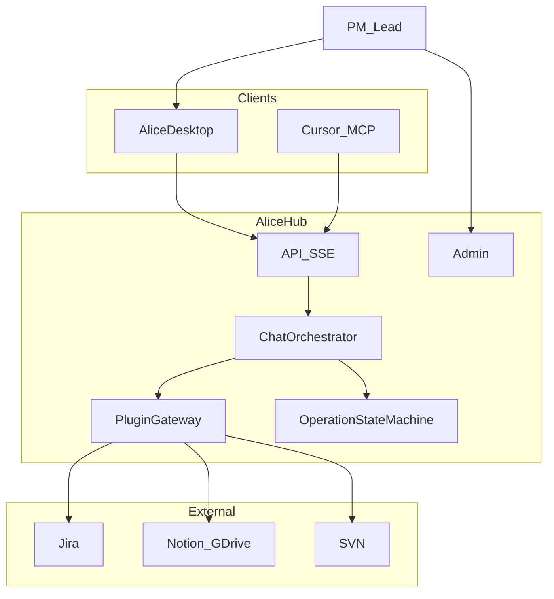

# Alice 三期蓝图计划

> **文档性质**：产品开发白皮书 · 开发校准唯一路径  
> **版本**：v1.0 | **日期**：2026-06-05 | **状态**：已批准执行  
> **部署形态**：私有化 Hub（单机）+ 各用户 Alice 客户端 + Admin 统一配链  
> **成本约束**：基础设施仅开源可自托管；LLM 按量 API；不采购商业中间件/SaaS  

**相关文档**：[Master PRD](Alice_Master_PRD_v1.0.md) · [技术架构](Alice_Master_Architecture_v1.0.md) · [API 契约](Alice_API_Contract_v1.0.md) · [灰盒 SOP](Alice_Graybox_SOP_v1.0.md) · [Baize 对照](Baize_Architecture_v1.0.md)

---

## 1. 产品愿景与终极形态

### 1.1 定位

Alice 是 **研发协同中间件（Orchestration Hub）**，不是长期意义上的「Jira 聊天框」。

| 链路 | 说明 |
|------|------|
| 纵向 | 开发者 **Cursor（执行 Agent）** ↔ Alice（策略 / 审计 / 状态）↔ **Jira（事实源）** |
| 横向 | PM / 主程在 Alice **管控面** 审批写操作、查看队列与健康度 |
| A2A | 机器间通过 **MCP + operation_id + Audit**；人通过 **HITL + 必要时聊天** |

### 1.2 三期总览

| 期 | 时间盒 | 产品定位 | 出口里程碑 |
|----|--------|----------|------------|
| **近期** | 0–4 月 | 可信工作台：聊天 + 审批 + Admin 稳定 | 内部日常可用 + eval 门禁 + API v1 文档冻结 |
| **中期** | 4–10 月 | 团队中枢：管控台 + Cursor MCP 试点 | 3 条 Cursor E2E + MCP 只读/半自动写 |
| **远期** | 10–18 月 | A2A 中间件，可对外私有化售卖 | 全链路 A2E 演示 + 第二家工作室部署 POC |

### 1.3 部署与配链

- **Hub**：一台服务器运行 `ai_bridge`、Admin、Hub 数据目录（`backend/data/`）。
- **客户端**：Electron 桌面端；仅配置 **Hub URL + 用户标识**（近一期目标：Jira PAT 仅 Hub 持有）。
- **配链**：Jira / Notion / GDrive / SVN / 模型密钥 **仅在 Admin** 配置。

---

## 2. 架构宪法（全期遵守）

以下条款优先于任何单次需求；违反须在 PR 中说明并获架构负责人批准。

| # | 条款 | 说明 |
|---|------|------|
| C1 | Hub-and-Spoke | 外部系统只连 Hub；客户端/Cursor **禁止**直连 Jira |
| C2 | 单一 Operation 状态机 | 审批/草稿/恢复以 `jira_operation_manager` 为唯一真相源；**禁止**用 LangGraph checkpoint 存审批 |
| C3 | 单一编排入口 | 新逻辑进 `chat_orchestrator`；`ai_bridge.py` 仅路由（绞杀者迁移） |
| C4 | 契约优先 | SSE / REST / MCP 共用 `operation_id`、`draft_id`、`conversation_id` |
| C5 | 确定性优先 | JQL、Issue Key、KB-id、revision 由代码处理；LLM 填槽与总结 |
| C6 | Eval 门禁 | 发布前必跑 §6.1 所列评测 |
| C7 | OSS-only | 新基础设施依赖须开源可自托管；MIT/Apache-2.0 优先；AGPL 须审查 |
| C8 | 近一期存储 | **仅** JSON 文件 + SQLite（按需）；**不引入** Redis / Temporal（中期再评估） |

### 2.1 非目标（近一期）

- 全量 LangGraph 替换 ReAct（保留 `ALICE_ENGINE` 实验开关）
- 全站 asyncio / 更换 ASGI 栈
- Cursor 无审批自动写 Jira
- 多租户 SaaS
- 商业软件采购（Camunda 企业版、Glean、LangSmith SaaS、LlamaParse 等）

---

## 3. 技术基座（开源选型）

### 3.1 已采用（保持）

| 类别 | 选型 |
|------|------|
| 协议 | MCP、HTTP/SSE、Jira REST |
| 后端 | Python、Flask、Waitress |
| 前端 | Electron、React、Vite、Zustand、IndexedDB |
| 编排库 | LangGraph（可选，`ALICE_ENGINE=v2`） |
| 向量（试点） | FAISS + LangChain TextSplitter |
| 领域层 | Baize 移植：registry、确认卡、JQL 引擎（`jira_search_engine`） |

### 3.2 中期可引入（仍须 OSS）

| 能力 | 开源方案 | 触发条件 |
|------|----------|----------|
| 长任务 | Temporal | Mailbox 跨天、需可靠续跑 |
| 向量库 | Qdrant / pgvector / Milvus | 文档 chunk 规模 &gt; 单机 FAISS |
| 队列 | Redis | Hub 并发队列瓶颈（优先 SQLite） |
| 可观测 | OTel + Prometheus + Grafana | 对外 SLA |
| 文档解析 | Unstructured | 复杂 Office/PDF |
| 评测（可选） | Langfuse 自托管 | 需 trace 平台时 |

### 3.3 运营成本（非软件采购）

- **LLM**：DeepSeek 或 OpenAI 兼容网关，Admin 配置模型与限流。
- **Jira/KB**：团队已有系统与 PAT。

---

## 4. 非功能需求（NFR）

| 指标 | 近期目标 |
|------|----------|
| 并发 | Hub 支持约 50 活跃用户；单用户限制并行 SSE 流 |
| 延迟 | 闲聊 P95 首 token &lt; 3s；Jira 结构化读 P95 &lt; 15s |
| 记忆 | 团队规则：Hub `shallow_memory.json`；会话：客户端 IndexedDB；作业状态：Hub operations/draft |
| 上下文 | 闲聊：单轮无工具；作业：8k 摘要；VIP：禁止无关历史 |
| 可观测 | 每请求：request_id、intent_label、lane、外部 HTTP 状态码 |
| 连接诊断 | Admin Jira 测试区分 **502 网关** vs **401 凭据** |

---

## 5. 可执行开发计划（WBS）

**状态符号**：`[x]` 已完成基线 · `[ ]` 待做 · `[-]` 进行中  

**优先级**：P0 阻塞商用 · P1 本期必做 · P2 可延期  

### 5.1 近期 Epic 总表

| Epic | 名称 | 优先级 | 目标完成 |
|------|------|--------|----------|
| E1 | 编排绞杀者 | P0 | 近一期 M2 |
| E2 | HITL 闭环 | P0 | 近一期 M2 |
| E3 | Eval 发布门禁 | P0 | 近一期 M1 |
| E4 | Hub 独占凭据 | P1 | 近一期 M3 |
| E5 | 路由消歧 | P1 | 近一期 M2 |
| E6 | RAG / 上下文 | P1 | 近一期 M3 |
| E7 | Admin 运维体验 | P1 | 近一期 M1 |

**近期里程碑**

| 里程碑 | 时间 | 验收 |
|--------|------|------|
| M1 | 近一期第 4 周 | E3 + E7 完成；灰盒 SOP 可跑通 | **已交付 v1.0.2** |
| M2 | 近一期第 8 周 | E1 + E2 + E5 完成；PRD 写路径点验 | **代码 v1.0.6**（灰盒点验待签字） |
| M3 | 近一期第 16 周 | E4 + E6 完成；内部「日常可用」签字 | **代码 v1.0.6**（E6.5 hybrid 已接；日常可用待签字） |

---

### 5.2 E3 — Eval 发布门禁（P0）

| ID | 任务 | 交付物 | DoD | 状态 |
|----|------|--------|-----|------|
| E3.1 | 扩展 `eval/datasets/kb_matrix.yaml` | 用例 ≥ 20 条 | CI 可跑通 | [x] v1.1 共 20 条 + validate 脚本 |
| E3.2 | 闲聊误触发 Jira 用例 | `scripts/smoke_chat_only.py` 入 CI | 「你好」无 plugin_state | [x] ci-gate 可选集成 |
| E3.3 | coordinator 金标子集 | `eval/reports/` 基线报告 | 通过率基线存档 | [x] coordinator_m1 + baseline_M1 |
| E3.4 | 发布 checklist | `docs/master/Alice_Graybox_SOP_v1.0.md` §发布 | 发版必须勾选 | [x] §八 + release_checklist_M1 |
| E3.5 | PR 门禁 | GitHub Actions / 本地 `run_eval` | main 合并前失败则阻断 | [x] ci-gate.yml + scripts/ci_gate.py |

---

### 5.3 E7 — Admin 运维体验（P1）

| ID | 任务 | 交付物 | DoD | 状态 |
|----|------|--------|-----|------|
| E7.1 | Jira 测试连接错误文案 | `test_jira_connection` + Admin UI | 502/401/超时 三类提示 | [x] error_category + 中文文案 |
| E7.2 | `/health` 扩展 | jira/kb/model 探活摘要 | Admin 仪表盘可读 | [x] integrations + Admin 顶栏 |
| E7.3 | 配置备份说明 | Admin 文档一节 | shallow_memory + global_config 备份步骤 | [x] Settings 备份卡片 |

---

### 5.4 E5 — 路由消歧（P1）

| ID | 任务 | 交付物 | DoD | 状态 |
|----|------|--------|-----|------|
| E5.1 | `route_intent` 使用 confidence | `intent_router.py` | &lt;0.8 不静默收窄工具 | [x] |
| E5.2 | `intent_disambiguation` SSE | `ai_bridge` + 契约文档 | 前端可选卡片 | [x] |
| E5.3 | 与 Jira user supplement 统一 UX | `JiraSearchSupplement` 规范 | 设计稿一种交互 | [x] kind=intent |
| E5.4 | 扩充 fast-path 规则 | `intent_classifier` | 自测 23+5 全绿 | [x] 基线已有 |

---

### 5.5 E2 — HITL 闭环（P0）

| ID | 任务 | 交付物 | DoD | 状态 |
|----|------|--------|-----|------|
| E2.1 | Draft/Confirm 卡片 | 前端组件 | PRD #14–17 点验 | [x] 基线已有 |
| E2.2 | `operation_progress` SSE | 后端事件 + 前端进度 | 写 Jira 过程可见 | [x] confirm?stream=1 + operationConfirmStream |
| E2.3 | F5 恢复第一步草稿 | `chatSlice` + 后端 draft 持久化 | 刷新见 draft_card | [x] GET /drafts + restorePendingDrafts |
| E2.4 | `recovery_required` UI | ConfirmCard 扩展 | 可补字段并续跑 | [x] recovery actions + retry_without_labels |
| E2.5 | 待审批聚合页 | 新视图或 Sidebar 区 | `GET /operations/pending` 一览 | [x] Sidebar 待处理区 |
| E2.6 | HTTP e2e | `scripts/e2e_short_draft_memory.py` 维护 | CI 绿 | [x] 基线已有 |

---

### 5.6 E1 — 编排绞杀者（P0）

| ID | 任务 | 交付物 | DoD | 状态 |
|----|------|--------|-----|------|
| E1.1 | 新建 `chat_orchestrator.py` | 模块 | VIP 快车道迁入 | [x] iter_preflight_sse + VIP |
| E1.2 | 新建 `plugin_gateway.py` | 模块 | 草稿/写/危险拦截迁入 | [x] draft/write 快车道 |
| E1.3 | `ai_bridge` 瘦身 | 路由 + 配置 | 净新增业务逻辑禁止堆在 bridge | [x] ReAct → react_runner + orchestrator 预检 |
| E1.4 | chat-only 道保留 | `should_use_chat_only_lane` | 闲聊无 Jira | [x] |
| E1.5 | 单测 / 冒烟 | `tests/` + smoke 脚本 | 核心路径不回归 | [x] test_chat_orchestrator |

---

### 5.7 E4 — Hub 独占凭据（P1）

| ID | 任务 | 交付物 | DoD | 状态 |
|----|------|--------|-----|------|
| E4.1 | 客户端移除 Jira PAT 必填 | `runtimeConfig` | 仅 Hub URL | [x] |
| E4.2 | Hub 代理全部 Jira 写读 | `jira_api` | 客户端无 Jira 直连 | [x] ALICE_HUB_ONLY_JIRA |
| E4.3 | 迁移指南 | 文档 | 现有用户升级步骤 | [x] E4_hub_credentials_migration.md |

---

### 5.8 E6 — RAG 与上下文（P1）

| ID | 任务 | 交付物 | DoD | 状态 |
|----|------|--------|-----|------|
| E6.1 | `read_specific_doc` 骨架截断 | backend | 超长 HTML 先提取 heading/summary | [x] doc_content_extractor |
| E6.2 | 确定性 L1 加强 | catalog 检索 | Issue Key / KB-id 穿透 | [x] catalog Key 前置 |
| E6.3 | shallow memory 按 intent 过滤 | `memory_manager` | 无关规则不注入 | [x] |
| E6.4 | 作业通道 8k 摘要 | orchestrator | 保留 Issue Key + 最近 operation | [x] format_job_channel_context |
| E6.5 | hybrid 检索试点 | FAISS + 关键词 | 仅对已索引文档；eval 提升 | [x] catalog+ALICE_HYBRID_RAG |

---

### 5.9 中期计划（4–10 月）摘要

| Epic | 关键任务 | DoD |
|------|----------|-----|
| M1 MCP Server | `tools/registry.yaml` → MCP；审计强制 | Cursor 可调 Hub 工具 |
| M2 Mailbox | SQLite 任务表；`task_id` 协议 | 派工/拉取/回报 |
| M3 HITL 控制台 v1 | 待审批/进行中/失败/链路健康 | 默认入口非聊天 |
| M4 角色 | 开发者/PM/Admin；操作绑定 user_id | 审批可追溯 |
| M5 工作流模板 | 版本日检查、策划→子任务草稿 | 2 个模板上线 |
| M6 API v1 冻结 | 契约版本号；兼容策略文档 | 客户端升级不碎 |

**中期存储**：Mailbox 用 **SQLite**；仅当瓶颈明确再评估 Redis（须过 C7/C8 变更）。

---

### 5.10 远期计划（10–18 月）摘要

| Epic | 关键任务 | DoD |
|------|----------|-----|
| F1 A2A 闭环 | 派工→Cursor→SVN→回报→Jira | 单条流水线演示 |
| F2 多 Agent | 编码/审查/文档 Agent 统一 Mailbox | 3 类 Agent 协议 |
| F3 商业化包 | 安装包、实施文档、Alice 自有许可 | 第二家工作室 2 周部署 |
| F4 合规 | 审计导出、保留策略、密钥轮换 | 外售法务可审 |

---

## 6. 发布与校准

### 6.1 发布门禁（近期每次发版）

- [x] `py -3 backend/intent_classifier.py` 全绿（见 `release_2026-06-05.md`）  
- [x] `py -3 scripts/ci_gate.py` → `CI_GATE_OK`  
- [ ] `py -3 scripts/smoke_chat_only.py` → `SMOKE_CHAT_ONLY_OK`  
- [ ] `py -3 scripts/e2e_short_draft_memory.py` → `E2E_SHORT_OK`  
- [ ] `py -3 backend/run_eval.py coordinator_m1` 不低于 `eval/reports/coordinator_baseline_M1.md`  
- [ ] 灰盒 SOP §八勾选 + `eval/reports/release_YYYY-MM-DD.md`  

### 6.2 需求校准规则

1. **新功能**必须映射到本表 §5 的 Epic/ID；无 ID 则先补计划再开发。  
2. **架构例外**须违反宪法条款编号 + 负责人批准（PR 描述）。  
3. **中期/远期**需求不得提前破坏近期 C8（如近一期引入 Redis）。  
4. **Master PRD** 记功能；**本文档**记路径与顺序；冲突时以 **本文档三期** 为准。  

### 6.3 进度更新

- 每完成 WBS 项：将 `[ ]` 改为 `[x]` 并注明版本号（如 `v1.0.1`）。  
- 每里程碑：在 `eval/reports/` 留存签字纪要（可 markdown）。  

---

## 7. 文档索引

| 文档 | 用途 |
|------|------|
| **本文档** | 开发路径与白皮书（唯一校准源） |
| [Alice_Master_PRD_v1.0.md](Alice_Master_PRD_v1.0.md) | 功能需求与角色场景 |
| [Alice_Master_Architecture_v1.0.md](Alice_Master_Architecture_v1.0.md) | 技术栈与模块图 |
| [Alice_API_Contract_v1.0.md](Alice_API_Contract_v1.0.md) | 接口与 SSE 事件 |
| [Alice_Graybox_SOP_v1.0.md](Alice_Graybox_SOP_v1.0.md) | 人工验收步骤 |
| [TECHNICAL.md](TECHNICAL.md) | VIP / ReAct 实现细节 |
| [README.md](README.md) | 本目录文档索引 |
| [AGENTS.md](../../AGENTS.md) | 仓库 Agent 入口 |

---

## 修订记录

| 版本 | 日期 | 说明 |
|------|------|------|
| v1.0.6 | 2026-06-05 | 里程碑债务收口：submit_supplement UI、E6.5 hybrid、发版纪要 |
| v1.0.5 | 2026-06-05 | M3 骨架：E4 Hub 凭据 + E6 上下文；M2 收尾 E5 路由消歧 |
| v1.0.4 | 2026-06-05 | M2：E1 ReAct 迁出 + E2 HITL SSE/恢复 + 里程碑纪要 |
| v1.0.3 | 2026-06-05 | M2 启动 E1：chat_orchestrator + plugin_gateway 绞杀者预检 |
| v1.0.2 | 2026-06-05 | M1：E3 Eval 门禁 + E7 Admin 运维（CI、health、kb_matrix 20 条） |
| v1.0.1 | 2026-06-05 | master 文档索引与发版门禁对齐；治理规则落盘 |
| v1.0 | 2026-06-05 | 首期可执行版：近/中/远 WBS + 架构宪法 + OSS 约束 |
