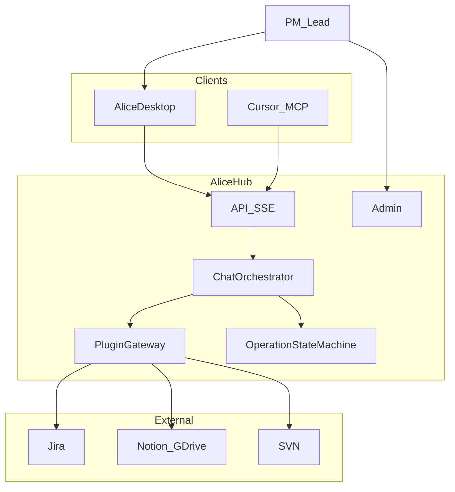
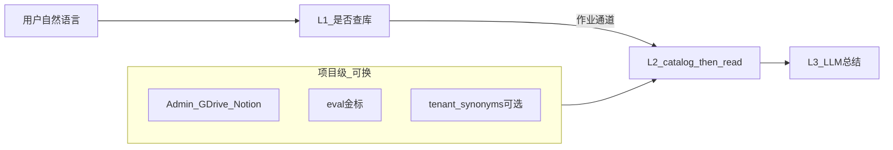

# Alice 三期蓝图计划

> **文档性质**：产品开发白皮书 · 开发校准唯一路径  
> **版本**：v1.4 | **日期**：2026-06-09 | **状态**：已批准执行（客户端角色体系概念 + Cursor SDK v1.2 修正）  
> **部署形态**：私有化 Hub（单机）+ 各用户 Alice 客户端 + Admin 统一配链  
> **成本约束**：基础设施仅开源可自托管；LLM 按量 API；不采购商业中间件/SaaS  

**相关文档**：[Master PRD](Alice_Master_PRD_v1.0.md) · [技术架构](Alice_Master_Architecture_v1.0.md) · [API 契约](Alice_API_Contract_v1.0.md) · [灰盒 SOP](Alice_Graybox_SOP_v1.0.md) · [Baize 对照](Baize_Architecture_v1.0.md)

---

## 1. 产品愿景与终极形态

### 1.1 定位

Alice 是 **研发协同中间件（Orchestration Hub）**，不是长期意义上的「Jira 聊天框」。

| 链路 | 说明 |
|------|------|
| 纵向 | 开发者 **Cursor（执行 Agent）** ↔ Alice（策略 / 审计 / 状态）↔ **Jira（事实源）** |
| 横向 | PM / 主程在 Alice **管控面** 审批写操作、查看队列与健康度 |
| A2A | 机器间通过 **MCP + operation_id + Audit**；人通过 **HITL + 必要时聊天** |

### 1.2 三期总览

| 期 | 时间盒 | 产品定位 | 出口里程碑 |
|----|--------|----------|------------|
| **近期** | 0–4 月 | 可信工作台：聊天 + 审批 + Admin 稳定 | 内部日常可用 + eval 门禁 + **API v1 已冻结（§5.11）** |
| **中期** | 4–10 月 | 团队中枢：管控台 + Cursor MCP 试点 | 3 条 Cursor E2E + MCP 只读/半自动写 |
| **远期** | 10–18 月 | A2A 中间件，可对外私有化售卖 | 全链路 A2E 演示 + 第二家工作室部署 POC |

### 1.3 部署与配链

- **Hub**：一台服务器运行 `ai_bridge`、Admin、Hub 数据目录（`backend/data/`）。
- **客户端**：Electron 桌面端；仅配置 **Hub URL + 用户标识**（近一期目标：Jira PAT 仅 Hub 持有）。
- **配链**：Jira / Notion / GDrive / SVN / 模型密钥 **仅在 Admin** 配置。



---

## 2. 架构宪法（全期遵守）

以下条款优先于任何单次需求；违反须在 PR 中说明并获架构负责人批准。

| # | 条款 | 说明 |
|---|------|------|
| C1 | Hub-and-Spoke | 外部系统只连 Hub；客户端/Cursor **禁止**直连 Jira |
| C2 | 单一 Operation 状态机 | 审批/草稿/恢复以 `jira_operation_manager` 为唯一真相源；**禁止**用 LangGraph checkpoint 存审批 |
| C3 | 单一编排入口 | 新逻辑进 `chat_orchestrator`；`ai_bridge.py` 仅路由（绞杀者迁移） |
| C4 | 契约优先 | SSE / REST / MCP 共用 `operation_id`、`draft_id`、`conversation_id` |
| C5 | 确定性优先（管道） | **管道确定性**：JQL、Issue Key、KB-id、revision、工具契约、防编造由代码保证；**语义与业务槽位**由 LLM 从用户句抽取后总结。**不等于**把知识库正文写进代码 |
| C6 | Eval 门禁 | 发布前必跑 §6.1 所列评测 |
| C7 | OSS-only | 新基础设施依赖须开源可自托管；MIT/Apache-2.0 优先；AGPL 须审查 |
| C8 | 近一期存储 | **仅** JSON 文件 + SQLite（按需）；**不引入** Redis / Temporal（中期再评估） |
| C9 | 知识库多项目 | 见 §2.2；**禁止**在代码中硬编码某一项目的业务名词用于路由/检索；项目差异走 Admin、eval、可选 `tenant_synonyms.json` |

### 2.1 非目标（近一期）

- 全量 LangGraph 替换 ReAct（保留 `ALICE_ENGINE` 实验开关）
- 全站 asyncio / 更换 ASGI 栈
- Cursor 无审批自动写 Jira
- 多租户 SaaS
- 商业软件采购（Camunda 企业版、Glean、LangSmith SaaS、LlamaParse 等）
- **新增（v1.1）**：不支持用 Cursor SDK 替代 Alice 核心引擎（仅作编排道）

### 2.2 知识库答题设计（多项目）

Alice 面向**多种项目**复用同一套 Hub：用户自然语言 → AI **理解语义** → 系统 **逐层检索**（catalog → read）→ 基于真实文档回答。

**红线（C9）**：`backend/`、`frontend/` **不得**写入某一项目的业务实体词（如具体系统名、位置枚举、名单）来锁定检索或路由。  
**允许**：读 GDrive/Notion、文件名匹配、表头识别、Issue Key 格式、多轮是否再调工具。



| 层 | 职责 | 主要实现 | 换项目是否改代码 |
|----|------|----------|------------------|
| L1 | 闲聊 vs 查库；工具子集 | `chat_orchestrator`、`intent_classifier`（通用）、`intent_router`（LLM） | 否 |
| L2 | 找文档、读表、按槽位筛行 | `search_docs_catalog`、`read_specific_doc`、`gdrive_knowledge` | 否 |
| L3 | 组织答案、引用来源 | ReAct + 反幻觉 prompt | 否 |
| 知识内容 | 文档正文与名单 | GDrive / Notion | **不进代码** |

**换项目检查清单**（例：足球 → 乒乓球）：(1) Admin 换目录 (2) 换 `eval/datasets` 金标 (3) 可选 `tenant_synonyms.json` (4) 跑 eval；(5) 若失败只修**通用** L2/L3，禁止在 regex 写「乒乓球」。

**内测案例归属**：原话 → `eval/reports/user_test_feedback.md`；金标 → `eval/datasets/gdrive_sheet_cases.yaml`（如 gsheet-001/002）；**不进** `intent_classifier`。

**明确不做**：为每个位置/项目加 Python `if`；用硬编码名单代替 `read_specific_doc`；为单条内测通过堆领域 regex。

#### C9 细则

| 子项 | 规则 |
|------|------|
| C9.1 | 禁止业务名词、名单、位置枚举硬编码于路由/检索代码 |
| C9.2 | 项目差异：Admin 配置、eval 金标、可选 `backend/data/tenant_synonyms.json` |
| C9.3 | L1：通用作业信号 + `intent_router` LLM；禁止为单用例加领域 regex |
| C9.4 | L2：筛选来自 LLM 槽位或表头识别，非写死列含义 |
| C9.5 | L3：多轮换条件须再调 catalog+read |
| C9.6 | PR 改动 `intent_classifier` 新模式须通过 `scripts/check_kb_domain_hardcode.py` 或说明例外 |

---

## 3. 技术基座（开源选型）

### 3.1 已采用（保持）

| 类别 | 选型 |
|------|------|
| 协议 | MCP、HTTP/SSE、Jira REST |
| 后端 | Python、Flask、Waitress |
| 前端 | Electron、React、Vite、Zustand、IndexedDB |
| 编排库 | LangGraph（可选，`ALICE_ENGINE=v2`） |
| 向量（试点） | FAISS + LangChain TextSplitter |
| 领域层 | Baize 移植：registry、确认卡、JQL 引擎（`jira_search_engine`） |

### 3.2 中期可引入（仍须 OSS）

| 能力 | 开源方案 | 触发条件 |
|------|----------|----------|
| 长任务 | Temporal | Mailbox 跨天、需可靠续跑 |
| 向量库 | Qdrant / pgvector / Milvus | 文档 chunk 规模 &gt; 单机 FAISS |
| 队列 | Redis | Hub 并发队列瓶颈（优先 SQLite） |
| 可观测 | OTel + Prometheus + Grafana | 对外 SLA |
| 文档解析 | Unstructured | 复杂 Office/PDF |
| 评测（可选） | Langfuse 自托管 | 需 trace 平台时 |

### 3.3 运营成本（非软件采购）

- **LLM**：DeepSeek 或 OpenAI 兼容网关，Admin 配置模型与限流。
- **Jira/KB**：团队已有系统与 PAT。

---

## 4. 非功能需求（NFR）

| 指标 | 近期目标 |
|------|----------|
| 并发 | Hub 支持约 50 活跃用户；单用户限制并行 SSE 流 |
| 延迟 | 闲聊 P95 首 token &lt; 3s；Jira 结构化读 P95 &lt; 15s |
| 记忆 | 团队规则：Hub `shallow_memory.json`；会话：客户端 IndexedDB；作业状态：Hub operations/draft |
| 上下文 | 闲聊：单轮无工具；作业：8k 摘要；VIP：禁止无关历史 |
| 可观测 | 每请求：request_id、intent_label、lane、外部 HTTP 状态码 |
| 连接诊断 | Admin Jira 测试区分 **502 网关** vs **401 凭据** |

---

## 5. 可执行开发计划（WBS）

**状态符号**：`[x]` 已完成基线 · `[ ]` 待做 · `[-]` 进行中  

**优先级**：P0 阻塞商用 · P1 本期必做 · P2 可延期  

### 5.1 近期 Epic 总表

| Epic | 名称 | 优先级 | 目标完成 |
|------|------|--------|----------|
| E1 | 编排绞杀者 | P0 | 近一期 M2 |
| E2 | HITL 闭环 | P0 | 近一期 M2 |
| E3 | Eval 发布门禁 | P0 | 近一期 M1 |
| E4 | Hub 独占凭据 | P1 | 近一期 M3 |
| E5 | 路由消歧 | P1 | 近一期 M2 |
| E6 | RAG / 上下文 | P1 | 近一期 M3 |
| E7 | Admin 运维体验 | P1 | 近一期 M1 |

**近期里程碑**

| 里程碑 | 时间 | 验收 |
|--------|------|------|
| M1 | 近一期第 4 周 | E3 + E7 完成；灰盒 SOP 可跑通 | **已交付 v1.0.2** |
| M2 | 近一期第 8 周 | E1 + E2 + E5 完成；CI + 集成脚本 | **已交付 v1.0.6** |
| M3 | 近一期第 16 周 | E4 + E6 完成；CI + 集成脚本 | **已交付 v1.0.6** |

---

### 5.2 E3 — Eval 发布门禁（P0）

| ID | 任务 | 交付物 | DoD | 状态 |
|----|------|--------|-----|------|
| E3.1 | 扩展 `eval/datasets/kb_matrix.yaml` | 用例 ≥ 20 条 | CI 可跑通 | [x] v1.1 共 20 条 + validate 脚本 |
| E3.2 | 闲聊误触发 Jira 用例 | `scripts/smoke_chat_only.py` 入 CI | 「你好」无 plugin_state | [x] ci-gate 可选集成 |
| E3.3 | coordinator 金标子集 | `eval/reports/` 基线报告 | 通过率基线存档 | [x] coordinator_m1 + baseline_M1 |
| E3.4 | 发布 checklist | `docs/master/Alice_Graybox_SOP_v1.0.md` §发布 | 发版必须勾选 | [x] §八 + release_checklist_M1 |
| E3.5 | PR 门禁 | GitHub Actions / 本地 `run_eval` | main 合并前失败则阻断 | [x] ci-gate.yml + scripts/ci_gate.py |

---

### 5.3 E7 — Admin 运维体验（P1）

| ID | 任务 | 交付物 | DoD | 状态 |
|----|------|--------|-----|------|
| E7.1 | Jira 测试连接错误文案 | `test_jira_connection` + Admin UI | 502/401/超时 三类提示 | [x] error_category + 中文文案 |
| E7.2 | `/health` 扩展 | jira/kb/model 探活摘要 | Admin 仪表盘可读 | [x] integrations + Admin 顶栏 |
| E7.3 | 配置备份说明 | Admin 文档一节 | shallow_memory + global_config 备份步骤 | [x] Settings 备份卡片 |

---

### 5.4 E5 — 路由消歧（P1）

| ID | 任务 | 交付物 | DoD | 状态 |
|----|------|--------|-----|------|
| E5.1 | `route_intent` 使用 confidence | `intent_router.py` | &lt;0.8 不静默收窄工具 | [x] |
| E5.2 | `intent_disambiguation` SSE | `ai_bridge` + 契约文档 | 前端可选卡片 | [x] |
| E5.3 | 与 Jira user supplement 统一 UX | `JiraSearchSupplement` 规范 | 设计稿一种交互 | [x] kind=intent |
| E5.4 | 扩充 fast-path 规则 | `intent_classifier` | 自测 23+5 全绿 | [x] 基线已有 |

---

### 5.5 E2 — HITL 闭环（P0）

| ID | 任务 | 交付物 | DoD | 状态 |
|----|------|--------|-----|------|
| E2.1 | Draft/Confirm 卡片 | 前端组件 | PRD #14–17 点验 | [x] 基线已有 |
| E2.2 | `operation_progress` SSE | 后端事件 + 前端进度 | 写 Jira 过程可见 | [x] confirm?stream=1 + operationConfirmStream |
| E2.3 | F5 恢复第一步草稿 | `chatSlice` + 后端 draft 持久化 | 刷新见 draft_card | [x] GET /drafts + restorePendingDrafts |
| E2.4 | `recovery_required` UI | ConfirmCard 扩展 | 可补字段并续跑 | [x] recovery actions + retry_without_labels |
| E2.5 | 待审批聚合页 | 新视图或 Sidebar 区 | `GET /operations/pending` 一览 | [x] Sidebar 待处理区 |
| E2.6 | HTTP e2e | `scripts/e2e_short_draft_memory.py` 维护 | CI 绿 | [x] 基线已有 |

---

### 5.6 E1 — 编排绞杀者（P0）

| ID | 任务 | 交付物 | DoD | 状态 |
|----|------|--------|-----|------|
| E1.1 | 新建 `chat_orchestrator.py` | 模块 | VIP 快车道迁入 | [x] iter_preflight_sse + VIP |
| E1.2 | 新建 `plugin_gateway.py` | 模块 | 草稿/写/危险拦截迁入 | [x] draft/write 快车道 |
| E1.3 | `ai_bridge` 瘦身 | 路由 + 配置 | 净新增业务逻辑禁止堆在 bridge | [x] ReAct → react_runner + orchestrator 预检 |
| E1.4 | chat-only 道保留 | `should_use_chat_only_lane` | 闲聊无 Jira | [x] |
| E1.5 | 单测 / 冒烟 | `tests/` + smoke 脚本 | 核心路径不回归 | [x] test_chat_orchestrator |

---

### 5.7 E4 — Hub 独占凭据（P1）

| ID | 任务 | 交付物 | DoD | 状态 |
|----|------|--------|-----|------|
| E4.1 | 客户端移除 Jira PAT 必填 | `runtimeConfig` | 仅 Hub URL | [x] |
| E4.2 | Hub 代理全部 Jira 写读 | `jira_api` | 客户端无 Jira 直连 | [x] ALICE_HUB_ONLY_JIRA |
| E4.3 | 迁移指南 | 文档 | 现有用户升级步骤 | [x] E4_hub_credentials_migration.md |

---

### 5.8 E6 — RAG 与上下文（P1）

| ID | 任务 | 交付物 | DoD | 状态 |
|----|------|--------|-----|------|
| E6.1 | `read_specific_doc` 骨架截断 | backend | 超长 HTML 先提取 heading/summary | [x] doc_content_extractor |
| E6.2 | 确定性 L1 加强 | catalog 检索 | Issue Key / KB-id 穿透 | [x] catalog Key 前置 |
| E6.3 | shallow memory 按 intent 过滤 | `memory_manager` | 无关规则不注入 | [x] |
| E6.4 | 作业通道 8k 摘要 | orchestrator | 保留 Issue Key + 最近 operation | [x] format_job_channel_context |
| E6.5 | hybrid 检索试点 | FAISS + 关键词 | 仅对已索引文档；eval 提升 | [x] catalog+ALICE_HYBRID_RAG |

---

### 5.9 中期计划（4–10 月）WBS

**中期出口里程碑**：M3 控制台可审批 · M2 Mailbox 派工/拉取/回报 E2E 绿 · M4 审批可追溯 · M5 两模板可触发。

**执行纪律**（§6.2 补充）：每个 `M*.n` 须单独交付——代码 + 契约（若涉 API）+ 自动化（单测/e2e/eval）+ 本表 `[x]`；禁止无测试标完成。

#### Epic 总表

| Epic | 关键任务 | DoD | 状态 |
|------|----------|-----|------|
| M1 MCP Server | registry → HTTP/stdio MCP；只读审计 | `cursor_e2e_mcp.py` 3 条绿 | [x] v1.0.7 |
| M2 Mailbox | SQLite 任务表 + `mailbox_task_id` 协议 | 派工/拉取/回报 + MCP + E2E | [x] v1.0.12 |
| M3 HITL 控制台 v1 | 审批台 + `/operations` | 侧栏入口 + 控制台内可审批 | [x] v1.0.11 |
| M4 角色与审计 | `user_id` 绑定 + 审批人落盘 | confirm/reject 可追溯 + audit API | [x] v1.0.15（M4.1–M4.8 全量交付） |
| M5 工作流模板 | 版本日检查、策划→子任务 | 2 模板 + 2 金标 | [x] v1.0.20（M5 全量交付） |
| M6 API v1 冻结 | additive-only | 契约 §零 + `/health` api_version | [x] v1.0.7 |

**中期存储**：Mailbox 用 **SQLite**（`backend/data/mailbox.db`）；仅当瓶颈明确再评估 Redis（须过 C7/C8 变更）。

**ID 命名约定**（避免与现有代码冲突）：

| 字段 | 用途 | 模块 |
|------|------|------|
| `operation_id` | HITL Jira 写审批 | `jira_operation_manager` |
| `mailbox_task_id` | Agent 派工队列（M2） | `mailbox_store`（新建） |
| `admin_batch_task_id` | Admin 批量分析（现有内存队列，M2.8 重命名） | `ai_bridge` |

#### M1 明细（已完成）

| ID | 任务 | 交付物 | DoD | 状态 |
|----|------|--------|-----|------|
| M1.1 | MCP registry | `mcp_registry.py` | readonly 工具清单 | [x] |
| M1.2 | HTTP shim | `GET/POST /mcp/v1/tools` | Cursor 可调 | [x] |
| M1.3 | stdio Server | `hub_mcp_server.py` | FastMCP 启动 | [x] |
| M1.4 | 审计 | `audit_gateway` on invoke | 写工具拒绝 | [x] |
| M1.5 | E2E | `scripts/cursor_e2e_mcp.py` | 3 只读绿 | [x] |

#### M2 明细 — Mailbox

| ID | 任务 | 交付物 | 依赖 | DoD | KB 影响 | 状态 |
|----|------|--------|------|-----|---------|------|
| M2.1 | 数据模型 | `mailbox_schema.sql` + `mailbox_store.py` | — | 表 `mailbox_tasks`：id, status, assignee, payload_json, result_json, created_at, updated_at, operation_id(可选) | 无 | [x] v1.0.10 |
| M2.2 | `mailbox_task_id` 契约 | `Alice_API_Contract_v1.0.md` §Mailbox | M2.1 | 文档区分三种 ID；状态机 pending → claimed → done / failed | 无 | [x] v1.0.10 |
| M2.3 | 派工 API | `POST /v1/mailbox/dispatch` | M2.1 | 创建任务并返回 `mailbox_task_id`；payload 校验 | 无 | [x] v1.0.10 |
| M2.4 | 拉取 API | `GET /v1/mailbox/tasks` | M2.1 | 按 assignee/status 拉取；`?status=pending&limit=` | 无 | [x] v1.0.10 |
| M2.5 | 回报 API | `POST /v1/mailbox/tasks/<id>/report` | M2.1 | 写入 result_json；状态 done/failed；非法转移 409 | 无 | [x] v1.0.10 |
| M2.6 | 与 Operation SM 边界 | `mailbox_store.py` + 注释 | M2.1, C2 | Mailbox 不存审批状态；`operation_id` 仅引用 | 无 | [x] v1.0.10 |
| M2.7 | MCP 工具 | `mcp_registry` 增 pull/report | M2.3–M2.5 | `e2e_mailbox_mcp.py` 或扩展现有 MCP e2e ≥1 条绿 | 无 | [x] v1.0.12 |
| M2.8 | 清理命名冲突 | `ai_bridge.py` 内存队列 | — | `task_id` 改名为 `admin_batch_task_id`；契约 §4.5 同步 | 无 | [x] v1.0.15 |
| M2.9 | E2E | `scripts/e2e_mailbox.py` | M2.3–M2.5 | dispatch → pull → report 全链路 | 无 | [x] v1.0.10 |
| M2.10 | 控制台可见性（P2） | OperationsConsole 或 Admin | M2.9 | 只读任务列表 | 无 | [ ] |

#### M3 明细 — HITL 控制台

| ID | 任务 | 交付物 | 依赖 | DoD | KB 影响 | 状态 |
|----|------|--------|------|-----|---------|------|
| M3.1 | 操作列表 API | `GET /operations` | — | 按 status 过滤 | 无 | [x] |
| M3.2 | 前端管控台 | `OperationsConsole.tsx` | M3.1 | 健康 + 待审批 + 失败列表 | 无 | [x] |
| M3.3 | 侧栏入口 | `Sidebar.tsx` + `uiSlice` | M3.2 | 「审批管控台」可切换 | 无 | [x] |
| M3.4 | 控制台内 confirm/reject | `OperationsConsole.tsx` | M3.2 | 单条审批；复用 `POST /operations/<id>/confirm\|reject` | 无 | [x] v1.0.11 |
| M3.5 | 批量审批 | 多选 UI | M3.4 | PM 勾选 N 条依次确认 | 无 | [x] v1.0.11 |
| M3.6 | 跳转会话 | Console → chat | M3.4 | 带 `conversation_id` 回聊天 | 无 | [x] v1.0.11 |
| M3.7 | E2E | `scripts/e2e_operations_console.py` | M3.4 | API 层 list+reject 绿；confirm 依 Jira 环境 | 无 | [x] v1.0.11 |

#### M4 明细 — 角色与审批可追溯

| ID | 任务 | 交付物 | 依赖 | DoD | KB 影响 | 状态 |
|----|------|--------|------|-----|---------|------|
| M4.1 | 客户端身份 | `runtimeConfig.ts` + 请求头 | — | SSE 带 `user_id` | 无 | [x] v1.0.13 |
| M4.2 | 创建时绑定 | `ai_bridge` / `plugin_gateway` | M4.1 | 所有 create operation/draft 写入 `user_id` | 无 | [x] v1.0.13 |
| M4.3 | 审批人落盘 | `jira_operation_manager` + `operation_confirm.py` | M4.2 | `confirmed_by` / `rejected_by` + 时间戳 | 无 | [x] v1.0.13 |
| M4.4 | 列表暴露身份 | `GET /operations` 响应 | M4.3 | 含 creator + approver；契约更新 | 无 | [x] v1.0.14 |
| M4.5 | 角色配置 | `global_config` 或 `skills/registry.yaml` | M4.3 | PM 可审批；未授权 403 | 无 | [x] v1.0.14 |
| M4.6 | 持久审计 | `audit_gateway` + `data/audit.log` | M4.3 | `GET /v1/audit/logs`；重启不丢 | 无 | [x] v1.0.14 |
| M4.7 | 加载 audit_rules | `audit_gateway.py` | — | 读 `skills/registry.yaml` | 无 | [x] v1.0.14 |
| M4.8 | 单测 + E2E | `tests/test_audit_trace.py` | M4.3–M4.6 | confirm 后 audit 含 user_id | 无 | [x] v1.0.15 |

#### M5 明细 — 工作流模板

| ID | 任务 | 交付物 | 依赖 | DoD | KB 影响 | 状态 |
|----|------|--------|------|-----|---------|------|
| M5.1 | 模板注册表 | `workflow_templates.yaml` + `workflow_engine.py` | — | 加载、校验、列出模板 ID | 无 | [x] v1.0.16 |
| M5.2 | 模板 A：版本日检查 | YAML + orchestrator 入口 | M5.1 | JQL 清单 + 检查项；只读 | 无 | [x] v1.0.18 |
| M5.3 | 模板 B：策划→子任务 | YAML + draft 集成 | M5.1, M4.2 | 父 Issue → `create_issues_draft`；HITL | 调用 `search_docs_catalog`（依赖 Phase B） | [x] v1.0.19 |
| M5.4 | 触发入口 | Sidebar + `[WORKFLOW:xxx]` | M5.2, M5.3 | 用户可显式触发 | L1 需覆盖 workflow 信号 | [x] v1.0.20 |
| M5.5 | Eval 金标 | `eval/datasets/workflow_templates.yaml` | M5.2, M5.3 | 每模板 ≥1 条 | 无 | [x] v1.0.20 |

**建议开工顺序**：M3.4 → M3.5–M3.7 → M2.1–M2.9 → M4.1–M4.8 → M5.1–M5.5（M5 依赖 Phase B 与 M4）。

---

### 5.11 近期出口收口（Phase A）

| ID | 任务 | 交付物 | DoD | 状态 |
|----|------|--------|-----|------|
| A1 | E4 rollout | `start_hub.ps1` + desktop env | `e2e_e4_hub_only.py` | [x] |
| A2 | 桌面打包 | `build_release.ps1` | dist 脚本可执行 | [x] |
| A3 | API v1 冻结 | 契约 §零 | `api_version` on `/health` | [x] |
| A4 | coord-004 | `coordinator_m1.yaml` + eval_engine | expect_confirm_card | [x] |
| A5 | Hub 配置同步 | `hubConfig.ts` | 读 health.hub_only_jira | [x] |
| A6 | GDrive 表格热修 | `gdrive_knowledge.py` + H1–H3 | `test_gdrive_knowledge` + 可选 `e2e_gdrive_sheet` | [x] |

#### Phase B — KB 准确性门禁（内测 P0，阻塞 Wave 0，遵守 C9）

**目标**：内测 P0 全绿 + 清偿领域 regex 技术债（§2.2）。

| ID | 任务 | 交付物 | DoD | 状态 |
|----|------|--------|-----|------|
| B1 | 内测原话归档 | [user_test_feedback.md](../../eval/reports/user_test_feedback.md) | 只记原话/期望 | [x] v1.0.9 |
| B2a | 重构 L1 路由 | `intent_classifier.py` | 删除球员/中锋/门将等；通用文档/知识库/列出/名单/表格/KB-id | [x] v1.0.9 |
| B2b | L1 LLM 兜底 | `intent_router.py` | 文档名+列举 → doc_search；fast-path 不依赖领域 classify | [x] v1.0.9 |
| B3 | 聊天路径 e2e | `scripts/e2e_gdrive_chat.py` | gsheet-001 SSE 调 KB 工具 | [x] v1.0.9 |
| B4 | 项目金标 | `gdrive_sheet_cases.yaml` | gsheet-001 + gsheet-002；用例在 eval 不在代码 | [x] v1.0.9 |
| B5 | ci_gate | `scripts/ci_gate.py` | `ALICE_RUN_GDRIVE_E2E=1` 含 gsheet-001/002 | [x] v1.0.9 |
| B6 | L2 表结构筛选 | `gdrive_knowledge.py` + `tenant_synonyms.json` | 表头识别 + 槽位筛行 + 同义词配置 | [x] v1.0.9 |
| B7 | L3 多轮再检索 | orchestrator / ReAct prompt | 换条件追问强制再 catalog+read | [x] v1.0.9 |
| B8 | C9 静态检查 | `scripts/check_kb_domain_hardcode.py` | intent 文件无业务实体词；ci 可选 | [x] v1.0.9 |
| B9 | 文档验收 | §2.2 + C9 | 与实现一致 | [x] v1.0.9 |
| B10 | Wave 0 解除 | 本节暂停说明 | B1–B9 全 [x] | [x] v1.0.26 |

**备注**：曾用领域 regex 使 gsheet-001 中锋通过，属临时债，**不得以 B2 临时方案为终态**；须完成 B2a/B2b。

**暂停**：Wave 0 全员发布（B10）；M3.4 可与 Phase B 并行，见 §5.9。

---

### 5.10 远期计划（10–18 月）摘要

| Epic | 关键任务 | DoD |
|------|----------|-----|
| F1 A2A 闭环 | 派工→Cursor→SVN→回报→Jira | 单条流水线演示 |
| F2 多 Agent | 编码/审查/文档 Agent 统一 Mailbox | 3 类 Agent 协议 |
| F3 商业化包 | 安装包、实施文档、Alice 自有许可 | 第二家工作室 2 周部署 |
| F4 合规 | 审计导出、保留策略、密钥轮换 | 外售法务可审 |

---

## 6. 发布与校准

### 6.1 发布门禁（近期每次发版）

- [x] `py -3 backend/intent_classifier.py` 全绿（见 `release_2026-06-05.md`）  
- [x] `py -3 scripts/ci_gate.py` → `CI_GATE_OK`  
- [x] `ALICE_RUN_INTEGRATION=1` 时 ci_gate 含 `smoke_chat_only` + `e2e_short_draft_memory`  
- [x] （可选）`py -3 backend/run_eval.py coordinator_m1` — 基线 4/5（80%），avg 65%（2026-06-08）  
- [x] （可选）`ALICE_RUN_W6=1` + `W6_ISSUE_KEY` → `e2e_w6_transition.py`（2026-06-08 CT-11152）  
- [x] 发版记录：`eval/reports/release_YYYY-MM-DD.md`（**仅自动化结果，无人工签字**）  

### 6.2 需求校准规则

1. **新功能**必须映射到本表 §5 的 Epic/ID；无 ID 则先补计划再开发。  
2. **架构例外**须违反宪法条款编号 + 负责人批准（PR 描述）。  
3. **中期/远期**需求不得提前破坏近期 C8（如近一期引入 Redis）。  
4. **Master PRD** 记功能；**本文档**记路径与顺序；冲突时以 **本文档三期** 为准。  

### 6.3 进度更新

- 每完成 WBS 项：将 `[ ]` 改为 `[x]` 并注明版本号（如 `v1.0.1`）。  
- 每里程碑：在 `eval/reports/` 留存 **自动化交付记录**（无人工签字要求）。  

---

## 7. 文档索引

| 文档 | 用途 |
|------|------|
| **本文档** | 开发路径与白皮书（唯一校准源） |
| [Alice_Master_PRD_v1.0.md](Alice_Master_PRD_v1.0.md) | 功能需求与角色场景 |
| [Alice_Master_Architecture_v1.0.md](Alice_Master_Architecture_v1.0.md) | 技术栈与模块图 |
| [Alice_API_Contract_v1.0.md](Alice_API_Contract_v1.0.md) | 接口与 SSE 事件 |
| [Alice_Graybox_SOP_v1.0.md](Alice_Graybox_SOP_v1.0.md) | 人工验收步骤 |
| [TECHNICAL.md](TECHNICAL.md) | VIP / ReAct 实现细节 |
| [README.md](README.md) | 本目录文档索引 |
| [AGENTS.md](../../AGENTS.md) | 仓库 Agent 入口 |

---

### 5.12 调试期增强（Phase C）

> 调试期（RABBIT_ROADMAP.md §4）排队的优化和增强项，补齐 Alice 的 Jira 准确度、回答深度、工程分析能力。

| ID | 任务 | 交付物 | DoD | 状态 |
|----|------|--------|-----|:--:|
| C1 | P0 解除阻塞 | `intent_router.py` L266-297 + `react_runner.py` L251-294 | CI_GATE_OK + 13/14 验证剧本 | [x] v1.0.24 |
| C2 | P1-1 NL→结构化 | `jira_query_builder.py` | 8/8 单测 | [x] v1.0.25 |
| C3 | P1-2 单 Issue 增强 | `ai_bridge.py` L1233-1255 重写 | 7/7 单测 | [x] v1.0.26 |
| C4 | P1-3 写审计闸门 | `jira_operation_manager.py` audit_jira_operation + create_operation_card_with_audit | 8/8 单测 | [x] v1.0.27 |
| C5 | P1-4 受控代码分析 | `workspace_manager.py` + `tools/registry.yaml` 4 工具 + `workspace_tools.py` 4 执行器（v1.0.28-1 从 ai_bridge 抽离，遵守 E1.3） | 4/4 单测 + CI_GATE_OK | ⚠️ v1.0.28（已被 Cursor SDK 方向替代，见 §5.13） |
|| C6 | P2-2 Cursor SDK Lane | `cursor_agent_lane.py` + `chat_orchestrator.py` 集成 + 手搓工具标记 deprecated | TBD | 🔲 v1.0.29 |

---

### 5.13 Cursor SDK Lane（Phase D，v1.0.29 · v1.2 修正）

> **v1.2 修正（2026-06-09）**：协调者纠正——Cursor SDK 不应仅做"代码分析"。
> SDK 的核心价值是**开放式多步编排**。所有复杂执行（Jira 创建子任务、改状态、代码分析、跨域综合）
> 都应交由 Cursor SDK，Alice 提供被审计闸门包裹的自定义工具。
>
> **一句话**：Cursor SDK = Alice 的复杂任务执行引擎。DeepSeek ReAct 退守聊聊/简单查询。

**编排流（v1.2）**：

```
用户问题
  │
  ├── chat_orchestrator 预检
  │     ├── 闲聊/简单问候 → chat-only lane（DeepSeek，不变）
  │     ├── 危险拦截 → 拒绝（不变）
  │     │
  │     └── 其他（需执行/分析/多步推理）→ 🎯 Cursor SDK Lane
  │           │
  │           ├── cursor_sdk.Agent.create(
  │           │       model=config.CURSOR_SDK_MODEL,
  │           │       mode="plan",
  │           │       local=LocalAgentOptions(cwd=白名单目录),
  │           │       custom_tools=[
  │           │           # ── 只读工具 ──
  │           │           jira_search_issues,
  │           │           jira_read_issue_detail,
  │           │           read_file, search_code, svn_log, list_directory,
  │           │           # ── 写工具（经审计闸门）──
  │           │           jira_create_subtasks,    # → audit → 确认卡
  │           │           jira_update_status,       # → audit → 确认卡
  │           │           jira_add_comment,         # → audit → 确认卡
  │           │       ],
  │           │   )
  │           │
  │           ├── agent.send(user_question)
  │           │     Cursor Agent 自主编排：
  │           │       ├─ 理解意图
  │           │       ├─ 读 Jira → 生成子任务结构 → 创建
  │           │       ├─ 读代码 → grep → svn log → 总结
  │           │       └─ 跨域综合（Jira + 文档 + 代码）
  │           │
  │           └── run.messages() 流式 → Alice 包装 → SSE
  │                 ├─ 标注 source: "cursor"
  │                 └─ 写操作附带确认卡
  └── FAISS KB / VIP 快车道（不变）
```

**安全红线**：
- 🚧 所有「写」自定义工具的 handler 内部 → 必须 `audit_jira_operation()` → 确认卡
- ❌ Cursor SDK Agent 不持有 Jira PAT/URL → 只能通过自定义工具回调 Hub
- ❌ Cursor SDK Agent 不写文件（mode="plan"）
- ❌ Cursor SDK Agent 不直连外部系统

**DeepSeek ReAct 降级范围**：仅处理闲聊（"海贼王是什么"）、极简单步 Jira 查询、VIP 快车道。其他全部走 Cursor SDK。

**交付物清单（v1.2 扩展）**：
| 文件 | 操作 | 说明 |
|------|------|------|
| `backend/cursor_agent_lane.py` | 新建 | SDK 编排道：`should_use_cursor_lane()` + `run_cursor_agent()` + 自定义工具注册（Jira 工具组 + workspace 工具组）+ SSE 流式 |
| `backend/chat_orchestrator.py` | 修改 | 插入 `should_use_cursor_lane()` 判断 |
| `backend/tools/registry.yaml` | 修改 | P1-4 4 个手搓工具标记 `deprecated: true` |
| `backend/ai_bridge.py` | 修改 | `get_admin_config()` 加 `CURSOR_SDK_KEY` / `CURSOR_SDK_MODEL` / `CURSOR_SDK_THINKING` |
| `admin-ui/src/composables/useAdminStore.js` | 修改 | 新增 `state.cursor`（KEY/MODEL/THINKING） |
| `admin-ui/src/views/SettingsView.vue` | 修改 | 新增 Cursor SDK 配置卡片（API Key 密码框 + 模型/推理深度下拉框） |
| `src/store/useChatStore.ts` | 修改 | `Message` 类型加 `source?: 'deepseek' \| 'cursor'` |
| `src/store/slices/chatSlice.ts` | 修改 | SSE 解析 `source` 字段 |
| `src/App.tsx` | 修改 | 头像/气泡颜色区分（🐰/🔬 + 来源标签） |
| `tests/test_cursor_agent_lane.py` | 新建 | 单测：分流逻辑 + 自定义工具注册 + 降级路径 |
| `requirements.txt` | 修改 | 新增 `cursor-sdk` 依赖 |

**后台可配置项**（`127.0.0.1:9099/admin#settings` → Cursor SDK 配置卡片）：

| 字段 | 类型 | 默认值 | 说明 |
|------|------|------|------|
| CURSOR_SDK_KEY | 密码框 | — | Cursor API Key（来自 dashboard） |
| CURSOR_SDK_MODEL | 下拉框 | composer-2.5 | 模型选择 |
| CURSOR_SDK_THINKING | 下拉框 | high | 推理深度（high/medium/low） |

**手搓工具退役**：P1-4 4 工具 deprecated，不删除（降级兜底）

---

### 5.14 客户端角色体系 + 审批控制台（Phase E，远期）

> **协调者产品概念（2026-06-09）**：Alice 客户端 = 团队版 Cursor——Cursor SDK 引擎 + 角色系统 + 审批流 + 审计追溯。

**三件套架构**：

```
┌────────────────────────────────────────────────────────────┐
│                        Alice Hub                           │
│              (唯一真相源，服务器常驻)                          │
│   global_config.json · jira_operation_manager · 审计闸门     │
└──────┬──────────────────────────────┬──────────────────────┘
       │                              │
       ▼                              ▼
┌──────────────────┐        ┌───────────────────────────────┐
│   管理后台        │        │         Alice 客户端            │
│   admin:9099     │        │                               │
│                  │        │   启动时登录 → 决定角色           │
│   配置知识库      │        │                               │
│   系统集成配置    │        │   👔 管理者角色                  │
│   API Keys       │        │     ├─ 审批队列                 │
│                  │        │     ├─ 操作历史                 │
│                  │        │     ├─ 系统配置入口              │
│                  │        │     └─ 对话咨询                 │
│                  │        │                               │
│                  │        │   👨‍💻 开发者角色                  │
│                  │        │     ├─ AI 对话                  │
│                  │        │     ├─ 操作申请提交              │
│                  │        │     ├─ Cursor SDK（本地配置）    │
│                  │        │     └─ 我的请求状态追踪          │
└──────────────────┘        └───────────────────────────────┘
```

**客户端角色视图**：

```
开发者客户端视角                     管理者客户端视角

┌─ 🐰 Alice 对话 ───────────┐  ┌─ 📋 审批队列 ─── [3条待审] ─┐
│                            │  │                              │
│ "CT-10899 下创建3个子任务"  │  │  李大大 · 创建3个子任务         │
│                            │  │  CT-10899                    │
│  🔬 Cursor 分析中...       │  │  ├─ 【客户端】CT-10899         │
│  已生成3个子任务结构         │  │  ├─ 【服务器】CT-10899         │
│  等待审批...               │  │  └─ 【策划】CT-10899           │
│                            │  │                              │
│  [提交审批]                │  │  [同意]  [驳回]              │
└────────────────────────────┘  └──────────────────────────────┘

┌─ 我的请求 ─────────────────┐  ┌─ 操作历史 ────────────────────┐
│  待审批 (1)                │  │  今天                          │
│  ✅ 已通过 (3)             │  │  14:32  李大大 创建3子任务      │
│  ❌ 已驳回 (0)             │  │  13:01  王五 改状态 CT-10899   │
└────────────────────────────┘  └──────────────────────────────┘
```

**与 Cursor IDE 的类比**：

| Cursor IDE | Alice 客户端 |
|------|------|
| AI 聊天面板 | AI 聊天面板（🐰/🔬 来源区分） |
| AI 能读你的代码 | Cursor SDK 能读你的代码（本地配置） |
| AI 能帮你写代码 | Cursor SDK 能帮你分析代码 |
| 你自己决定改不改 | **你提交申请 → PM 审批 → 执行** |
| 个人工具 | **团队工具** |
| 无审批流 | **有审批流 ← 核心差异** |
| 无角色 | **开发者/管理者双视角** |

**待建模块**：

| 模块 | 说明 |
|------|------|
| 账号系统 | 用户注册/登录、角色定义（developer / PM / lead）、会话管理 |
| 客户端角色视图 | 前端根据 `user.role` 渲染不同侧边栏：开发者→对话+我的请求 / 管理者→审批队列+操作历史 |
| 审批队列 API | `GET /v1/approval/queue`（管理者视角）、`POST /v1/approval/resolve`（同意/驳回） |
| 推送通知 | PM 审批后 → 通知开发者客户端（SSE 长连接或 WebSocket） |
| Cursor SDK 本地配置 | 开发者客户端配自己的 Cursor API Key，本地执行分析（方案 B） |
| 操作历史 | 可追溯、可审计、可导出 |

**实现路径**（从当前往远期）：

| 阶段 | 能力 | 状态 |
|------|------|:--:|
| Phase A：单人确认卡 | Alice 出确认卡 → 发起者自己点"确认/驳回" | ✅ v1.0.27 |
| Phase B：SDK 分析→审批管道 | Cursor SDK 分析报告 + "AI 建议" → 推到管控台 → 决定采纳/忽略 | 🔲 P2-2 后 |
| Phase C：账号系统 + 角色视图 | 登录 → 角色 → 开发者/管理者双界面 → 请求提交+审批队列 | ⬜ 远期 |
| Phase D：C2A（Client-to-Client） | PM 审批通过 → 推送指令到开发者 Cursor IDE → 自动执行 Plan | ⬜ 远期 |

**宪法原则**：**写操作永远需审批**（C2 单一 Operation 状态机是唯一真相源）。客户端角色体系是 C2 的用户层延伸——从"谁都能点确认"到"按角色审批"。

---

## 修订记录

| 版本 | 日期 | 说明 |
|------|------|------|
| v1.4 | 2026-06-09 | **§5.14 重写**：客户端角色体系设计（管理者/开发者双视角）+ 三件套架构图 + Cursor IDE 类比 + 四阶段实现路径；协调者确认 |
| v1.3 | 2026-06-09 | **v1.2 修正**：Cursor SDK 角色从"代码分析引擎"→"通用复杂执行引擎"；§5.13 重写：新增自定义工具模型（Jira 工具组 + workspace 工具组经审计闸门）、DeepSeek ReAct 退守聊聊/简单查询、P2-2 交付物扩展至 11 个文件；协调者确认 |
| v1.2 | 2026-06-09 | 新增 §5.14 审批控制台中期目标（Phase E）：三阶段路径（单人确认卡→SDK分析审批管道→多角色审批台）；协调者确认 |
| v1.1 | 2026-06-09 | **路线修正**：P1-4 手搓工具集被 Cursor SDK Lane 方向替代（§5.13 Phase D）；新增 C6 任务 + Cursor SDK 编排流设计 + 宪法合规 C7 例外审批；蓝本版本升至 v1.1 |
| v1.0.28-1 | 2026-06-09 | P1-4 架构收口：4 个 workspace 执行器从 `ai_bridge.py` 抽离到 `workspace_tools.py`（4043→3928 行，净减 115 行），遵守 E1.3（ai_bridge 仅路由，禁止堆新逻辑） |
| v1.0.28 | 2026-06-09 | P1-4 受控代码分析：新增 `workspace_manager.py` 工作区授权模块 + `tools/registry.yaml` 4 个只读工具（read_file/search_code/svn_log/list_directory）+ `ai_bridge.py` 4 个执行器 + `test_workspace_manager.py` 4 条单测；蓝图新增 §5.12 调试期增强（Phase C）C1–C5 |
| v1.0.27 | 2026-06-09 | P1-3 Jira 写操作审计闸门：`jira_operation_manager.py` 新增 `audit_jira_operation()` 三态决策（allow/require_confirmation/deny）+ `create_operation_card_with_audit()` 包装函数 + `test_jira_audit.py` 8 条单测；对标 Baize audit-rules/jira.js |
| v1.0.26-check | 2026-06-09 | 自检对齐：B10 Wave 0 解除（B1–B9 全 [x] 满足条件，[x] v1.0.26）、CURRENT_SPRINT 下一波/排队修正（P1-3 写操作确认增强 + P1-4 受控代码分析）、全量测试验证（jira_query_builder 8/8 + jira_metadata_enhanced 7/7 + react_runner_empty_probe 6/6 + CI_GATE_OK） |
| v1.0.26 | 2026-06-09 | P1-2 单 Issue 详情增强：`_exec_query_jira_metadata` 扩展 fields（+priority/created/updated/duedate/description/project/comment + renderFields）+ `simplify_issue()` 提取基础字段 + `_strip_html()` 清理 + 描述截断 ≤500 字 + 评论最近 3 条 ≤200 字；`test_jira_metadata_enhanced.py` 7 条单测 |
| v1.0.25 | 2026-06-09 | P1-1 Jira 聪明度第一弹：新增 `jira_query_builder.py`（DeepSeek NL→结构化查询 JSON 层，temperature=0.0）+ `_exec_search_jira_issues` 注入（LLM 优先 / regex 降级）+ `test_jira_query_builder.py` 8 条单测 |
| v1.0.24 | 2026-06-08 | 修复：ReAct `tool_choice=required` 2 工具集空响应兜底——空 `finish_reason`/空 `content`/无 `tool_calls` 时 retry `tool_choice="auto"` 再试，不再 break 丢回答；`test_react_runner_empty_probe.py` 6 条单测 |
| v1.0.23 | 2026-06-08 | 修复：Issue Key fast-path 硬编码词表炸弹——借鉴 Baize 路由分离，读/写判断下沉到通道内部（Issue Key + 写关键词→jira_write，其余→jira_search）；`jira_search` 新增 `query_jira_metadata` 工具；`test_intent_router.py` 新增 4 条路由测试 |
| v1.0.22 | 2026-06-08 | O2 调试优化：KB 上下文缓存（conversation_id 粒度 + 关键词重叠命中/清空）+ FAISS top_k 3→5 + 对比查询信号检测（对比/差异/vs/不同/区别/比较）+ SVN/FishEye 3 条验证（SVN-1/2/3）+ `test_kb_context_cache.py` 4 条单测 |
| v1.0.21 | 2026-06-08 | 调试阶段 O1：浅层记忆注入（`memory_manager.py` 按 intent_label 过滤注入系统 prompt + `test_shallow_memory_injection.py` 4 条单测+ 11 条基线剧本验证） |
| v1.0.20 | 2026-06-08 | M5.4 Sidebar 工作流启动器 + `[WORKFLOW:xxx]` 聊天触发 + M5.5 Eval 金标 2 条；M5 Epic 全量交付封板 |
| v1.0.19 | 2026-06-08 | M5.3 策划→子任务模板（4 步：kb_search → llm_identify → create_drafts → format_draft_list；partial_failures 容错；auto_confirm 仅 ALICE_DEBUG=1） |
| v1.0.18 | 2026-06-08 | M5.2 版本日检查模板执行器（`execute_template` 三步：jira_search → format → llm_summarize；API `GET/POST /v1/workflow/execute`；8 条单测全绿） |
| v1.0.17 | 2026-06-08 | KB 优化令：FAISS 语义检索升级为主路径（startup 自动建索引 + health `faiss_indexed_docs` + intent_router 优先 knowledge_query + eval 新增 3 条语义金标） |
| v1.0.16 | 2026-06-08 | M5.1 工作流模板注册表 + 引擎骨架（`workflow_templates.yaml` + `workflow_engine.py`） |
| v1.0.15 | 2026-06-08 | M4.8 单测收口 + M2.8 `task_id` → `admin_batch_task_id` 命名清理；M4 Epic 全量交付 |
| v1.0.14 | 2026-06-08 | M4.4–M4.6 管控台审计字段 + 审批 403 + `GET /v1/audit/logs` + `e2e_audit_trace.py` |
| v1.0.13 | 2026-06-08 | M4.1–M4.3 用户身份透传 + creator/approver 落盘 + `e2e_audit_user_id.py` |
| v1.0.12 | 2026-06-08 | M2.7 Mailbox MCP 工具 + `e2e_mailbox_mcp.py` |
| v1.0.11 | 2026-06-08 | M3 管控台收口：M3.4–M3.7 confirm/批量/跳转会话 + `e2e_operations_console.py` |
| v1.0.10 | 2026-06-08 | M2 Mailbox 闭环：M2.1–M2.6、M2.4–M2.5、M2.9 + `e2e_mailbox.py` |
| v1.0.9 | 2026-06-08 | §2.2 知识库多项目设计 + C5/C9；Phase B 重写 B1–B10 |
| v1.0.8 | 2026-06-08 | §5.9 中期 WBS 细拆（M2/M3/M4/M5 任务级）；§5.11 增补 Phase B |
| v1.0.7 | 2026-06-08 | 近期出口收口 + M1 MCP + M3 管控台骨架 |
| v1.0.6 | 2026-06-05 | 里程碑债务收口：submit_supplement UI、E6.5 hybrid、发版纪要 |
| v1.0.5 | 2026-06-05 | M3 骨架：E4 Hub 凭据 + E6 上下文；M2 收尾 E5 路由消歧 |
| v1.0.4 | 2026-06-05 | M2：E1 ReAct 迁出 + E2 HITL SSE/恢复 + 里程碑纪要 |
| v1.0.3 | 2026-06-05 | M2 启动 E1：chat_orchestrator + plugin_gateway 绞杀者预检 |
| v1.0.2 | 2026-06-05 | M1：E3 Eval 门禁 + E7 Admin 运维（CI、health、kb_matrix 20 条） |
| v1.0.1 | 2026-06-05 | master 文档索引与发版门禁对齐；治理规则落盘 |
| v1.0 | 2026-06-05 | 首期可执行版：近/中/远 WBS + 架构宪法 + OSS 约束 |
